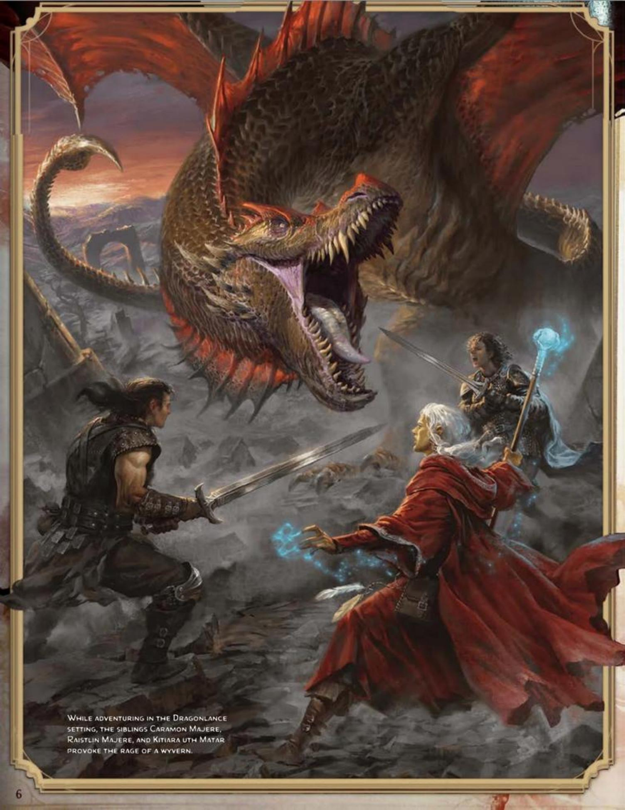

# WORLDS OF ADVENTURE

The worlds of D&D glimmer with magic, monsters, and spectacular adventure. Launching from a foundation of medieval fantasy, these worlds soar with possibilities beyond those of our reality.

D&D worlds exist in a multiverse and are connected to one another and to other planes of existence. Some of the worlds have been published as official D&D settings, including the Greyhawk, Forgotten Realms, Dragonlance, Spelljammer, Planescape, Dark Sun, Eberron, and Ravenloft settings. Alongside these worlds are thousands more, created by generations of D&D players for their own games. Amid the richness of the multiverse, you might create a world of your own.

The worlds of the multiverse share characteristics, but each world is set apart by its own history and geography. Your DM might set a campaign on one of these worlds or on a world of their own invention. Because there is so much variety among D&D worlds, check with your DM about the world of your upcoming adventures.

