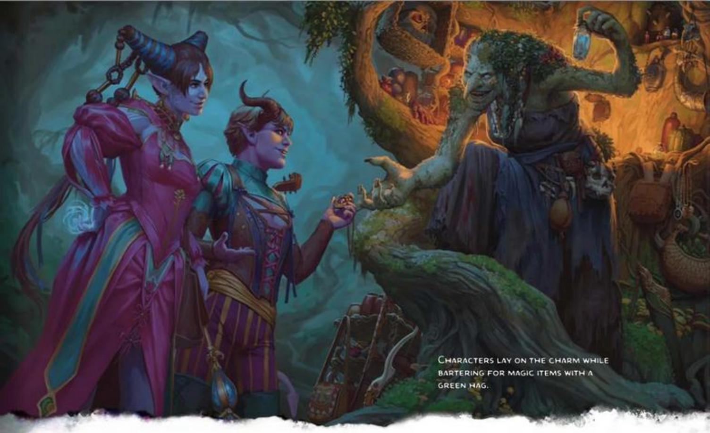

#### REACTIONS

Certain special abilities, spells, and situations allow you to take a special action called a Reaction. A Reaction is an instant response to a trigger of some kind, which can occur on your turn or on someone else's. The Opportunity Attack, described later in this chapter, is the most common type of Reaction.

When you take a Reaction, you can't take another one until the start of your next turn. If the reaction interrupts another creature's turn, that creature can continue its turn right after the Reaction.

In terms of timing, a Reaction takes place immediately after its trigger unless the Reaction's description says otherwise.

#### WHAT WOULD YOUR CHARACTER DO?

Ask yourself as you play, "What would my character do?" Playing a role involves some amount of getting into another person's head and understanding what motivates them and how those motivations translate into action. In D&D, those actions unfold against the backdrop of a fantastic world full of situations we can only imagine. How does your character react to those situations?

This advice comes with one important caveat: avoid character choices that ruin the fun of the other players and the DM. Choose actions that delight you and your friends.

