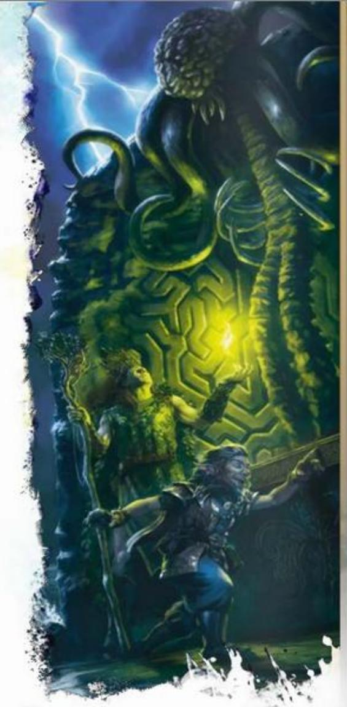

### VISION AND LIGHT

Some adventuring tasks—such as noticing danger, hitting an enemy, and targeting certain spells—are affected by sight, so effects that obscure vision can hinder you, as explained below.

### OBSCURED AREAS

An area might be Lightly or Heavily Obscured. In a Lightly Obscured area—such as an area with Dim Light, patchy fog, or moderate foliage—you have Disadvantage on Wisdom (Perception) checks that rely on sight.

A Heavily Obscured area—such as an area with Darkness, heavy fog, or dense foliage—is opaque. You have the Blinded condition (see the rules glossary) when trying to see something there.

### LIGHT

The presence or absence of light determines the category of illumination in an area, as defined below.

Bright Light. Bright Light lets most creatures see normally. Even gloomy days provide Bright Light, as do torches, lanterns, fires, and other sources of illumination within a specific radius.

Dim Light. Dim Light, also called shadows, creates a Lightly Obscured area. An area of Dim Light is usually a boundary between Bright Light and surrounding Darkness. The soft light of twilight and dawn also counts as Dim Light. A full moon might bathe the land in Dim Light.

Darkness. Darkness creates a Heavily Obscured area. Characters face Darkness outdoors at night (even most moonlit nights), within the confines of an unlit dungeon, or in an area of magical Darkness.

## SPECIAL SENSES

Some creatures have special senses that help them perceive things in certain situations. The rules glossary defines the following special senses:

Blindsight Darkvision Tremorsense Truesight