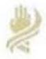
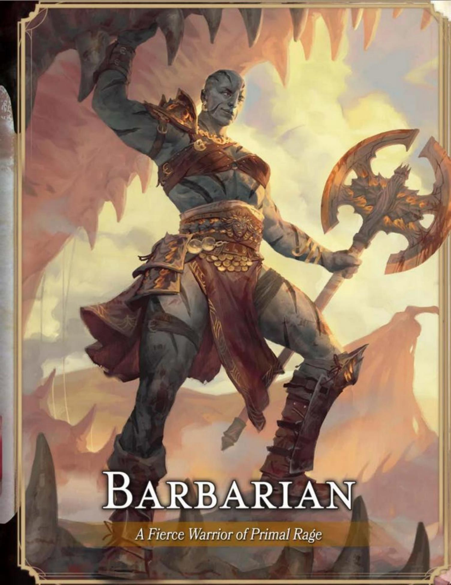

# CHARACTER CLASSES

CHARACTER CLASS PROVIDES A CHARACTER'S most exciting capabilities. This chapter offers twelve classes, each of which contains four subclasses—all summarized below.

**Barbarian.** Storm with Rage, and wade into hand-to-hand combat. Then follow the Path of the ...

Berserker to unleash raw violence.

Wild Heart to manifest kinship with animals.

World Tree to tap into cosmic vitality.

Zealot to rage in union with a god.

**Bard.** Perform spells that inspire and heal allies or beguile foes. Then join the *College of* ...

Dance to harness agility in battle.

Glamour to weave beguiling Feywild magic.

Lore to collect knowledge and magical secrets.

Valor to wield weapons with spells.

**Cleric.** Invoke divine magic to heal, bolster, and smite. Then harness the ...

Life Domain to be a master of healing.

Light Domain to wield searing, warding light.

Trickery Domain to bedevil foes with mischief.

War Domain to inspire valor and chastise foes.

**Druid.** Channel nature magic to heal, shape-shift, and control the elements. Then join the Circle of the ...

Land to draw on the magic of the environment.

Moon to adopt powerful animal forms.

Sea to channel tides and storms.

Stars to gain powers in a starry form.

**Fighter.** Master all weapons and armor. Then embody the ...

Battle Master to use special combat maneuvers.

Champion to strive for peak combat prowess.

Eldritch Knight to learn spells to aid in combat.

Psi Warrior to augment attacks with psionic power.

**Monk.** Dart in and out of melee while striking fast and hard. Then become a Warrior of ...

Mercy to heal or harm with a touch.

Shadow to employ shadows for subterfuge.

The Elements to wield elemental power.

The Open Hand to master unarmed combat.

**Paladin.** Smite foes and shield allies with divine and martial might. Then swear the Oath of ...

Devotion to emulate the angels of justice.

Glory to reach the heights of heroism.

The Ancients to preserve life, joy, and nature.

Vengeance to hunt down evildoers.

**Ranger.** Weave together martial prowess, nature magic, and survival skills. Then embody the ...

Beast Master to bond with a primal beast.

Fey Wanderer to manifest fey mirth and fury.

Gloom Stalker to hunt foes that lurk in darkness.

Hunter to protect nature with martial versatility.

**Rogue.** Launch deadly Sneak Attacks while avoiding harm through stealth. Then embody the ...

Arcane Trickster to enhance stealth with spells.

Assassin to deliver ambushes and poison.

Soulknife to strike foes with psi blades.

Thief to master infiltration and treasure hunting.

**Sorcerer.** Wield magic innate to your being, shaping the power to your will. Then channel ...

Aberrant Sorcery to use strange psionic magic.

Clockwork Sorcery to harness cosmic forces of order.

Draconic Sorcery to breathe the magic of dragons.

Wild Magic to unleash chaos magic.

**Warlock.** Cast spells derived from occult knowledge. Then form a pact with the ...

Archfey Patron to teleport and wield fey magic.

Celestial Patron to heal with heavenly magic.

Fiend Patron to call on sinister powers.

Great Old One Patron to delve into forbidden lore.

**Wizard.** Study arcane magic and master spells for every purpose. Then embody the ...

Abjurer to shield allies and banish foes.

Diviner to learn the multiverse's secrets.

Evoker to create explosive effects.

Illusionist to weave spells of deception.

