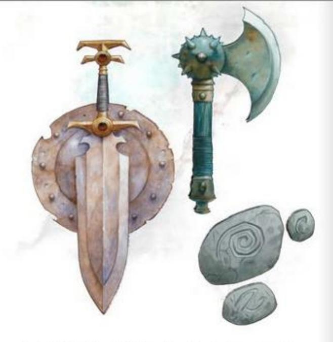
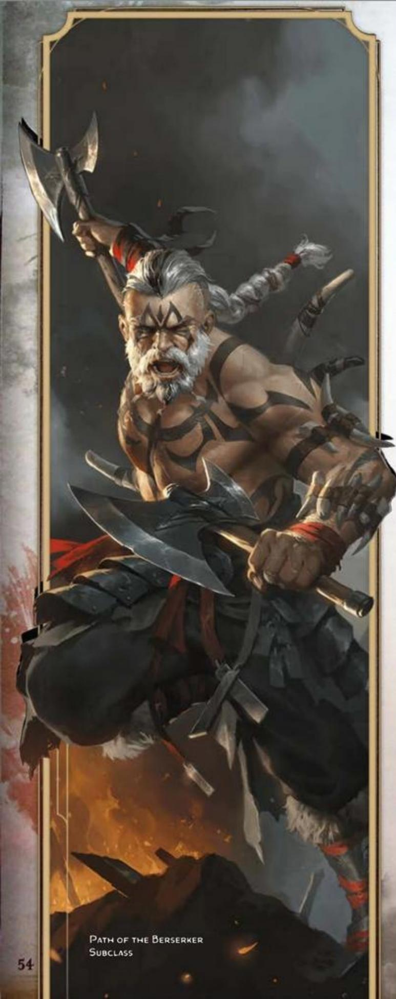
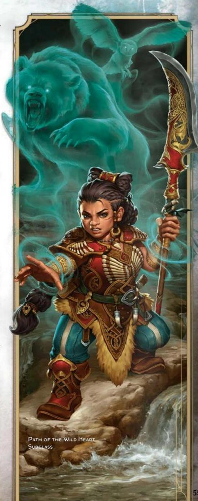
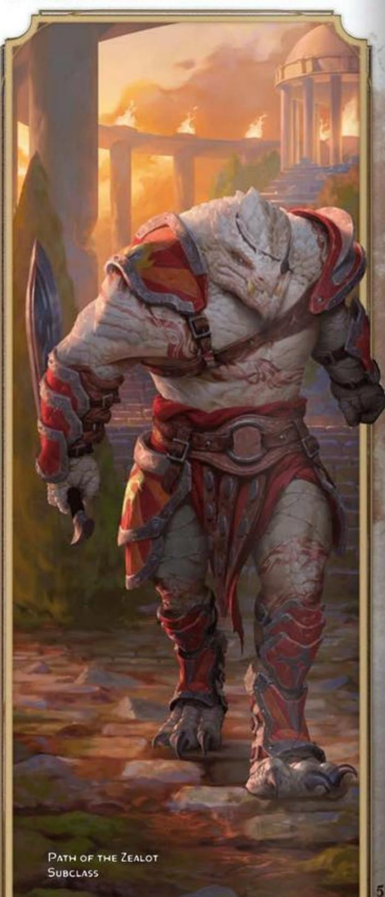
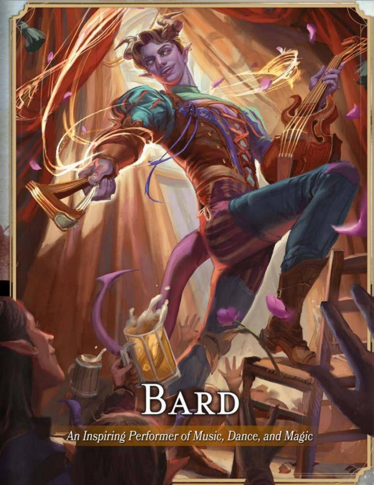

#### CORE BARBARIAN TRAITS

**Primary Ability** Strength

**Hit Point Die** d12 per Barbarian level

**Saving Throws** Strength and Constitution

**Proficiencies**

**Skill Proficiencies** Choose 2: Animal Handling, Athletics, Intimidation, Nature, Perception, or Survival

**Weapon Proficiencies** Simple and Martial weapons

**Armor Training** Light and Medium armor and Shields

**Starting Equipment** Choose A or B: (A) Greataxe, 4 Handaxes, Explorer's Pack, and 15 GP; or (B) 75 GP

BARBARIANS ARE MIGHTY WARRIORS WHO are powered by primal forces of the multiverse that manifest as a Rage. More than a mere emotion—and not limited to anger—this Rage is an incarnation of a predator's ferocity, a storm's fury, and a sea's turmoil.

Some Barbarians personify their Rage as a fierce spirit or revered forebear. Others see it as a connection to the pain and anguish of the world, as an impersonal tangle of wild magic, or as an expression of their own deepest self. For every Barbarian, their Rage is a power that fuels not just battle prowess, but also uncanny reflexes and heightened senses.

Barbarians often serve as protectors and leaders in their communities. They charge headlong into danger so those under their protection don't have to. Their courage in the face of danger makes Barbarians perfectly suited for adventure.

## BECOMING A BARBARIAN

#### AS A LEVEL 1 CHARACTER

- Gain all the traits in the Core Barbarian Traits table.
- Gain the Barbarian's level 1 features, which are listed in the Barbarian Features table.

#### AS A MULTICLASS CHARACTER

- Gain the following traits from the Core Barbarian Traits table: Hit Point Die, proficiency with Martial weapons, and training with Shields.
- Gain the Barbarian's level 1 features, which are listed in the Barbarian Features table.

#### BARBARIAN CLASS FEATURES

As a Barbarian, you gain the following class features when you reach the specified Barbarian levels. These features are listed in the Barbarian Features table.

#### LEVEL 1: RAGE

You can imbue yourself with a primal power called Rage, a force that grants you extraordinary might and resilience. You can enter it as a Bonus Action if you aren't wearing Heavy armor.

You can enter your Rage the number of times shown for your Barbarian level in the Rages column of the Barbarian Features table. You regain one expended use when you finish a Short Rest, and you regain all expended uses when you finish a Long Rest.

While active, your Rage follows the rules below. Damage Resistance. You have Resistance to Bludgeoning, Piercing, and Slashing damage.

Rage Damage. When you make an attack using Strength—with either a weapon or an Unarmed Strike—and deal damage to the target, you gain a bonus to the damage that increases as you gain levels as a Barbarian, as shown in the Rage Damage column of the Barbarian Features table.

Strength Advantage. You have Advantage on Strength checks and Strength saving throws.

No Concentration or Spells. You can't maintain Concentration, and you can't cast spells.

Duration. The Rage lasts until the end of your next turn, and it ends early if you don Heavy armor or have the Incapacitated condition. If your Rage is still active on your next turn, you can extend the Rage for another round by doing one of the following:

- Make an attack roll against an enemy.
- Force an enemy to make a saving throw.
- Take a Bonus Action to extend your Rage.

Each time the Rage is extended, it lasts until the end of your next turn. You can maintain a Rage for up to 10 minutes.

#### LEVEL 1: UNARMORED DEFENSE

While you aren't wearing any armor, your base Armor Class equals 10 plus your Dexterity and Constitution modifiers. You can use a Shield and still gain this benefit.

#### BARBARIAN FEATURES

| Level | Proficiency Bonus | Class Features                          | Rages | Rage Damage | Weapon Mastery |
|-------|----------------------|-----------------------------------------|-------|----------------|-------------------|
| 1     | +2                   | Rage, Unarmored Defense, Weapon Mastery | 2     | +2             | 2                 |
| 2     | +2                   | Danger Sense, Reckless Attack           | 2     | +2             | 2                 |
| 3     | +2                   | Barbarian Subclass, Primal Knowledge    | 3     | +2             | 2                 |
| 4     | +2                   | Ability Score Improvement               | 3     | +2             | 3                 |
| 5     | +3                   | Extra Attack, Fast Movement             | 3     | +2             | 3                 |
| 6     | +3                   | Subclass feature                        | 4     | +2             | 3                 |
| 7     | +3                   | Feral Instinct, Instinctive Pounce      | 4     | +2             | 3                 |
| 8     | +3                   | Ability Score Improvement               | 4     | +2             | 3                 |
| 9     | +4                   | Brutal Strike                           | 4     | +3             | 3                 |
| 10    | +4                   | Subclass feature                        | 4     | +3             | 4                 |
| 11    | +4                   | Relentless Rage                         | 4     | +3             | 4                 |
| 12    | +4                   | Ability Score Improvement               | 5     | +3             | 4                 |
| 13    | +5                   | Improved Brutal Strike                  | 5     | +3             | 4                 |
| 14    | +5                   | Subclass feature                        | 5     | +3             | 4                 |
| 15    | +5                   | Persistent Rage                         | 5     | +3             | 4                 |
| 16    | +5                   | Ability Score Improvement               | 5     | +4             | 4                 |
| 17    | +6                   | Improved Brutal Strike                  | 6     | +4             | 4                 |
| 18    | +6                   | Indomitable Might                       | 6     | +4             | 4                 |
| 19    | +6                   | Epic Boon                               | 6     | +4             | 4                 |
| 20    | +6                   | Primal Champion                         | 6     | +4             | 4                 |

#### LEVEL 1: WEAPON MASTERY

Your training with weapons allows you to use the mastery properties of two kinds of Simple or Martial Melee weapons of your choice, such as Great-axes and Handaxes. Whenever you finish a Long Rest, you can practice weapon drills and change one of those weapon choices.

When you reach certain Barbarian levels, you gain the ability to use the mastery properties of more kinds of weapons, as shown in the Weapon Mastery column of the Barbarian Features table.

#### LEVEL 2: DANGER SENSE

You gain an uncanny sense of when things aren't as they should be, giving you an edge when you dodge perils. You have Advantage on Dexterity saving throws unless you have the Incapacitated condition.

#### LEVEL 2: RECKLESS ATTACK

You can throw aside all concern for defense to attack with increased ferocity. When you make your first attack roll on your turn, you can decide to attack recklessly. Doing so gives you Advantage on attack rolls using Strength until the start of your next turn, but attack rolls against you have Advantage during that time.

#### LEVEL 3: BARBARIAN SUBCLASS

You gain a Barbarian subclass of your choice. The Path of the Berserker, Path of the Wild Heart, Path of the World Tree, and Path of the Zealot subclasses are detailed after this class's description. A subclass is a specialization that grants you features at certain Barbarian levels. For the rest of your career, you gain each of your subclass's features that are of your Barbarian level or lower.

#### LEVEL 3: PRIMAL KNOWLEDGE

You gain proficiency in another skill of your choice from the skill list available to Barbarians at level 1.

In addition, while your Rage is active, you can channel primal power when you attempt certain tasks; whenever you make an ability check using one of the following skills, you can make it as a Strength check even if it normally uses a different ability: Acrobatics, Intimidation, Perception, Stealth, or Survival. When you use this ability, your Strength represents primal power coursing through you, honing your agility, bearing, and senses.

#### LEVEL 4: ABILITY SCORE IMPROVEMENT

You gain the Ability Score Improvement feat (see chapter 5) or another feat of your choice for which you qualify. You gain this feature again at Barbarian levels 8, 12, and 16.

#### LEVEL 5: EXTRA ATTACK

You can attack twice instead of once whenever you take the Attack action on your turn.

#### LEVEL 5: FAST MOVEMENT

Your speed increases by 10 feet while you aren't wearing Heavy armor.

#### LEVEL 7: FERAL INSTINCT

Your instincts are so honed that you have Advantage on Initiative rolls.

#### LEVEL 7: INSTINCTIVE POUNCE

As part of the Bonus Action you take to enter your Rage, you can move up to half your Speed.

#### LEVEL 9: BRUTAL STRIKE

If you use Reckless Attack, you can forgo any Advantage on one Strength-based attack roll of your choice on your turn. The chosen attack roll mustn't have Disadvantage. If the chosen attack roll hits, the target takes an extra 1d10 damage of the same type dealt by the weapon or Unarmed Strike, and you can cause one Brutal Strike effect of your choice. You have the following effect options.

Forceful Blow. The target is pushed 15 feet straight away from you. You can then move up to half your Speed straight toward the target without provoking Opportunity Attacks.

Hamstring Blow. The target's Speed is reduced by 15 feet until the start of your next turn. A target can be affected by only one Hamstring Blow at a time—the most recent one.

#### LEVEL 11: RELENTLESS RAGE

Your Rage can keep you fighting despite grievous wounds. If you drop to 0 Hit Points while your Rage is active and don't die outright, you can make a DC 10 Constitution saving throw. If you succeed, your Hit Points instead change to a number equal to twice your Barbarian level.

Each time you use this feature after the first, the DC increases by 5. When you finish a Short or Long Rest, the DC resets to 10.

#### LEVEL 13: IMPROVED BRUTAL STRIKE

You have honed new ways to attack furiously. The following effects are now among your Brutal Strike options.

Staggering Blow. The target has Disadvantage on the next saving throw it makes, and it can't make Opportunity Attacks until the start of your next turn.

Sundering Blow. Before the start of your next turn, the next attack roll made by another creature against the target gains a +5 bonus to the roll. An attack roll can gain only one Sundering Blow bonus.

#### LEVEL 15: PERSISTENT RAGE

When you roll Initiative, you can regain all expended uses of Rage. After you regain uses of Rage in this way, you can't do so again until you finish a Long Rest.

In addition, your Rage is so fierce that it now lasts for 10 minutes without you needing to do anything to extend it from round to round. Your Rage ends early if you have the Unconscious condition (not just the Incapacitated condition) or don Heavy armor.

#### LEVEL 17: IMPROVED BRUTAL STRIKE

The extra damage of your Brutal Strike increases to 2d10. In addition, you can use two different Brutal Strike effects whenever you use your Brutal Strike feature.

#### LEVEL 18: INDOMITABLE MIGHT

If your total for a Strength check or Strength saving throw is less than your Strength score, you can use that score in place of the total.

#### LEVEL 19: EPIC BOON

You gain an Epic Boon feat (see chapter 5) or another feat of your choice for which you qualify. Boon of Irresistible Offense is recommended.

#### LEVEL 20: PRIMAL CHAMPION

You embody primal power. Your Strength and Constitution scores increase by 4, to a maximum of 25.

# BARBARIAN SUBCLASSES

A Barbarian subclass is a specialization that grants you features at certain levels, as specified in the subclass. This section presents the Path of the Berserker, Path of the Wild Heart, Path of the World Tree, and Path of the Zealot subclasses.

# PATH OF THE BERSERKER

Channel Rage into Violent Fury

Barbarians who walk the Path of the Berserker direct their Rage primarily toward violence. Their path is one of untrammeled fury, and they thrill in the chaos of battle as they allow their Rage to seize and empower them.

#### LEVEL 3: FRENZY

If you use Reckless Attack while your Rage is active, you deal extra damage to the first target you hit on your turn with a Strength-based attack. To determine the extra damage, roll a number of d6s equal to your Rage Damage bonus, and add them together. The damage has the same type as the weapon or Unarmed Strike used for the attack.

#### LEVEL 6: MINDLESS RAGE

You have Immunity to the Charmed and Frightened conditions while your Rage is active. If you're Charmed or Frightened when you enter your Rage, the condition ends on you.

#### LEVEL 10: RETALIATION

When you take damage from a creature that is within 5 feet of you, you can take a Reaction to make one melee attack against that creature, using a weapon or an Unarmed Strike.

#### LEVEL 14: INTIMIDATING PRESENCE

As a Bonus Action, you can strike terror into others with your menacing presence and primal power. When you do so, each creature of your choice in a 30-foot Emanation originating from you must make a Wisdom saving throw (DC 8 plus your Strength modifier and Proficiency Bonus). On a failed save, a creature has the Frightened condition for 1 minute. At the end of each of the Frightened creature's turns, the creature repeats the save, ending the effect on itself on a success.

Once you use this feature, you can't use it again until you finish a Long Rest unless you expend a use of your Rage (no action required) to restore your use of it.

# PATH OF THE WILD HEART

Walk in Community with the Animal World

Barbarians who follow the Path of the Wild Heart view themselves as kin to animals. These Barbarians learn magical means to communicate with animals, and their Rage heightens their connection to animals as it fills them with supernatural might.

#### LEVEL 3: ANIMAL SPEAKER

You can cast the Beast Sense and Speak with Animals spells but only as Rituals. Wisdom is your spellcasting ability for them.

#### LEVEL 3: RAGE OF THE WILDS

Your Rage taps into the primal power of animals. Whenever you activate your Rage, you gain one of the following options of your choice.

Bear. While your Rage is active, you have Resistance to every damage type except Force, Necrotic, Psychic, and Radiant.

Eagle. When you activate your Rage, you can take the Disengage and Dash actions as part of that Bonus Action. While your Rage is active, you can take a Bonus Action to take both of those actions.

Wolf. While your Rage is active, your allies have Advantage on attack rolls against any enemy of yours within 5 feet of you.

#### LEVEL 6: ASPECT OF THE WILDS

You gain one of the following options of your choice. Whenever you finish a Long Rest, you can change your choice.

Owl. You have Darkvision with a range of 60 feet. If you already have Darkvision, its range increases by 60 feet.

Panther. You have a Climb Speed equal to your Speed.

Salmon. You have a Swim Speed equal to your Speed.

#### LEVEL 10: NATURE SPEAKER

You can cast the Commune with Nature spell but only as a Ritual. Wisdom is your spellcasting ability for it.

#### LEVEL 14: POWER OF THE WILDS

Whenever you activate your Rage, you gain one of the following options of your choice.

Falcon. While your Rage is active, you have a Fly Speed equal to your Speed if you aren't wearing any armor.

Lion. While your Rage is active, any of your enemies within 5 feet of you have Disadvantage on attack rolls against targets other than you or another Barbarian who has this option active.

Ram. While your Rage is active, you can cause a Large or smaller creature to have the Prone condition when you hit it with a melee attack.

# PATH OF THE WORLD TREE

Trace the Roots and Branches of the Multiverse

Barbarians who follow the Path of the World Tree connect with the cosmic tree Yggdrasil through their Rage. This tree grows among the Outer Planes, connecting them to each other and the Material Plane. These Barbarians draw on the tree's magic for vitality and as a means of dimensional travel.

#### LEVEL 3: VITALITY OF THE TREE

Your Rage taps into the life force of the World Tree. You gain the following benefits.

Vitality Surge. When you activate your Rage, you gain a number of Temporary Hit Points equal to your Barbarian level.

Life-Giving Force. At the start of each of your turns while your Rage is active, you can choose another creature within 10 feet of yourself to gain Temporary Hit Points. To determine the number of Temporary Hit Points, roll a number of d6s equal to your Rage Damage bonus, and add them together. If any of these Temporary Hit Points remain when your Rage ends, they vanish.

#### LEVEL 6: BRANCHES OF THE TREE

Whenever a creature you can see starts its turn within 30 feet of you while your Rage is active, you can take a Reaction to summon spectral branches of the World Tree around it. The target must succeed on a Strength saving throw (DC 8 plus your Strength modifier and Proficiency Bonus) or be teleported to an unoccupied space you can see within 5 feet of yourself or in the nearest unoccupied space you can see. After the target teleports, you can reduce its Speed to 0 until the end of the current turn.

#### LEVEL 10: BATTERING ROOTS

During your turn, your reach is 10 feet greater with any Melee weapon that has the Heavy or Versatile property, as tendrils of the World Tree extend from you. When you hit with such a weapon on your turn, you can activate the Push or Topple mastery property in addition to a different mastery property you're using with that weapon.

#### LEVEL 14: TRAVEL ALONG THE TREE

When you activate your Rage and as a Bonus Action while your Rage is active, you can teleport up to 60 feet to an unoccupied space you can see.

In addition, once per Rage, you can increase the range of that teleport to 150 feet. When you do so, you can also bring up to six willing creatures who are within 10 feet of you. Each creature teleports to an unoccupied space of your choice within 10 feet of your destination space.

# PATH OF THE ZEALOT

Rage in Ecstatic Union with a God

Barbarians who walk the Path of the Zealot receive boons from a god or pantheon. These Barbarians experience their Rage as an ecstatic episode of divine union that infuses them with power. They are often allies to the priests and other followers of their god or pantheon.

#### LEVEL 3: DIVINE FURY

You can channel divine power into your strikes. On each of your turns while your Rage is active, the first creature you hit with a weapon or an Unarmed Strike takes extra damage equal to 1d6 plus half your Barbarian level (round down). The extra damage is Necrotic or Radiant; you choose the type each time you deal the damage.

#### LEVEL 3: WARRIOR OF THE GODS

A divine entity helps ensure you can continue the fight. You have a pool of four d12s that you can spend to heal yourself. As a Bonus Action, you can expend dice from the pool, roll them, and regain a number of Hit Points equal to the roll's total.

Your pool regains all expended dice when you finish a Long Rest.

The pool's maximum number of dice increases by one when you reach Barbarian levels 6 (5 dice), 12 (6 dice), and 17 (7 dice).

#### LEVEL 6: FANATICAL FOCUS

Once per active Rage, if you fail a saving throw, you can reroll it with a bonus equal to your Rage Damage bonus, and you must use the new roll.

#### LEVEL 10: ZEALOUS PRESENCE

As a Bonus Action, you unleash a battle cry infused with divine energy. Up to ten other creatures of your choice within 60 feet of you gain Advantage on attack rolls and saving throws until the start of your next turn.

Once you use this feature, you can't use it again until you finish a Long Rest unless you expend a use of your Rage (no action required) to restore your use of it.

#### LEVEL 14: RAGE OF THE GODS

When you activate your Rage, you can assume the form of a divine warrior. This form lasts for 1 minute or until you drop to 0 Hit Points. Once you use this feature, you can't do so again until you finish a Long Rest.

While in this form, you gain the benefits below. Flight. You have a Fly Speed equal to your Speed and can hover.

Resistance. You have Resistance to Necrotic, Psychic, and Radiant damage.

Revivification. When a creature within 30 feet of you would drop to 0 Hit Points, you can take a Reaction to expend a use of your Rage to instead change the target's Hit Points to a number equal to your Barbarian level.

