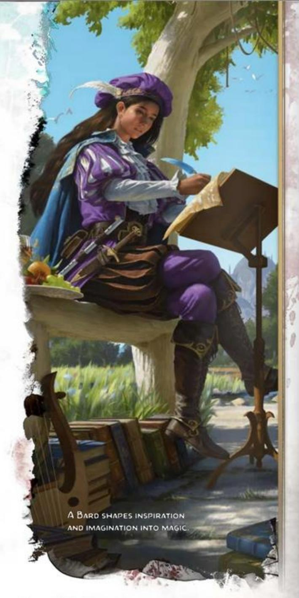
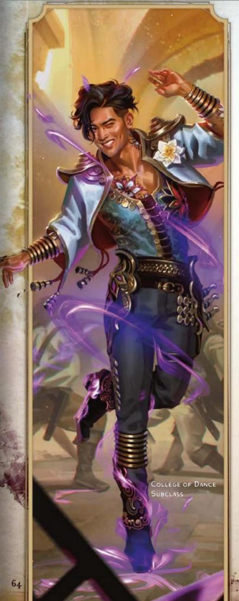
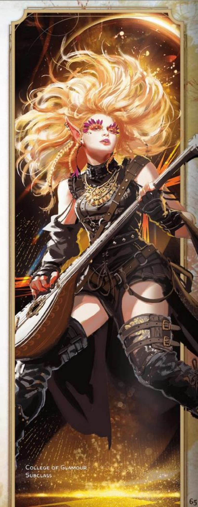
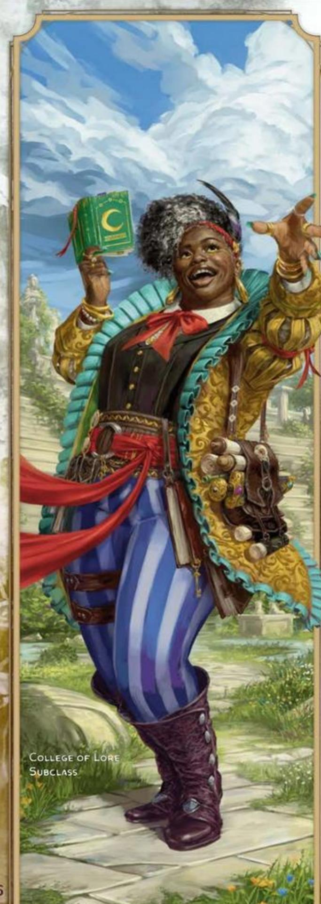
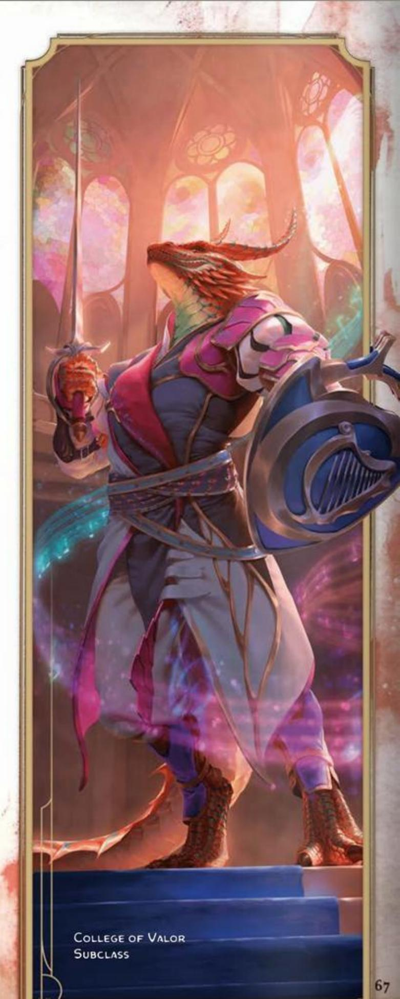
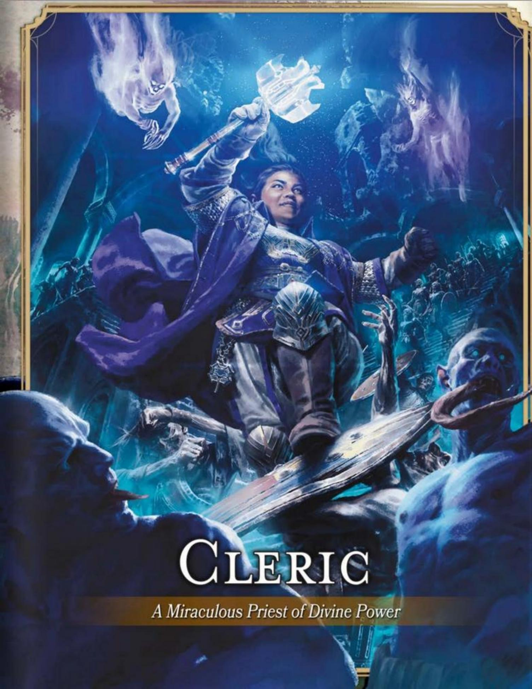

#### CORE BARD TRAITS

**Primary Ability** Charisma

**Hit Point Die** d8 per Bard level

**Saving Throws** Dexterity and Charisma

**Proficiencies**

**Skill Proficiencies** Choose any 3 skills (see chapter 1)

**Weapon Proficiencies** Simple weapons

**Tool Proficiencies** Choose 3 Musical Instruments (see chapter 6)

**Armor Training** Light armor

**Starting Equipment** Choose A or B: (A) Leather Armor, 2 Daggers, Musical Instrument of your choice, Entertainer's Pack, and 19 GP; or (B) 90 GP

INVOKING MAGIC THROUGH MUSIC, DANCE, and verse, Bards are expert at inspiring others, soothing hurts, disheartening foes, and creating illusions. Bards believe the multiverse was spoken into existence and that remnants of its Words of Creation still resound and glimmer on every plane of existence. Bardic magic attempts to harness those words, which transcend any language.

Anything can inspire a new song or tale, so Bards are fascinated by almost everything. They become masters of many things, including performing music, working magic, and making jests.

A Bard's life is spent traveling, gathering lore, telling stories, and living on the gratitude of audiences, much like any other entertainer. But Bards' depth of knowledge and mastery of magic sets them apart.

## BECOMING A BARD

#### AS A LEVEL 1 CHARACTER

- Gain all the traits in the Core Bard Traits table.
- Gain the Bard's level 1 features, which are listed in the Bard Features table.

#### AS A MULTICLASS CHARACTER

- Gain the following traits from the Core Bard Traits table: Hit Point Die, proficiency in one skill of your choice, proficiency with one Musical Instrument of your choice, and training with Light armor.
- Gain the Bard's level 1 features, which are listed in the Bard Features table. See the multiclassing rules in chapter 2 to determine your available spell slots.

#### BARD CLASS FEATURES

As a Bard, you gain the following class features when you reach the specified Bard levels. These features are listed in the Bard Features table.

#### LEVEL 1: BARDIC INSPIRATION

You can supernaturally inspire others through words, music, or dance. This inspiration is represented by your Bardic Inspiration die, which is a d6.

Using Bardic Inspiration. As a Bonus Action, you can inspire another creature within 60 feet of yourself who can see or hear you. That creature gains one of your Bardic Inspiration dice. A creature can have only one Bardic Inspiration die at a time.

Once within the next hour when the creature fails a D20 Test, the creature can roll the Bardic Inspiration die and add the number rolled to the d20, potentially turning the failure into a success. A Bardic Inspiration die is expended when it's rolled.

Number of Uses. You can confer a Bardic Inspiration die a number of times equal to your Charisma modifier (minimum of once), and you regain all expended uses when you finish a Long Rest.

At Higher Levels. Your Bardic Inspiration die changes when you reach certain Bard levels, as shown in the Bardic Die column of the Bard Features table. The die becomes a d8 at level 5, a d10 at level 10, and a d12 at level 15.

#### LEVEL 1: SPELLCASTING

You have learned to cast spells through your bardic arts. See chapter 7 for the rules on spellcasting. The information below details how you use those rules with Bard spells, which appear in the Bard spell list later in the class's description.

Cantrips. You know two cantrips of your choice from the Bard spell list. Dancing Lights and Vicious Mockery are recommended.

Whenever you gain a Bard level, you can replace one of your cantrips with another cantrip of your choice from the Bard spell list.

When you reach Bard levels 4 and 10, you learn another cantrip of your choice from the Bard spell list, as shown in the Cantrips column of the Bard Features table.

Spell Slots. The Bard Features table shows how many spell slots you have to cast your level 1+ spells. You regain all expended slots when you finish a Long Rest.

Prepared Spells of Level 1+. You prepare the list of level 1+ spells that are available for you to cast with this feature. To start, choose four level 1 spells from the Bard spell list. Charm Person, Color Spray, Dissonant Whispers, and Healing Word are recommended.

#### BARD FEATURES

| Level | Proficiency Bonus | Class Features                      | Bardic Die | Cantrips | Prepared Spells | 1 | 2 | 3 | 4 | 5 | 6 | 7 | 8 | 9 |
|-------|----------------------|-------------------------------------|---------------|----------|--------------------|---|---|---|---|---|---|---|---|---|
| 1     | +2                   | Bardic Inspiration, Spellcasting    | d6            | 2        | 4                  | 2 | — | — | — | — | — | — | — | — |
| 2     | +2                   | Expertise, Jack of All Trades       | d6            | 2        | 5                  | 3 | — | — | — | — | — | — | — | — |
| 3     | +2                   | Bard Subclass                       | d6            | 2        | 6                  | 4 | 2 | — | — | — | — | — | — | — |
| 4     | +2                   | Ability Score Improvement           | d6            | 3        | 7                  | 4 | 3 | — | — | — | — | — | — | — |
| 5     | +3                   | Font of Inspiration                 | d8            | 3        | 9                  | 4 | 3 | 2 | — | — | — | — | — | — |
| 6     | +3                   | Subclass feature                    | d8            | 3        | 10                 | 4 | 3 | 3 | — | — | — | — | — | — |
| 7     | +3                   | Countercharm                        | d8            | 3        | 11                 | 4 | 3 | 3 | 1 | — | — | — | — | — |
| 8     | +3                   | Ability Score Improvement           | d8            | 3        | 12                 | 4 | 3 | 3 | 2 | — | — | — | — | — |
| 9     | +4                   | Expertise                           | d8            | 3        | 14                 | 4 | 3 | 3 | 3 | 1 | — | — | — | — |
| 10    | +4                   | Magical Secrets                     | d10           | 4        | 15                 | 4 | 3 | 3 | 3 | 2 | — | — | — | — |
| 11    | +4                   | —                                   | d10           | 4        | 16                 | 4 | 3 | 3 | 3 | 2 | 1 | — | — | — |
| 12    | +4                   | Ability Score Improvement           | d10           | 4        | 16                 | 4 | 3 | 3 | 3 | 2 | 1 | — | — | — |
| 13    | +5                   | —                                   | d10           | 4        | 17                 | 4 | 3 | 3 | 3 | 2 | 1 | 1 | — | — |
| 14    | +5                   | Subclass feature                    | d10           | 4        | 17                 | 4 | 3 | 3 | 3 | 2 | 1 | 1 | — | — |
| 15    | +5                   | —                                   | d12           | 4        | 18                 | 4 | 3 | 3 | 3 | 2 | 1 | 1 | 1 | — |
| 16    | +5                   | Ability Score Improvement           | d12           | 4        | 18                 | 4 | 3 | 3 | 3 | 2 | 1 | 1 | 1 | — |
| 17    | +6                   | —                                   | d12           | 4        | 19                 | 4 | 3 | 3 | 3 | 2 | 1 | 1 | 1 | 1 |
| 18    | +6                   | Superior Inspiration                | d12           | 4        | 20                 | 4 | 3 | 3 | 3 | 3 | 1 | 1 | 1 | 1 |
| 19    | +6                   | Epic Boon                           | d12           | 4        | 21                 | 4 | 3 | 3 | 3 | 3 | 2 | 1 | 1 | 1 |
| 20    | +6                   | Words of Creation                   | d12           | 4        | 22                 | 4 | 3 | 3 | 3 | 3 | 2 | 2 | 1 | 1 |

The number of spells on your list increases as you gain Bard levels, as shown in the Prepared Spells column of the Bard Features table. Whenever that number increases, choose additional spells from the Bard spell list until the number of spells on your list matches the number on the table. The chosen spells must be of a level for which you have spell slots. For example, if you're a level 3 Bard, your list of prepared spells can include six spells of levels 1 and 2 in any combination.

If another Bard feature gives you spells that you always have prepared, those spells don't count against the number of spells you can prepare with this feature, but those spells otherwise count as Bard spells for you.

Changing Your Prepared Spells. Whenever you gain a Bard level, you can replace one spell on your list with another Bard spell for which you have spell slots.

Spellcasting Ability. Charisma is your spellcasting ability for your Bard spells.

Spellcasting Focus. You can use a Musical Instrument as a Spellcasting Focus for your Bard spells.

#### LEVEL 2: EXPERTISE

You gain Expertise (see the rules glossary) in two of your skill proficiencies of your choice. Performance and Persuasion are recommended if you have proficiency in them.

At Bard level 9, you gain Expertise in two more of your skill proficiencies of your choice.

#### LEVEL 2: JACK OF ALL TRADES

You can add half your Proficiency Bonus (round down) to any ability check you make that uses a skill proficiency you lack and that doesn't otherwise use your Proficiency Bonus.

For example, if you make a Strength (Athletics) check and lack Athletics proficiency, you can add half your Proficiency Bonus to the check.

#### LEVEL 3: BARD SUBCLASS

You gain a Bard subclass of your choice. The College of Dance, College of Glamour, College of Lore, and College of Valor subclasses are detailed after this class's description. A subclass is a specialization that grants you features at certain Bard levels. For the rest of your career, you gain each of your subclass's features that are of your Bard level or lower.

Does your Bard beat a drum while chanting the deeds of ancient heroes? Strum a lute while crooning romantic tunes? Perform arias of stirring power? Recite dramatic monologues from classic tragedies? Use the rhythm of a folk dance to coordinate the movement of allies in battle? Compose naughty limericks?

When you play a Bard, consider the style of artistic performance you favor, the moods you might invoke, and the themes that inspire your own creations. Are your poems inspired by moments of natural beauty, or are they brooding reflections on loss? Do you prefer lofty hymns or rowdy tavern songs? Are you drawn to laments for the fallen or celebrations of joy? Do you dance merry jigs or perform elaborate interpretive choreography? Do you focus on one style of performance or strive to master them all?

#### LEVEL 4: ABILITY SCORE IMPROVEMENT

You gain the Ability Score Improvement feat (see chapter 5) or another feat of your choice for which you qualify. You gain this feature again at Bard levels 8, 12, and 16.

#### LEVEL 5: FONT OF INSPIRATION

You now regain all your expended uses of Bardic Inspiration when you finish a Short or Long Rest.

In addition, you can expend a spell slot (no action required) to regain one expended use of Bardic Inspiration.

#### LEVEL 7: COUNTERCHARM

You can use musical notes or words of power to disrupt mind-influencing effects. If you or a creature within 30 feet of you fails a saving throw against an effect that applies the Charmed or Frightened condition, you can take a Reaction to cause the save to be rerolled, and the new roll has Advantage.

#### LEVEL 10: MAGICAL SECRETS

You've learned secrets from various magical traditions. Whenever you reach a Bard level (including this level) and the Prepared Spells number in the Bard Features table increases, you can choose any of your new prepared spells from the Bard, Cleric, Druid, and Wizard spell lists, and the chosen spells count as Bard spells for you (see a class's section for its spell list). In addition, whenever you replace a spell prepared for this class, you can replace it with a spell from those lists.

#### LEVEL 18: SUPERIOR INSPIRATION

When you roll Initiative, you regain expended uses of Bardic Inspiration until you have two if you have fewer than that.

#### LEVEL 19: EPIC BOON

You gain an Epic Boon feat (see chapter 5) or another feat of your choice for which you qualify. Boon of Spell Recall is recommended.

#### LEVEL 20: WORDS OF CREATION

You have mastered two of the Words of Creation: the words of life and death. You therefore always have the *Power Word Heal* and *Power Word Kill* spells prepared. When you cast either spell, you can target a second creature with it if that creature is within 10 feet of the first target.

# BARD SPELL LIST

This section presents the Bard spell list. The spells are organized by spell level and then alphabetized, and each spell's school of magic is listed. In the Special column, C means the spell requires Concentration, R means it's a Ritual, and M means it requires a specific Material component.

### CANTRIPS (LEVEL 0 BARD SPELLS)

| Spell            | School        | Special |
|------------------|---------------|---------|
| Blade Ward       | Abjuration    | C       |
| Dancing Lights   | Illusion      | C       |
| Friends          | Enchantment   | C       |
| Light            | Evocation     | —       |
| Mage Hand        | Conjuration   | —       |
| Mending          | Transmutation | —       |
| Message          | Transmutation | —       |
| Minor Illusion   | Illusion      | —       |
| Prestidigitation | Transmutation | —       |
| Starry Wisp      | Evocation     | —       |
| Thunderclap      | Evocation     | —       |
| True Strike      | Divination    | —       |
| Vicious Mockery  | Enchantment   | —       |

### LEVEL 1 BARD SPELLS

| Spell                    | School        | Special |
|--------------------------|---------------|---------|
| Animal Friendship        | Enchantment   | —       |
| Bane                     | Enchantment   | C       |
| Charm Person             | Enchantment   | —       |
| Color Spray              | Illusion      | —       |
| Command                  | Enchantment   | —       |
| Comprehend Languages     | Divination    | R       |
| Cure Wounds              | Abjuration    | —       |
| Detect Magic             | Divination    | C, R    |
| Disguise Self            | Illusion      | —       |
| Dissonant Whispers       | Enchantment   | —       |
| Faerie Fire              | Evocation     | C       |
| Feather Fall             | Transmutation | —       |
| Healing Word             | Abjuration    | —       |
| Heroism                  | Enchantment   | C       |
| Identify                 | Divination    | R, M    |
| Illusory Script          | Illusion      | R, M    |
| Longstrider              | Transmutation | —       |
| Silent Image             | Illusion      | C       |
| Sleep                    | Enchantment   | C       |
| Speak with Animals       | Divination    | R       |
| Tasha's Hideous Laughter | Enchantment   | C       |
| Thunderwave              | Evocation     | —       |
| Unseen Servant           | Conjuration   | R       |

### LEVEL 2 BARD SPELLS

| Spell                    | School        | Special |
|--------------------------|---------------|---------|
| Aid                      | Abjuration    | —       |
| Animal Messenger         | Enchantment   | R       |
| Blindness/Deafness       | Transmutation | —       |
| Calm Emotions            | Enchantment   | C       |
| Cloud of Daggers         | Conjuration   | C       |
| Crown of Madness         | Enchantment   | C       |
| Detect Thoughts          | Divination    | C       |
| Enhance Ability          | Transmutation | C       |
| Enlarge/Reduce           | Transmutation | C       |
| Enthrall                 | Enchantment   | C       |
| Heat Metal               | Transmutation | C       |
| Hold Person              | Enchantment   | C       |
| Invisibility             | Illusion      | C       |
| Knock                    | Transmutation | —       |
| Lesser Restoration       | Abjuration    | —       |
| Locate Animals or Plants | Divination    | R       |
| Locate Object            | Divination    | C       |
| Magic Mouth              | Illusion      | R, M    |
| Mirror Image             | Illusion      | —       |
| Phantasmal Force         | Illusion      | C       |
| See Invisibility         | Divination    | —       |
| Shatter                  | Evocation     | —       |
| Silence                  | Illusion      | C, R    |
| Suggestion               | Enchantment   | C       |
| Zone of Truth            | Enchantment   | —       |

### LEVEL 3 BARD SPELLS

| Spell              | School        | Special |
|--------------------|---------------|---------|
| Bestow Curse       | Necromancy    | C       |
| Clairvoyance       | Divination    | C, M    |
| Dispel Magic       | Abjuration    | —       |
| Fear               | Illusion      | C       |
| Feign Death        | Necromancy    | R       |
| Glyph of Warding   | Abjuration    | M       |
| Hypnotic Pattern   | Illusion      | C       |
| Leomund's Tiny Hut | Evocation     | R       |
| Major Image        | Illusion      | C       |
| Mass Healing Word  | Abjuration    | —       |
| Nondetection       | Abjuration    | M       |
| Plant Growth       | Transmutation | —       |
| Sending            | Divination    | —       |
| Slow               | Transmutation | C       |
| Speak with Dead    | Necromancy    | —       |
| Speak with Plants  | Transmutation | —       |
| Stinking Cloud     | Conjuration   | C       |
| Tongues            | Divination    | —       |

### LEVEL 4 BARD SPELLS

| Spell                 | School        | Special |
|-----------------------|---------------|---------|
| Charm Monster         | Enchantment   | —       |
| Compulsion            | Enchantment   | C       |
| Confusion             | Enchantment   | C       |
| Dimension Door        | Conjuration   | —       |
| Fount of Moonlight    | Evocation     | C       |
| Freedom of Movement   | Abjuration    | —       |
| Greater Invisibility  | Illusion      | C       |
| Hallucinatory Terrain | Illusion      | —       |
| Locate Creature       | Divination    | C       |
| Phantasmal Killer     | Illusion      | C       |
| Polymorph             | Transmutation | C       |

### LEVEL 5 BARD SPELLS

| Spell                    | School        | Special |
|--------------------------|---------------|---------|
| Animate Objects          | Transmutation | C       |
| Awaken                   | Transmutation | M       |
| Dominate Person          | Enchantment   | C       |
| Dream                    | Illusion      | —       |
| Geas                     | Enchantment   | —       |
| Greater Restoration      | Abjuration    | M       |
| Hold Monster             | Enchantment   | C       |
| Legend Lore              | Divination    | M       |
| Mass Cure Wounds         | Abjuration    | —       |
| Mislead                  | Illusion      | C       |
| Modify Memory            | Enchantment   | C       |
| Planar Binding           | Abjuration    | M       |
| Raise Dead               | Necromancy    | M       |
| Rary's Telepathic Bond   | Divination    | R       |
| Scrying                  | Divination    | C, M    |
| Seeming                  | Illusion      | —       |
| Synaptic Static          | Enchantment   | —       |
| Teleportation Circle     | Conjuration   | M       |
| Yolande's Regal Presence | Enchantment   | C       |

### LEVEL 6 BARD SPELLS

| Spell                     | School     | Special |
|---------------------------|------------|---------|
| Eyebite                   | Necromancy | C       |
| Find the Path             | Divination | C, M    |
| Guards and Wards          | Abjuration | M       |
| Heroes' Feast             | Conjuration | M      |
| Mass Suggestion           | Enchantment | —      |
| Otto's Irresistible Dance | Enchantment | C      |
| Programmed Illusion       | Illusion   | M       |
| True Seeing               | Divination | M       |

### LEVEL 7 BARD SPELLS

| Spell                              | School        | Special |
|------------------------------------|---------------|---------|
| Etherealness                       | Conjuration   | —       |
| Forcecage                          | Evocation     | C, M    |
| Mirage Arcane                      | Illusion      | —       |
| Mordenkainen's Magnificent Mansion | Conjuration   | M       |
| Mordenkainen's Sword               | Evocation     | C, M    |
| Power Word Fortify                 | Enchantment   | —       |
| Prismatic Spray                    | Evocation     | —       |
| Project Image                      | Illusion      | C, M    |
| Regenerate                         | Transmutation | —       |
| Resurrection                       | Necromancy    | M       |
| Symbol                             | Abjuration    | M       |
| Teleport                           | Conjuration   | —       |

### LEVEL 8 BARD SPELLS

| Spell               | School      | Special |
|---------------------|-------------|---------|
| Antipathy/Sympathy  | Enchantment | —       |
| Befuddlement        | Enchantment | —       |
| Dominate Monster    | Enchantment | C       |
| Glibness            | Enchantment | —       |
| Mind Blank          | Abjuration  | —       |
| Power Word Stun     | Enchantment | —       |

### LEVEL 9 BARD SPELLS

| Spell           | School        | Special |
|-----------------|---------------|---------|
| Foresight       | Divination    | —       |
| Power Word Heal | Enchantment   | —       |
| Power Word Kill | Enchantment   | —       |
| Prismatic Wall  | Abjuration    | —       |
| True Polymorph  | Transmutation | C       |

# BARD SUBCLASSES

A Bard subclass is a specialization that grants you features at certain Bard levels, as specified in the subclass. Bards form loose associations, which they call colleges, to preserve their traditions. This section presents the College of Dance, College of Glamour, College of Lore, and College of Valor subclasses.

# COLLEGE OF DANCE

Move in Harmony with the Cosmos

Bards of the College of Dance know that the Words of Creation can't be contained within speech or song; the words are uttered by the movements of celestial bodies and flow through the motions of the smallest creatures. These Bards practice a way of being in harmony with the whirling cosmos that emphasizes agility, speed, and grace.

#### LEVEL 3: DAZZLING FOOTWORK

While you aren't wearing armor or wielding a Shield, you gain the following benefits.

Dance Virtuoso. You have Advantage on any Charisma (Performance) check you make that involves you dancing.

Unarmored Defense. Your base Armor Class equals 10 plus your Dexterity and Charisma modifiers.

Agile Strikes. When you expend a use of your Bardic Inspiration as part of an action, a Bonus Action, or a Reaction, you can make one Unarmed Strike as part of that action, Bonus Action, or Reaction.

Bardic Damage. You can use Dexterity instead of Strength for the attack rolls of your Unarmed Strikes. When you deal damage with an Unarmed Strike, you can deal Bludgeoning damage equal to a roll of your Bardic Inspiration die plus your Dexterity modifier, instead of the strike's normal damage. This roll doesn't expend the die.

#### LEVEL 6: INSPIRING MOVEMENT

When an enemy you can see ends its turn within 5 feet of you, you can take a Reaction and expend one use of your Bardic Inspiration to move up to half your Speed. Then one ally of your choice within 30 feet of you can also move up to half their Speed using their Reaction.

None of this feature's movement provokes Opportunity Attacks.

#### LEVEL 6: TANDEM FOOTWORK

When you roll Initiative, you can expend one use of your Bardic Inspiration if you don't have the Incapacitated condition. When you do so, roll your Bardic Inspiration die; you and each ally within 30 feet of you who can see or hear you gains a bonus to Initiative equal to the number rolled.

#### LEVEL 14: LEADING EVASION

When you are subjected to an effect that allows you to make a Dexterity saving throw to take only half damage, you instead take no damage if you succeed on the saving throw and only half damage if you fail. If any creatures within 5 feet of you are making the same Dexterity saving throw, you can share this benefit with them for that save.

You can't use this feature if you have the Incapacitated condition.

# COLLEGE OF GLAMOUR

Weave Beguiling Fey Magic

The College of Glamour traces its origins to the beguiling magic of the Feywild. Bards who study this magic weave threads of beauty and terror into their songs and stories, and the mightiest among them can cloak themselves in otherworldly majesty. Their performances stir up wistful longing for forgotten innocence, evoke unconscious memories of longheld fears, and tug at the emotions of even the most hard-hearted listeners.

#### LEVEL 3: BEGUILING MAGIC

You always have the Charm Person and Mirror Image spells prepared.

In addition, immediately after you cast an Enchantment or Illusion spell using a spell slot, you can cause a creature you can see within 60 feet of yourself to make a Wisdom saving throw against your spell save DC. On a failed save, the target has the Charmed or Frightened condition (your choice) for 1 minute. The target repeats the save at the end of each of its turns, ending the effect on itself on a success.

Once you use this benefit, you can't use it again until you finish a Long Rest. You can also restore your use of it by expending one use of your Bardic Inspiration (no action required).

#### LEVEL 3: MANTLE OF INSPIRATION

You can weave fey magic into a song or dance to fill others with vigor. As a Bonus Action, you can expend a use of Bardic Inspiration, rolling a Bardic Inspiration die. When you do so, choose a number of other creatures within 60 feet of yourself, up to a number equal to your Charisma modifier (minimum of one creature). Each of those creatures gains a number of Temporary Hit Points equal to two times the number rolled on the Bardic Inspiration die, and then each can use its Reaction to move up to its Speed without provoking Opportunity Attacks.

#### LEVEL 6: MANTLE OF MAJESTY

You always have the Command spell prepared.

As a Bonus Action, you cast Command without expending a spell slot, and you take on an unearthly appearance for 1 minute or until your Concentration ends. During this time, you can cast Command as a Bonus Action without expending a spell slot.

Any creature Charmed by you automatically fails its saving throw against the Command you cast with this feature.

Once you use this feature, you can't use it again until you finish a Long Rest. You can also restore your use of it by expending a level 3+ spell slot (no action required).

#### LEVEL 14: UNBREAKABLE MAJESTY

As a Bonus Action, you can assume a magically majestic presence for 1 minute or until you have the Incapacitated condition. For the duration, whenever any creature hits you with an attack roll for the first time on a turn, the attacker must succeed on a Charisma saving throw against your spell save DC, or the attack misses instead, as the creature recoils from your majesty.

Once you assume this majestic presence, you can't do so again until you finish a Short or Long Rest.

# COLLEGE OF LORE

Plumb the Depths of Magical Knowledge

Bards of the College of Lore collect spells and secrets from diverse sources, such as scholarly tomes, mystical rites, and peasant tales. The college's members gather in libraries and universities to share their lore with one another. They also meet at festivals or affairs of state, where they can expose corruption, unravel lies, and poke fun at self-important figures of authority.

#### LEVEL 3: BONUS PROFICIENCIES

You gain proficiency with three skills of your choice.

#### LEVEL 3: CUTTING WORDS

You learn to use your wit to supernaturally distract, confuse, and otherwise sap the confidence and competence of others. When a creature that you can see within 60 feet of yourself makes a damage roll or succeeds on an ability check or attack roll, you can take a Reaction to expend one use of your Bardic Inspiration; roll your Bardic Inspiration die, and subtract the number rolled from the creature's roll, reducing the damage or potentially turning the success into a failure.

#### LEVEL 6: MAGICAL DISCOVERIES

You learn two spells of your choice. These spells can come from the Cleric, Druid, or Wizard spell list or any combination thereof (see a class's section for its spell list). A spell you choose must be a cantrip or a spell for which you have spell slots, as shown in the Bard Features table.

You always have the chosen spells prepared, and whenever you gain a Bard level, you can replace one of the spells with another spell that meets these requirements.

#### LEVEL 14: PEERLESS SKILL

When you make an ability check or attack roll and fail, you can expend one use of Bardic Inspiration; roll the Bardic Inspiration die, and add the number rolled to the d20, potentially turning a failure into a success. On a failure, the Bardic Inspiration isn't expended.

# COLLEGE OF VALOR

Sing the Deeds of Ancient Heroes

Bards of the College of Valor are daring storytellers whose tales preserve the memory of the great heroes of the past. These Bards sing the deeds of the mighty in vaulted halls or to crowds gathered around great bonfires. They travel to witness great events firsthand and to ensure that the memory of these events doesn't pass away. With their songs, they inspire new generations to reach the same heights of accomplishment as the heroes of old.

#### LEVEL 3: COMBAT INSPIRATION

You can use your wit to turn the tide of battle. A creature that has a Bardic Inspiration die from you can use it for one of the following effects.

Defense. When the creature is hit by an attack roll, that creature can use its Reaction to roll the Bardic Inspiration die and add the number rolled to its AC against that attack, potentially causing the attack to miss.

Offense. Immediately after the creature hits a target with an attack roll, the creature can roll the Bardic Inspiration die and add the number rolled to the attack's damage against the target.

#### LEVEL 3: MARTIAL TRAINING

You gain proficiency with Martial weapons and training with Medium armor and Shields.

In addition, you can use a Simple or Martial weapon as a Spellcasting Focus to cast spells from your Bard spell list.

#### LEVEL 6: EXTRA ATTACK

You can attack twice instead of once whenever you take the Attack action on your turn.

In addition, you can cast one of your cantrips that has a casting time of an action in place of one of those attacks.

#### LEVEL 14: BATTLE MAGIC

After you cast a spell that has a casting time of an action, you can make one attack with a weapon as a Bonus Action.

