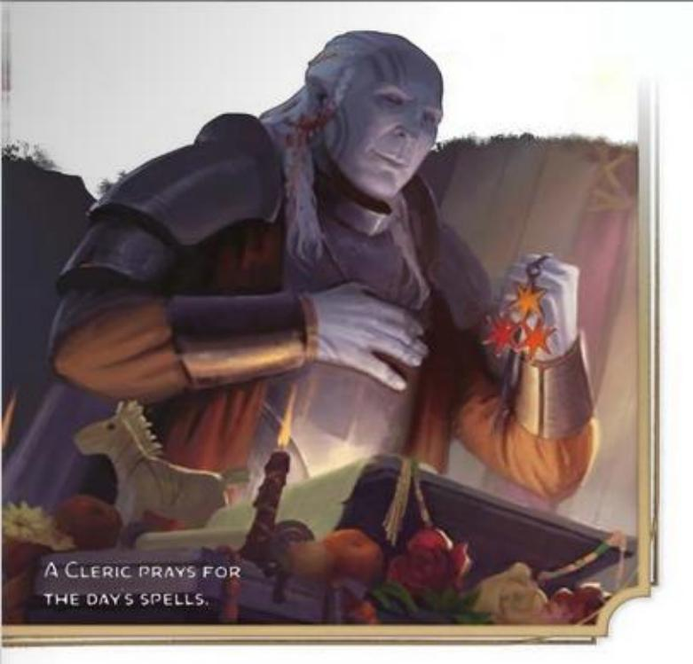
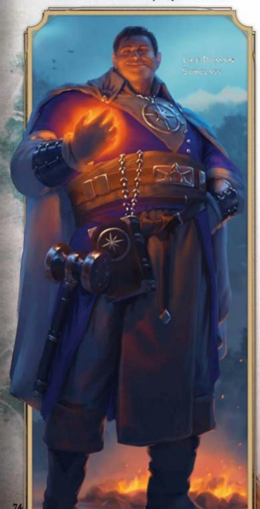
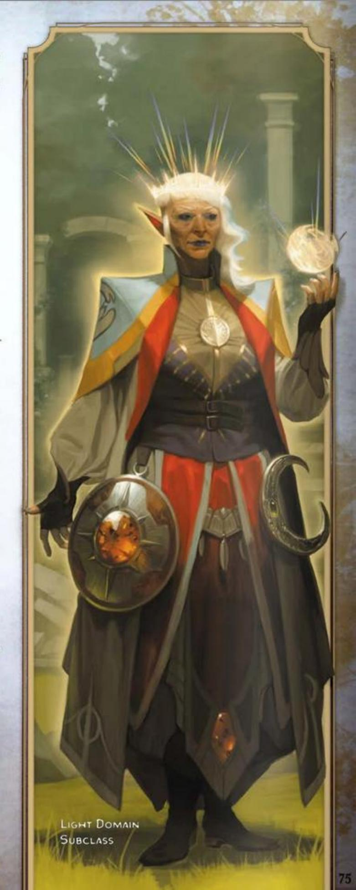
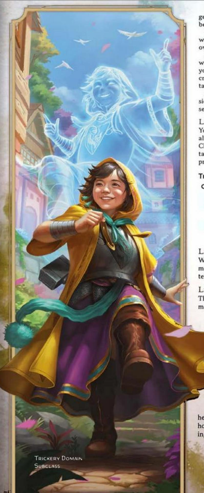
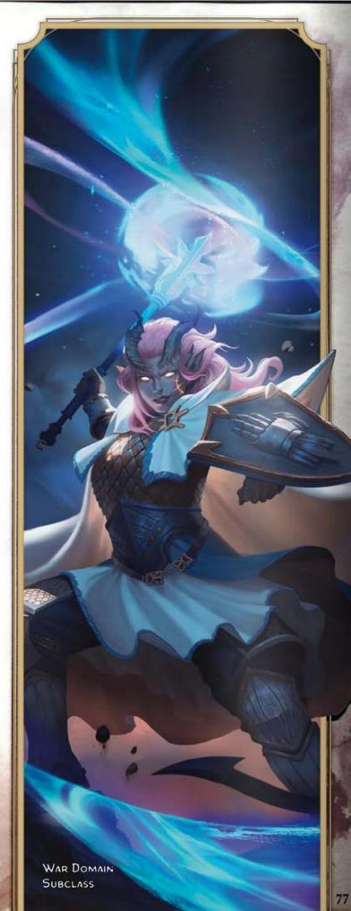
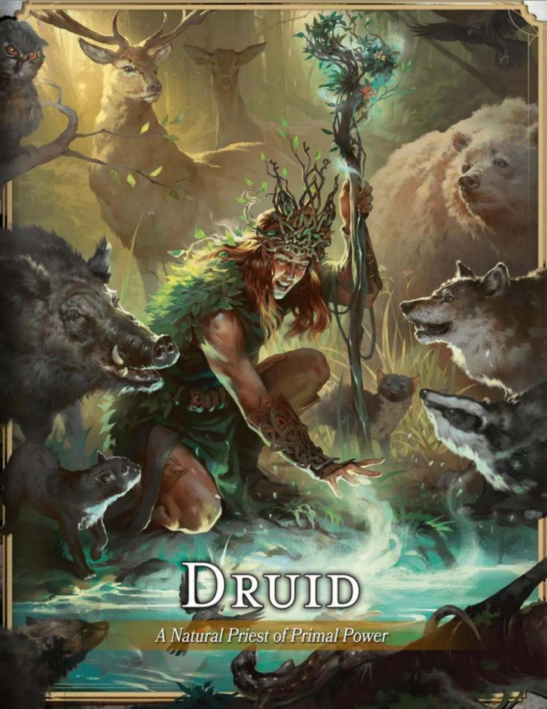

#### CORE CLERIC TRAITS

**Primary Ability** Wisdom

**Hit Point Die** d8 per Cleric level

**Saving Throws** Wisdom and Charisma

**Proficiencies**

**Skill Proficiencies** Choose 2: History, Insight, Medicine, Persuasion, or Religion

**Weapon Proficiencies** Simple weapons

**Armor Training** Light and Medium armor and Shields

**Starting Equipment** Choose A or B: (A) Chain Shirt, Shield, Mace, Holy Symbol, Priest's Pack, and 7 GP; or (B) 110 GP

CLERICS DRAW POWER FROM THE REALMS of the gods and harness it to work miracles. Blessed by a deity, a pantheon, or another immortal entity, a Cleric can reach out to the divine magic of the Outer Planes—where gods dwell—and channel it to bolster people and battle foes.

Because their power is a divine gift, Clerics typically associate themselves with temples dedicated to the deity or other immortal force that unlocked their magic. Harnessing divine magic doesn't rely on specific training, yet Clerics might learn prayers and rites that help them draw on power from the Outer Planes.

Not every member of a temple or shrine is a Cleric. Some priests are called to a simple life of temple service, carrying out their devotion through prayer and rituals, not through magic. Many mortals claim to speak for the gods, but few can marshal the power of those gods the way a Cleric can.

## BECOMING A CLERIC

#### AS A LEVEL 1 CHARACTER

- Gain all the traits in the Core Cleric Traits table.
- Gain the Cleric's level 1 features, which are listed in the Cleric Features table.

#### AS A MULTICLASS CHARACTER

- Gain the following traits from the Core Cleric Traits table: Hit Point Die and training with Light and Medium armor and Shields.
- Gain the Cleric's level 1 features, which are listed in the Cleric Features table. See the multiclassing rules in chapter 2 to determine your available spell slots.

#### CLERIC CLASS FEATURES

As a Cleric, you gain the following class features when you reach the specified Cleric levels. These features are listed in the Cleric Features table.

#### LEVEL 1: SPELLCASTING

You have learned to cast spells through prayer and meditation. See chapter 7 for the rules on spellcasting. The information below details how you use those rules with Cleric spells, which appear on the Cleric spell list later in the class's description.

Cantrips. You know three cantrips of your choice from the Cleric spell list. Guidance, Sacred Flame, and Thaumaturgy are recommended.

Whenever you gain a Cleric level, you can replace one of your cantrips with another cantrip of your choice from the Cleric spell list.

When you reach Cleric levels 4 and 10, you learn another cantrip of your choice from the Cleric spell list, as shown in the Cantrips column of the Cleric Features table.

Spell Slots. The Cleric Features table shows how many spell slots you have to cast your level 1+ spells. You regain all expended slots when you finish a Long Rest.

Prepared Spells of Level 1+. You prepare the list of level 1+ spells that are available for you to cast with this feature. To start, choose four level 1 spells from the Cleric spell list. Bless, Cure Wounds, Guiding Bolt, and Shield of Faith are recommended.

The number of spells on your list increases as you gain Cleric levels, as shown in the Prepared Spells column of the Cleric Features table. Whenever that number increases, choose additional spells from the Cleric spell list until the number of spells on your list matches the number on the table. The chosen spells must be of a level for which you have spell slots. For example, if you're a level 3 Cleric, your list of prepared spells can include six spells of levels 1 and 2 in any combination.

If another Cleric feature gives you spells that you always have prepared, those spells don't count against the number of spells you can prepare with this feature, but those spells otherwise count as Cleric spells for you.

Changing Your Prepared Spells. Whenever you finish a Long Rest, you can change your list of prepared spells, replacing any of the spells there with other Cleric spells for which you have spell slots.

Spellcasting Ability. Wisdom is your spellcasting ability for your Cleric spells.

Spellcasting Focus. You can use a Holy Symbol as a Spellcasting Focus for your Cleric spells.

#### CLERIC FEATURES

| Level | Proficiency Bonus | Class Features              | Channel Divinity | Cantrips | Prepared Spells | 1 | 2 | 3 | 4 | 5 | 6 | 7 | 8 | 9 |
|-------|----------------------|-----------------------------|---------------------|----------|--------------------|---|---|---|---|---|---|---|---|---|
| 1     | +2                   | Spellcasting, Divine Order  | —                   | 3        | 4                  | 2 | — | — | — | — | — | — | — | — |
| 2     | +2                   | Channel Divinity            | 2                   | 3        | 5                  | 3 | — | — | — | — | — | — | — | — |
| 3     | +2                   | Cleric Subclass             | 2                   | 3        | 6                  | 4 | 2 | — | — | — | — | — | — | — |
| 4     | +2                   | Ability Score Improvement   | 2                   | 4        | 7                  | 4 | 3 | — | — | — | — | — | — | — |
| 5     | +3                   | Sear Undead                 | 2                   | 4        | 9                  | 4 | 3 | 2 | — | — | — | — | — | — |
| 6     | +3                   | Subclass feature            | 3                   | 4        | 10                 | 4 | 3 | 3 | — | — | — | — | — | — |
| 7     | +3                   | Blessed Strikes             | 3                   | 4        | 11                 | 4 | 3 | 3 | 1 | — | — | — | — | — |
| 8     | +3                   | Ability Score Improvement   | 3                   | 4        | 12                 | 4 | 3 | 3 | 2 | — | — | — | — | — |
| 9     | +4                   | —                           | 3                   | 4        | 14                 | 4 | 3 | 3 | 3 | 1 | — | — | — | — |
| 10    | +4                   | Divine Intervention         | 3                   | 5        | 15                 | 4 | 3 | 3 | 3 | 2 | — | — | — | — |
| 11    | +4                   | —                           | 3                   | 5        | 16                 | 4 | 3 | 3 | 3 | 2 | 1 | — | — | — |
| 12    | +4                   | Ability Score Improvement   | 3                   | 5        | 16                 | 4 | 3 | 3 | 3 | 2 | 1 | — | — | — |
| 13    | +5                   | —                           | 3                   | 5        | 17                 | 4 | 3 | 3 | 3 | 2 | 1 | 1 | — | — |
| 14    | +5                   | Improved Blessed Strikes    | 3                   | 5        | 17                 | 4 | 3 | 3 | 3 | 2 | 1 | 1 | — | — |
| 15    | +5                   | —                           | 3                   | 5        | 18                 | 4 | 3 | 3 | 3 | 2 | 1 | 1 | 1 | — |
| 16    | +5                   | Ability Score Improvement   | 3                   | 5        | 18                 | 4 | 3 | 3 | 3 | 2 | 1 | 1 | 1 | — |
| 17    | +6                   | Subclass feature            | 3                   | 5        | 19                 | 4 | 3 | 3 | 3 | 2 | 1 | 1 | 1 | 1 |
| 18    | +6                   | —                           | 3                   | 5        | 20                 | 4 | 3 | 3 | 3 | 3 | 1 | 1 | 1 | 1 |
| 19    | +6                   | Epic Boon                   | 4                   | 5        | 21                 | 4 | 3 | 3 | 3 | 3 | 2 | 1 | 1 | 1 |
| 20    | +6                   | Greater Divine Intervention | 4                   | 5        | 22                 | 4 | 3 | 3 | 3 | 3 | 2 | 2 | 1 | 1 |

#### LEVEL 1: DIVINE ORDER

You have dedicated yourself to one of the following sacred roles of your choice.

Protector. Trained for battle, you gain proficiency with Martial weapons and training with Heavy armor.

Thaumaturge. You know one extra cantrip from the Cleric spell list. In addition, your mystical connection to the divine gives you a bonus to your Intelligence (Arcana or Religion) checks. The bonus equals your Wisdom modifier (minimum of +1).

#### LEVEL 2: CHANNEL DIVINITY

You can channel divine energy directly from the Outer Planes to fuel magical effects. You start with two such effects: Divine Spark and Turn Undead, each of which is described below. Each time you use this class's Channel Divinity, choose which Channel Divinity effect from this class to create. You gain additional effect options at higher Cleric levels.

You can use this class's Channel Divinity twice. You regain one of its expended uses when you finish a Short Rest, and you regain all expended uses when you finish a Long Rest. You gain additional uses when you reach certain Cleric levels, as shown in the Channel Divinity column of the Cleric Features table.

If a Channel Divinity effect requires a saving throw, the DC equals the spell save DC from this class's Spellcasting feature.

Divine Spark. As a Magic action, you point your Holy Symbol at another creature you can see within 30 feet of yourself and focus divine energy at it. Roll 1d8 and add your Wisdom modifier. You either restore Hit Points to the creature equal to that total or force the creature to make a Constitution saving throw. On a failed save, the creature takes Necrotic or Radiant damage (your choice) equal to that total. On a successful save, the creature takes half as much damage (round down).

You roll an additional d8 when you reach Cleric levels 7 (2d8), 13 (3d8), and 18 (4d8).

Turn Undead. As a Magic action, you present your Holy Symbol and censure Undead creatures. Each Undead of your choice within 30 feet of you must make a Wisdom saving throw. If the creature fails its save, it has the Frightened and Incapacitated conditions for 1 minute. For that duration, it tries to move as far from you as it can on its turns. This effect ends early on the creature if it takes any damage, if you have the Incapacitated condition, or if you die.

#### LEVEL 3: CLERIC SUBCLASS

You gain a Cleric subclass of your choice. The Life Domain, Light Domain, Trickery Domain, and War Domain subclasses are detailed after this class's description. A subclass is a specialization that grants you features at certain Cleric levels. For the rest of your career, you gain each of your subclass's features that are of your Cleric level or lower.

#### LEVEL 4: ABILITY SCORE IMPROVEMENT

You gain the Ability Score Improvement feat (see chapter 5) or another feat of your choice for which you qualify. You gain this feature again at Cleric levels 8, 12, and 16.

#### LEVEL 5: SEAR UNDEAD

Whenever you use Turn Undead, you can roll a number of d8s equal to your Wisdom modifier (minimum of 1d8) and add the rolls together. Each Undead that fails its saving throw against that use of Turn Undead takes Radiant damage equal to the roll's total. This damage doesn't end the turn effect.

#### LEVEL 7: BLESSED STRIKES

Divine power infuses you in battle. You gain one of the following options of your choice (if you get either option from a Cleric subclass in an older book, use only the option you choose for this feature).

Divine Strike. Once on each of your turns when you hit a creature with an attack roll using a weapon, you can cause the target to take an extra 1d8 Necrotic or Radiant damage (your choice).

Potent Spellcasting. Add your Wisdom modifier to the damage you deal with any Cleric cantrip.

#### LEVEL 10: DIVINE INTERVENTION

You can call on your deity or pantheon to intervene on your behalf. As a Magic action, choose any Cleric spell of level 5 or lower that doesn't require a Reaction to cast. As part of the same action, you cast that spell without expending a spell slot or needing Material components. You can't use this feature again until you finish a Long Rest.

#### LEVEL 14: IMPROVED BLESSED STRIKES

The option you chose for Blessed Strikes grows more powerful.

**Divine Strike.** The extra damage of your Divine Strike increases to 2d8.

Potent Spellcasting. When you cast a Cleric cantrip and deal damage to a creature with it, you can give vitality to yourself or another creature within 60 feet of yourself, granting a number of Temporary Hit Points equal to twice your Wisdom modifier.

#### LEVEL 19: EPIC BOON

You gain an Epic Boon feat (see chapter 5) or another feat of your choice for which you qualify. Boon of Fate is recommended.

#### LEVEL 20: GREATER DIVINE INTERVENTION

You can call on even more powerful divine intervention. When you use your Divine Intervention feature, you can choose Wish when you select a spell. If you do so, you can't use Divine Intervention again until you finish 2d4 Long Rests.

# CLERIC SPELL LIST

This section presents the Cleric spell list. The spells are organized by spell level and then alphabetized, and each spell's school of magic is listed. In the Special column, C means the spell requires Concentration, R means it's a Ritual, and M means it requires a specific Material component.

### CANTRIPS (LEVEL 0 CLERIC SPELLS)

| Spell            | School        | Special |
|------------------|---------------|---------|
| Guidance         | Divination    | C       |
| Light            | Evocation     | —       |
| Mending          | Transmutation | —       |
| Resistance       | Abjuration    | C       |
| Sacred Flame     | Evocation     | —       |
| Spare the Dying  | Necromancy    | —       |
| Thaumaturgy      | Transmutation | —       |
| Toll the Dead    | Necromancy    | —       |
| Word of Radiance | Evocation     | —       |

### LEVEL 1 CLERIC SPELLS

| Spell                            | School        | Special |
|----------------------------------|---------------|---------|
| Bane                             | Enchantment   | C       |
| Bless                            | Enchantment   | C, M    |
| Command                          | Enchantment   | —       |
| Create or Destroy Water          | Transmutation | —       |
| Cure Wounds                      | Abjuration    | —       |
| Detect Evil and Good             | Divination    | C       |
| Detect Magic                     | Divination    | C, R    |
| Detect Poison and Disease        | Divination    | C, R    |
| Guiding Bolt                     | Evocation     | —       |
| Healing Word                     | Abjuration    | —       |
| Inflict Wounds                   | Necromancy    | —       |
| Protection from Evil and Good | Abjuration    | C, M    |
| Purify Food and Drink            | Transmutation | R       |
| Sanctuary                        | Abjuration    | —       |
| Shield of Faith                  | Abjuration    | C       |

### LEVEL 2 CLERIC SPELLS

| Spell                  | School        | Special |
|------------------------|---------------|---------|
| Aid                    | Abjuration    | —       |
| Augury                 | Divination    | R, M    |
| Blindness/Deafness     | Transmutation | —       |
| Calm Emotions          | Enchantment   | C       |
| Continual Flame        | Evocation     | M       |
| Enhance Ability        | Transmutation | C       |
| Find Traps             | Divination    | —       |
| Gentle Repose          | Necromancy    | R, M    |
| Hold Person            | Enchantment   | C       |
| Lesser Restoration     | Abjuration    | —       |
| Locate Object          | Divination    | C       |
| Prayer of Healing      | Abjuration    | —       |
| Protection from Poison | Abjuration    | —       |
| Silence                | Illusion      | C, R    |
| Spiritual Weapon       | Evocation     | C       |
| Warding Bond           | Abjuration    | M       |
| Zone of Truth          | Enchantment   | —       |

### LEVEL 3 CLERIC SPELLS

| Spell                  | School        | Special |
|------------------------|---------------|---------|
| Animate Dead           | Necromancy    | —       |
| Aura of Vitality       | Abjuration    | C       |
| Beacon of Hope         | Abjuration    | C       |
| Bestow Curse           | Necromancy    | C       |
| Clairvoyance           | Divination    | C, M    |
| Create Food and Water  | Conjuration   | —       |
| Daylight               | Evocation     | —       |
| Dispel Magic           | Abjuration    | —       |
| Feign Death            | Necromancy    | R       |
| Glyph of Warding       | Abjuration    | M       |
| Magic Circle           | Abjuration    | M       |
| Mass Healing Word      | Abjuration    | —       |
| Meld into Stone        | Transmutation | R       |
| Protection from Energy | Abjuration    | C       |
| Remove Curse           | Abjuration    | —       |
| Revivify               | Necromancy    | M       |
| Sending                | Divination    | —       |
| Speak with Dead        | Necromancy    | —       |
| Spirit Guardians       | Conjuration   | C       |
| Tongues                | Divination    | —       |
| Water Walk             | Transmutation | R       |

### LEVEL 4 CLERIC SPELLS

| Spell               | School        | Special |
|---------------------|---------------|---------|
| Aura of Life        | Abjuration    | C       |
| Aura of Purity      | Abjuration    | C       |
| Banishment          | Abjuration    | C       |
| Control Water       | Transmutation | C       |
| Death Ward          | Abjuration    | —       |
| Divination          | Divination    | R, M    |
| Freedom of Movement | Abjuration    | —       |
| Guardian of Faith   | Conjuration   | —       |
| Locate Creature     | Divination    | C       |
| Stone Shape         | Transmutation | —       |

### LEVEL 5 CLERIC SPELLS

| Spell                | School      | Special |
|----------------------|-------------|---------|
| Circle of Power      | Abjuration  | C       |
| Commune              | Divination  | R       |
| Contagion            | Necromancy  | —       |
| Dispel Evil and Good | Abjuration  | C       |
| Flame Strike         | Evocation   | —       |
| Geas                 | Enchantment | —       |
| Greater Restoration  | Abjuration  | M       |
| Hallow               | Abjuration  | M       |
| Insect Plague        | Conjuration | C       |
| Legend Lore          | Divination  | M       |
| Mass Cure Wounds     | Abjuration  | —       |
| Planar Binding       | Abjuration  | M       |
| Raise Dead           | Necromancy  | M       |
| Scrying              | Divination  | C, M    |
| Summon Celestial     | Conjuration | C, M    |

### LEVEL 6 CLERIC SPELLS

| Spell          | School      | Special |
|----------------|-------------|---------|
| Blade Barrier  | Evocation   | C       |
| Create Undead  | Necromancy  | M       |
| Find the Path  | Divination  | C, M    |
| Forbiddance    | Abjuration  | R, M    |
| Harm           | Necromancy  | —       |
| Heal           | Abjuration  | —       |
| Heroes' Feast  | Conjuration | M       |
| Planar Ally    | Conjuration | —       |
| Sunbeam        | Evocation   | C       |
| True Seeing    | Divination  | M       |
| Word of Recall | Conjuration | —       |

### LEVEL 7 CLERIC SPELLS

| Spell              | School        | Special |
|--------------------|---------------|---------|
| Conjure Celestial  | Conjuration   | C       |
| Divine Word        | Evocation     | —       |
| Etherealness       | Conjuration   | —       |
| Fire Storm         | Evocation     | —       |
| Plane Shift        | Conjuration   | M       |
| Power Word Fortify | Enchantment   | —       |
| Regenerate         | Transmutation | —       |
| Resurrection       | Necromancy    | M       |
| Symbol             | Abjuration    | M       |

### LEVEL 8 CLERIC SPELLS

| Spell           | School        | Special |
|-----------------|---------------|---------|
| Antimagic Field | Abjuration    | C       |
| Control Weather | Transmutation | C       |
| Earthquake      | Transmutation | C       |
| Holy Aura       | Abjuration    | C, M    |
| Sunburst        | Evocation     | —       |

### LEVEL 9 CLERIC SPELLS

| Spell             | School      | Special |
|-------------------|-------------|---------|
| Astral Projection | Necromancy  | M       |
| Gate              | Conjuration | C, M    |
| Mass Heal         | Abjuration  | —       |
| Power Word Heal   | Enchantment | —       |
| True Resurrection | Necromancy  | M       |

# CLERIC SUBCLASSES

A Cleric subclass is a specialization that grants you features at certain Cleric levels, as specified in the subclass. Each Cleric subclass is named after a domain of existence that is favored by a god, pantheon, or religious order. This section presents the Life Domain, Light Domain, Trickery Domain, and War Domain subclasses.

# LIFE DOMAIN

Soothe the Hurts of the World

The Life Domain focuses on the positive energy that helps sustain all life in the multiverse. Clerics who tap into this domain are masters of healing, using that life force to cure many hurts.

Existence itself relies on the positive energy associated with this domain, so a Cleric of almost any religious tradition might choose it. This domain is particularly associated with agricultural deities, gods of healing or endurance, and gods of home and community. Religious orders of healing also seek the magic of this domain.

#### LEVEL 3: DISCIPLE OF LIFE

When a spell you cast with a spell slot restores Hit Points to a creature, that creature regains additional Hit Points on the turn you cast the spell. The additional Hit Points equal 2 plus the spell slot's level.

#### LEVEL 3: LIFE DOMAIN SPELLS

Your connection to this divine domain ensures you always have certain spells ready. When you reach a Cleric level specified in the Life Domain Spells table, you thereafter always have the listed spells prepared.

| Cleric Level | Prepared Spells                                    |
|--------------|----------------------------------------------------|
| 3            | Aid, Bless, Cure Wounds, Lesser Restoration        |
| 5            | Mass Healing Word, Revivify                        |
| 7            | Aura of Life, Death Ward                           |
| 9            | Greater Restoration, Mass Cure Wounds              |

#### LEVEL 3: PRESERVE LIFE

As a Magic action, you present your Holy Symbol and expend a use of your Channel Divinity to evoke healing energy that can restore a number of Hit Points equal to five times your Cleric level. Choose Bloodied creatures within 30 feet of yourself (which can include you), and divide those Hit Points among them. This feature can restore a creature to no more than half its Hit Point maximum.

#### LEVEL 6: BLESSED HEALER

The healing spells you cast on others heal you as well. Immediately after you cast a spell with a spell slot that restores Hit Points to one or more creatures other than yourself, you regain Hit Points equal to 2 plus the spell slot's level.

#### LEVEL 17: SUPREME HEALING

When you would normally roll one or more dice to restore Hit Points to a creature with a spell or Channel Divinity, don't roll those dice for the healing; instead use the highest number possible for each die. For example, instead of restoring 2d6 Hit Points to a creature with a spell, you restore 12.

# LIGHT DOMAIN

Bring Light to Banish Darkness

The Light Domain emphasizes the divine power to bring about blazing fire and revelation. Clerics who wield this power are enlightened souls infused with radiance and the power of their deities' discerning vision, charged with chasing away lies and burning away darkness.

The Light Domain is associated with gods of truth, vigilance, beauty, insight, and renewal. Some of these gods are identified with the sun or as charioteers who guide the sun across the sky. Others are sentinels who pierce deception. Some are deities of beauty and artistry who teach that art is a vehicle for the soul's improvement.

#### LEVEL 3: LIGHT DOMAIN SPELLS

Your connection to this divine domain ensures you always have certain spells ready. When you reach a Cleric level specified in the Light Domain Spells table, you thereafter always have the listed spells prepared.

| Cleric Level | Prepared Spells                                           |
|--------------|-----------------------------------------------------------|
| 3            | Burning Hands, Faerie Fire, Scorching Ray, See Invisibility |
| 5            | Daylight, Fireball                                        |
| 7            | Arcane Eye, Wall of Fire                                  |
| 9            | Flame Strike, Scrying                                     |

#### LEVEL 3: RADIANCE OF THE DAWN

As a Magic action, you present your Holy Symbol and expend a use of your Channel Divinity to emit a flash of light in a 30-foot Emanation originating from yourself. Any magical Darkness—such as that created by the *Darkness* spell—in that area is dispelled. Additionally, each creature of your choice in that area must make a Constitution saving throw, taking Radiant damage equal to 2d10 plus your Cleric level on a failed save or half as much damage on a successful one.

#### LEVEL 3: WARDING FLARE

When a creature that you can see within 30 feet of yourself makes an attack roll, you can take a Reaction to impose Disadvantage on the attack roll, causing light to flare before it hits or misses.

You can use this feature a number of times equal to your Wisdom modifier (minimum of once). You regain all expended uses when you finish a Long Rest.

#### LEVEL 6: IMPROVED WARDING FLARE

You regain all expended uses of your Warding Flare when you finish a Short or Long Rest.

In addition, whenever you use Warding Flare, you can give the target of the triggering attack a number of Temporary Hit Points equal to 2d6 plus your Wisdom modifier.

#### LEVEL 17: CORONA OF LIGHT

As a Magic action, you cause yourself to emit an aura of sunlight that lasts for 1 minute or until you dismiss it (no action required). You emit Bright Light in a 60-foot radius and Dim Light for an additional 30 feet. Your enemies in the Bright Light have Disadvantage on saving throws against your Radiance of the Dawn and any spell that deals Fire or Radiant damage.

You can use this feature a number of times equal to your Wisdom modifier (minimum of once), and you regain all expended uses when you finish a Long Rest.

# TRICKERY DOMAIN

Make Mischief and Challenge Authority

The Trickery Domain offers magic of deception, illusion, and stealth. Clerics who wield this magic are a disruptive force in the world, puncturing pride, mocking tyrants, freeing captives, and flouting hollow traditions. They prefer subterfuge and pranks to direct confrontation.

Gods of trickery are mischief-makers and instigators who stand as a constant challenge to the accepted order among both gods and mortals. They embody the forces of change and social upheaval, and they're patrons of thieves, scoundrels, gamblers, rebels, and liberators. Religious orders that operate in secret, especially those that seek to undermine oppressive governments or hierarchies, also draw on the power of the Trickery Domain.

#### LEVEL 3: BLESSING OF THE TRICKSTER

As a Magic action, you can choose yourself or a willing creature within 30 feet of yourself to have Advantage on Dexterity (Stealth) checks. This blessing lasts until you finish a Long Rest or you use this feature again.

#### LEVEL 3: INVOKE DUPLICITY

As a Bonus Action, you can expend one use of your Channel Divinity to create a perfect visual illusion of yourself in an unoccupied space you can see within 30 feet of yourself. The illusion is intangible and doesn't occupy its space. It lasts for 1 minute, but it ends early if you dismiss it (no action required) or have the Incapacitated condition. The illusion is animated and mimics your expressions and gestures. While it persists, you gain the following benefits.

Cast Spells. You can cast spells as though you were in the illusion's space, but you must use your own senses.

Distract. When both you and your illusion are within 5 feet of a creature that can see the illusion, you have Advantage on attack rolls against that creature, given how distracting the illusion is to the target.

Move. As a Bonus Action, you can move the illusion up to 30 feet to an unoccupied space you can see that is within 120 feet of yourself.

#### LEVEL 3: TRICKERY DOMAIN SPELLS

Your connection to this divine domain ensures you always have certain spells ready. When you reach a Cleric level specified in the Trickery Domain Spells table, you thereafter always have the listed spells prepared.

| Cleric Level | Prepared Spells                                                  |
|--------------|------------------------------------------------------------------|
| 3            | Charm Person, Disguise Self, Invisibility, Pass without Trace    |
| 5            | Hypnotic Pattern, Nondetection                                   |
| 7            | Confusion, Dimension Door                                        |
| 9            | Dominate Person, Modify Memory                                   |

#### LEVEL 6: TRICKSTER'S TRANSPOSITION

Whenever you take the Bonus Action to create or move the illusion of your Invoke Duplicity, you can teleport, swapping places with the illusion.

#### LEVEL 17: IMPROVED DUPLICITY

The illusion of your Invoke Duplicity has grown more powerful in the following ways.

Shared Distraction. When you and your allies make attack rolls against a creature within 5 feet of the illusion, the attack rolls have Advantage.

Healing Illusion. When the illusion ends, you or a creature of your choice within 5 feet of it regains a number of Hit Points equal to your Cleric level.

# WAR DOMAIN

Inspire Valor and Smite Foes

War has many manifestations. It can make heroes of ordinary people. It can be desperate and horrific, with acts of cruelty and cowardice eclipsing instances of excellence and courage. Clerics who tap into the magic of the War Domain excel in battle, inspiring others to fight the good fight or offering acts of violence as prayers.

Gods of the War Domain watch over warriors and reward them for their great deeds. They include champions of honor and chivalry as well as gods of destruction and pillage. Other war gods take a more neutral stance, promoting war in all its manifestations and supporting warriors in any circumstance.

#### LEVEL 3: GUIDED STRIKE

When you or a creature within 30 feet of you misses with an attack roll, you can expend one use of your Channel Divinity and give that roll a +10 bonus, potentially causing it to hit. When you use this feature to benefit another creature's attack roll, you must take a Reaction to do so.

#### LEVEL 3: WAR DOMAIN SPELLS

Your connection to this divine domain ensures you always have certain spells ready. When you reach a Cleric level specified in the War Domain Spells table, you thereafter always have the listed spells prepared.

| Cleric Level | Prepared Spells                                                  |
|--------------|------------------------------------------------------------------|
| 3            | Guiding Bolt, Magic Weapon, Shield of Faith, Spiritual Weapon    |
| 5            | Crusader's Mantle, Spirit Guardians                              |
| 7            | Fire Shield, Freedom of Movement                                 |
| 9            | Hold Monster, Steel Wind Strike                                  |

#### LEVEL 3: WAR PRIEST

As a Bonus Action, you can make one attack with a weapon or an Unarmed Strike. You can use this Bonus Action a number of times equal to your Wisdom modifier (minimum of once). You regain all expended uses when you finish a Short or Long Rest.

#### LEVEL 6: WAR GOD'S BLESSING

You can expend a use of your Channel Divinity to cast Shield of Faith or Spiritual Weapon rather than expending a spell slot. When you cast either spell in this way, the spell doesn't require Concentration. Instead the spell lasts for 1 minute, but it ends early if you cast that spell again, have the Incapacitated condition, or die.

#### LEVEL 17: AVATAR OF BATTLE

You gain Resistance to Bludgeoning, Piercing, and Slashing damage.

