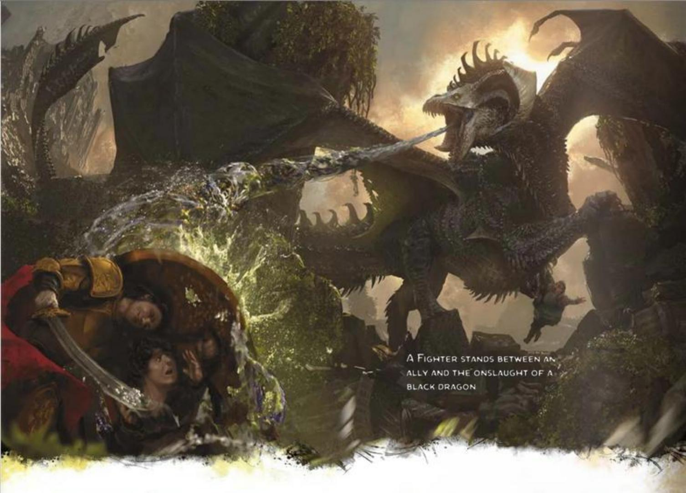
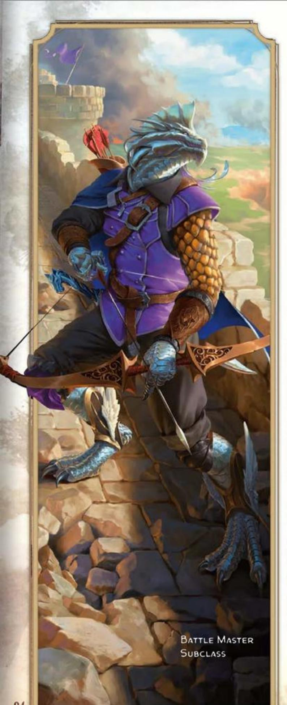
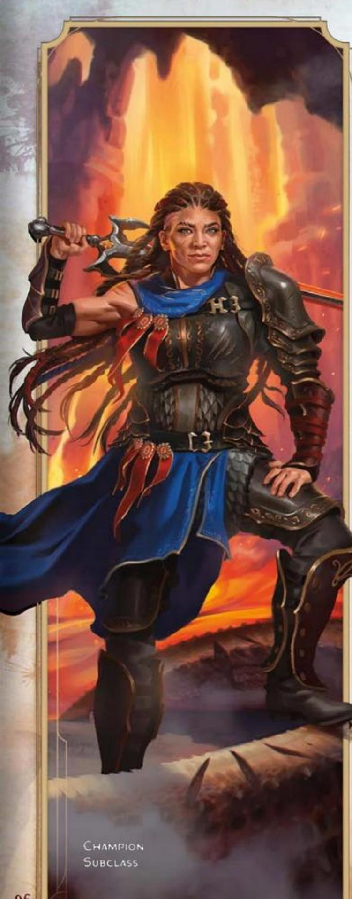
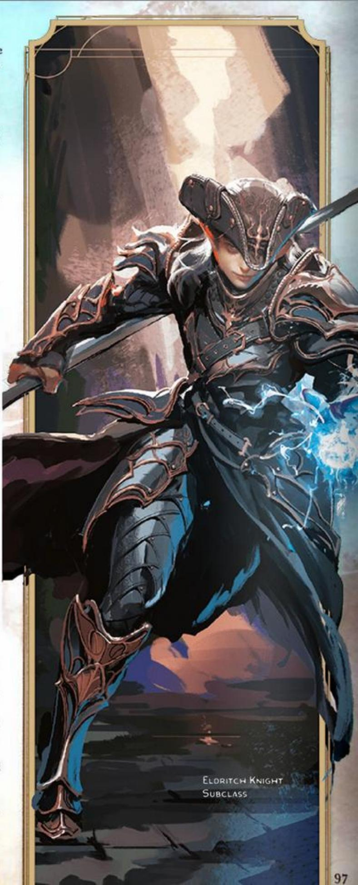
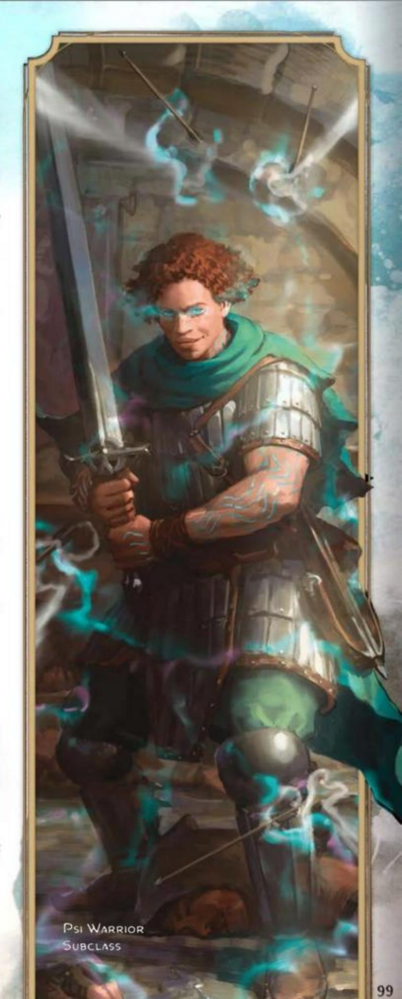
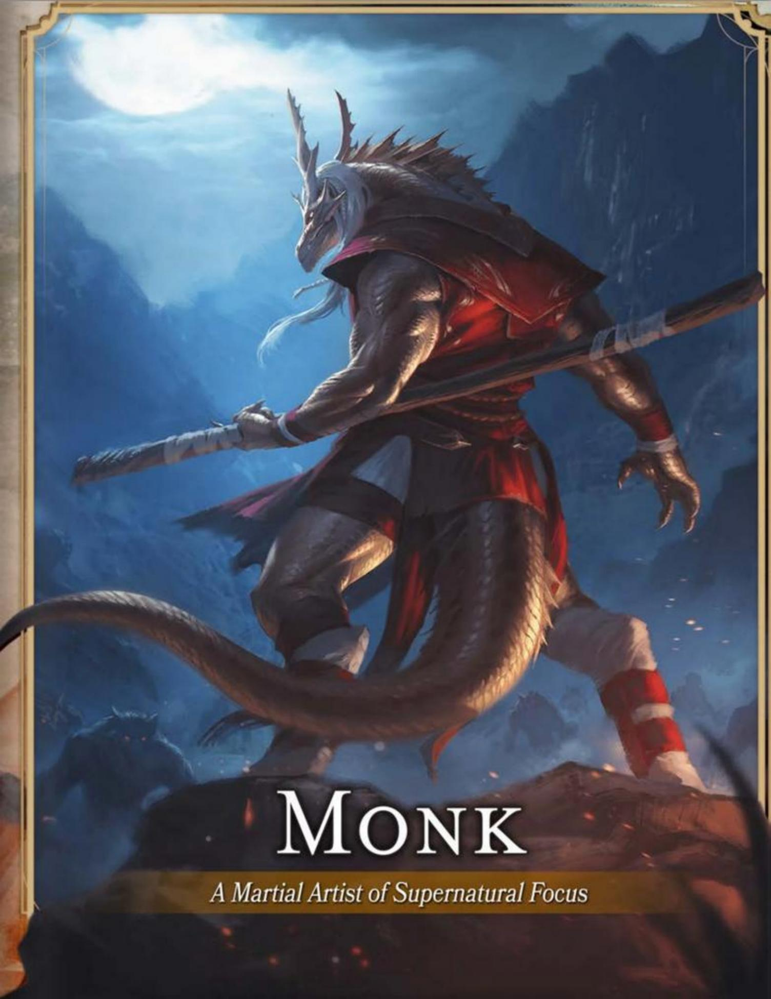

#### CORE FIGHTER TRAITS

| Trait | Detail |
|-------|--------|
| **Primary Ability** | Strength or Dexterity |
| **Hit Point Die** | D10 per Fighter level |
| **Saving Throw Proficiencies** | Strength and Constitution |
| **Skill Proficiencies** | Choose 2: Acrobatics, Animal Handling, Athletics, History, Insight, Intimidation, Persuasion, Perception, or Survival |
| **Weapon Proficiencies** | Simple and Martial weapons |
| **Armor Training** | Light, Medium, and Heavy armor and Shields |
| **Starting Equipment** | Choose A, B, or C: (A) Chain Mail, Greatsword, Flail, 8 Javelins, Dungeoneer's Pack, and 4 GP; (B) Studded Leather Armor, Scimitar, Shortsword, Longbow, 20 Arrows, Quiver, Dungeoneer's Pack, and 11 GP; or (C) 155 GP |

Questing knights, royal champions, elite soldiers, and hardened mercenaries—as Fighters, they all share an unparalleled prowess with weapons and armor. And they are well acquainted with death, both meting it out and defying it.

Fighters master various weapon techniques, and a well-equipped Fighter always has the right tool at hand for any combat situation. Likewise, a Fighter is adept with every form of armor. Beyond that basic degree of familiarity, each Fighter specializes in certain styles of combat. Some concentrate on archery, some on fighting with two weapons at once, and some on augmenting their martial skills with magic. This combination of broad ability and extensive specialization makes Fighters superior combatants.

## BECOMING A FIGHTER

#### AS A LEVEL 1 CHARACTER

- Gain all the traits in the Core Fighter Traits table.
- Gain the Fighter's level 1 features, which are listed in the Fighter Features table.

#### AS A MULTICLASS CHARACTER

- Gain the following traits from the Core Fighter Traits table: Hit Point Die, proficiency with Martial weapons, and training with Light and Medium armor and Shields.
- Gain the Fighter's level 1 features, which are listed in the Fighter Features table.

## FIGHTER CLASS FEATURES

As a Fighter, you gain the following class features when you reach the specified Fighter levels. These features are listed on the Fighter Features table.

#### LEVEL 1: FIGHTING STYLE

You have honed your martial prowess and gain a Fighting Style feat of your choice (see chapter 5). Defense is recommended.

Whenever you gain a Fighter level, you can replace the feat you chose with a different Fighting Style feat.

#### LEVEL 1: SECOND WIND

You have a limited well of physical and mental stamina that you can draw on. As a Bonus Action, you can use it to regain Hit Points equal to 1d10 plus your Fighter level.

You can use this feature twice. You regain one expended use when you finish a Short Rest, and you regain all expended uses when you finish a Long Rest.

When you reach certain Fighter levels, you gain more uses of this feature, as shown in the Second Wind column of the Fighter Features table.

#### LEVEL 1: WEAPON MASTERY

Your training with weapons allows you to use the mastery properties of three kinds of Simple or Martial weapons of your choice. Whenever you finish a Long Rest, you can practice weapon drills and change one of those weapon choices.

When you reach certain Fighter levels, you gain the ability to use the mastery properties of more kinds of weapons, as shown in the Weapon Mastery column of the Fighter Features table.

#### LEVEL 2: ACTION SURGE

You can push yourself beyond your normal limits for a moment. On your turn, you can take one additional action, except the Magic action.

Once you use this feature, you can't do so again until you finish a Short or Long Rest. Starting at level 17, you can use it twice before a rest but only once on a turn.

#### LEVEL 2: TACTICAL MIND

You have a mind for tactics on and off the battlefield. When you fail an ability check, you can expend a use of your Second Wind to push yourself toward success. Rather than regaining Hit Points, you roll 1d10 and add the number rolled to the ability check, potentially turning it into a success. If the check still fails, this use of Second Wind isn't expended.

#### FIGHTER FEATURES

| Level | Proficiency Bonus | Class Features | Second Wind | Weapon Mastery |
|-------|-------------------|----------------|-------------|----------------|
| 1 | +2 | Fighting Style, Second Wind, Weapon Mastery | 2 | 3 |
| 2 | +2 | Action Surge (one use), Tactical Mind | 2 | 3 |
| 3 | +2 | Fighter Subclass | 2 | 3 |
| 4 | +2 | Ability Score Improvement | 3 | 4 |
| 5 | +3 | Extra Attack, Tactical Shift | 3 | 4 |
| 6 | +3 | Ability Score Improvement | 3 | 4 |
| 7 | +3 | Subclass feature | 3 | 4 |
| 8 | +3 | Ability Score Improvement | 3 | 4 |
| 9 | +4 | Indomitable (one use), Tactical Master | 3 | 4 |
| 10 | +4 | Subclass feature | 4 | 5 |
| 11 | +4 | Two Extra Attacks | 4 | 5 |
| 12 | +4 | Ability Score Improvement | 4 | 5 |
| 13 | +5 | Indomitable (two uses), Studied Attacks | 4 | 5 |
| 14 | +5 | Ability Score Improvement | 4 | 5 |
| 15 | +5 | Subclass feature | 4 | 5 |
| 16 | +5 | Ability Score Improvement | 4 | 6 |
| 17 | +6 | Action Surge (two uses), Indomitable (three uses) | 4 | 6 |
| 18 | +6 | Subclass feature | 4 | 6 |
| 19 | +6 | Epic Boon | 4 | 6 |
| 20 | +6 | Three Extra Attacks | 4 | 6 |

#### LEVEL 3: FIGHTER SUBCLASS

You gain a Fighter subclass of your choice. The Battle Master, Champion, Eldritch Knight, and Psi Warrior subclasses are detailed after this class's description. A subclass is a specialization that grants you features at certain Fighter levels. For the rest of your career, you gain each of your subclass's features that are of your Fighter level or lower.

#### LEVEL 4: ABILITY SCORE IMPROVEMENT

You gain the Ability Score Improvement feat (see chapter 5) or another feat of your choice for which you qualify. You gain this feature again at Fighter levels 6, 8, 12, 14, and 16.

#### LEVEL 5: EXTRA ATTACK

You can attack twice instead of once whenever you take the Attack action on your turn.

#### LEVEL 5: TACTICAL SHIFT

Whenever you activate your Second Wind with a Bonus Action, you can move up to half your Speed without provoking Opportunity Attacks.

#### LEVEL 9: INDOMITABLE

If you fail a saving throw, you can reroll it with a bonus equal to your Fighter level. You must use the new roll, and you can't use this feature again until you finish a Long Rest. You can use this feature twice before a Long Rest starting at level 13 and three times before a Long Rest starting at level 17.

#### LEVEL 9: TACTICAL MASTER

When you attack with a weapon whose mastery property you can use, you can replace that property with the Push, Sap, or Slow property for that attack.

#### LEVEL 11: TWO EXTRA ATTACKS

You can attack three times instead of once whenever you take the Attack action on your turn.

#### LEVEL 13: STUDIED ATTACKS

You study your opponents and learn from each attack you make. If you make an attack roll against a creature and miss, you have Advantage on your next attack roll against that creature before the end of your next turn.

#### LEVEL 19: EPIC BOON

You gain an Epic Boon feat (see chapter 5) or another feat of your choice for which you qualify. Boon of Combat Prowess is recommended.

#### LEVEL 20: THREE EXTRA ATTACKS

You can attack four times instead of once whenever you take the Attack action on your turn.

## FIGHTER SUBCLASSES

A Fighter subclass is a specialization that grants you features at certain levels, as specified in the subclass. This section presents the Battle Master, Champion, Eldritch Knight, and Psi Warrior subclasses.

### BATTLE MASTER

Master Sophisticated Battle Maneuvers

Battle Masters are students of the art of battle, learning martial techniques passed down through generations. The most accomplished Battle Masters are well-rounded figures who combine their carefully honed combat skills with academic study in the fields of history, theory, and the arts.

#### LEVEL 3: COMBAT SUPERIORITY

Your experience on the battlefield has refined your fighting techniques. You learn maneuvers that are fueled by special dice called Superiority Dice.

Maneuvers. You learn three maneuvers of your choice from the "Maneuver Options" section later in this subclass's description. Many maneuvers enhance an attack in some way. You can use only one maneuver per attack.

You learn two additional maneuvers of your choice when you reach Fighter levels 7, 10, and 15. Each time you learn new maneuvers, you can also replace one maneuver you know with a different one.

Superiority Dice. You have four Superiority Dice, which are d8s. A Superiority Die is expended when you use it. You regain all expended Superiority Dice when you finish a Short or Long Rest.

You gain an additional Superiority Die when you reach Fighter levels 7 (five dice total) and 15 (six dice total).

Saving Throws. If a maneuver requires a saving throw, the DC equals 8 plus your Strength or Dexterity modifier (your choice) and Proficiency Bonus.

#### LEVEL 3: STUDENT OF WAR

You gain proficiency with one type of Artisan's Tools of your choice, and you gain proficiency in one skill of your choice from the skills available to Fighters at level 1.

#### LEVEL 7: KNOW YOUR ENEMY

As a Bonus Action, you can discern certain strengths and weaknesses of a creature you can see within 30 feet of yourself; you know whether that creature has any Immunities, Resistances, or Vulnerabilities, and if the creature has any, you know what they are.

Once you use this feature, you can't do so again until you finish a Long Rest. You can also restore a use of the feature by expending one Superiority Die (no action required).

#### LEVEL 10: IMPROVED COMBAT SUPERIORITY

Your Superiority Die becomes a d10.

#### LEVEL 15: RELENTLESS

Once per turn, when you use a maneuver, you can roll 1d8 and use the number rolled instead of expending a Superiority Die.

#### LEVEL 18: ULTIMATE COMBAT SUPERIORITY

Your Superiority Die becomes a d12.

#### MANEUVER OPTIONS

The maneuvers are presented here in alphabetical order.

Ambush. When you make a Dexterity (Stealth) check or an Initiative roll, you can expend one Superiority Die and add the die to the roll, unless you have the Incapacitated condition.

Bait and Switch. When you're within 5 feet of a creature on your turn, you can expend one Superiority Die and switch places with that creature, provided you spend at least 5 feet of movement and the creature is willing and doesn't have the Incapacitated condition. This movement doesn't provoke Opportunity Attacks.

Roll the Superiority Die. Until the start of your next turn, you or the other creature (your choice) gains a bonus to AC equal to the number rolled.

Commander's Strike. When you take the Attack action on your turn, you can replace one of your attacks to direct one of your companions to strike. When you do so, choose a willing creature who can see or hear you and expend one Superiority Die. That creature can immediately use its Reaction to make one attack with a weapon or an Unarmed Strike, adding the Superiority Die to the attack's damage roll on a hit.

Commanding Presence. When you make a Charisma (Intimidation, Performance, or Persuasion) check, you can expend one Superiority Die and add that die to the roll.

Disarming Attack. When you hit a creature with an attack roll, you can expend one Superiority Die to attempt to disarm the target. Add the Superiority Die roll to the attack's damage roll. The target must succeed on a Strength saving throw or drop one object of your choice that it's holding, with the object landing in its space.

Distracting Strike. When you hit a creature with an attack roll, you can expend one Superiority Die to distract the target. Add the Superiority Die roll to the attack's damage roll. The next attack roll against the target by an attacker other than you has Advantage if the attack is made before the start of your next turn.

Evasive Footwork. As a Bonus Action, you can expend one Superiority Die and take the Disengage action. You also roll the die and add the number rolled to your AC until the start of your next turn.

Feinting Attack. As a Bonus Action, you can expend one Superiority Die to feint, choosing one creature within 5 feet of yourself as your target. You have Advantage on your next attack roll against that target this turn. If that attack hits, add the Superiority Die to the attack's damage roll.

Goading Attack. When you hit a creature with an attack roll, you can expend one Superiority Die to attempt to goad the target into attacking you. Add the Superiority Die to the attack's damage roll. The target must succeed on a Wisdom saving throw or have Disadvantage on attack rolls against targets other than you until the end of your next turn.

Lunging Attack. As a Bonus Action, you can expend one Superiority Die and take the Dash action. If you move at least 5 feet in a straight line immediately before hitting with a melee attack as part of the Attack action on this turn, you can add the Superiority Die to the attack's damage roll.

Maneuvering Attack. When you hit a creature with an attack roll, you can expend one Superiority Die to maneuver one of your comrades into another position. Add the Superiority Die roll to the attack's damage roll, and choose a willing creature who can see or hear you. That creature can use its Reaction to move up to half its Speed without provoking an Opportunity Attack from the target of your attack.

Menacing Attack. When you hit a creature with an attack roll, you can expend one Superiority Die to attempt to frighten the target. Add the Superiority Die to the attack's damage roll. The target must succeed on a Wisdom saving throw or have the Frightened condition until the end of your next turn.

Parry. When another creature damages you with a melee attack roll, you can take a Reaction and expend one Superiority Die to reduce the damage by the number you roll on your Superiority Die plus your Strength or Dexterity modifier (your choice).

Precision Attack. When you miss with an attack roll, you can expend one Superiority Die, roll that die, and add it to the attack roll, potentially causing the attack to hit.

Pushing Attack. When you hit a creature with an attack roll using a weapon or an Unarmed Strike, you can expend one Superiority Die to attempt to drive the target back. Add the Superiority Die to the attack's damage roll. If the target is Large or smaller, it must succeed on a Strength saving throw or be pushed up to 15 feet directly away from you.

Rally. As a Bonus Action, you can expend one Superiority Die to bolster the resolve of a companion. Choose an ally of yours within 30 feet of yourself who can see or hear you. That creature gains Temporary Hit Points equal to the Superiority Die roll plus half your Fighter level (round down).

Riposte. When a creature misses you with a melee attack roll, you can take a Reaction and expend one Superiority Die to make a melee attack roll with a weapon or an Unarmed Strike against the creature. If you hit, add the Superiority Die to the attack's damage.

Sweeping Attack. When you hit a creature with a melee attack roll using a weapon or an Unarmed Strike, you can expend one Superiority Die to attempt to damage another creature. Choose another creature within 5 feet of the original target and within your reach. If the original attack roll would hit the second creature, it takes damage equal to the number you roll on your Superiority Die. The damage is of the same type dealt by the original attack.

Tactical Assessment. When you make an Intelligence (History or Investigation) check or a Wisdom (Insight) check, you can expend one Superiority Die and add that die to the ability check.

Trip Attack. When you hit a creature with an attack roll using a weapon or an Unarmed Strike, you can expend one Superiority Die and add the die to the attack's damage roll. If the target is Large or smaller, it must succeed on a Strength saving throw or have the Prone condition.

### CHAMPION

Pursue Physical Excellence in Combat

A Champion focuses on the development of martial prowess in a relentless pursuit of victory. Champions combine rigorous training with physical excellence to deal devastating blows, withstand peril, and garner glory. Whether in athletic contests or bloody battle, Champions strive for the crown of the victor.

#### LEVEL 3: IMPROVED CRITICAL

Your attack rolls with weapons and Unarmed Strikes can score a Critical Hit on a roll of 19 or 20 on the d20.

#### LEVEL 3: REMARKABLE ATHLETE

Thanks to your athleticism, you have Advantage on Initiative rolls and Strength (Athletics) checks.

In addition, immediately after you score a Critical Hit, you can move up to half your Speed without provoking Opportunity Attacks.

#### LEVEL 7: ADDITIONAL FIGHTING STYLE

You gain another Fighting Style feat of your choice.

#### LEVEL 10: HEROIC WARRIOR

The thrill of battle drives you toward victory. During combat, you can give yourself Heroic Inspiration whenever you start your turn without it.

#### LEVEL 15: SUPERIOR CRITICAL

Your attack rolls with weapons and Unarmed Strikes can now score a Critical Hit on a roll of 18-20 on the d20.

#### LEVEL 18: SURVIVOR

You attain the pinnacle of resilience in battle, giving you these benefits.

Defy Death. You have Advantage on Death Saving Throws. Moreover, when you roll 18-20 on a Death Saving Throw, you gain the benefit of rolling a 20 on it.

Heroic Rally. At the start of each of your turns, you regain Hit Points equal to 5 plus your Constitution modifier if you are Bloodied and have at least 1 Hit Point.

### ELDRITCH KNIGHT

Support Combat Skills with Arcane Magic

Eldritch Knights combine the martial mastery common to all Fighters with a careful study of magic. Their spells both complement and extend their combat skills, providing additional protection to shore up their armor and also allowing them to engage many foes at once with explosive magic.

You have learned to cast spells. See chapter 7 for the rules on spellcasting. The information below details how you use those rules as an Eldritch Knight.

Cantrips. You know two cantrips of your choice from the Wizard spell list (see that class's section for its list). Ray of Frost and Shocking Grasp are recommended. Whenever you gain a Fighter level, you can replace one of these cantrips with another cantrip of your choice from the Wizard spell list.

When you reach Fighter level 10, you learn another Wizard cantrip of your choice.

Spell Slots. The Eldritch Knight Spellcasting table shows how many spell slots you have to cast your level 1+ spells. You regain all expended slots when you finish a Long Rest.

#### ELDRITCH KNIGHT SPELLCASTING

| Fighter Level | Spells Prepared | 1 | 2 | 3 | 4 |
|---------------|-----------------|---|---|---|---|
| 3 | 3 | 2 | — | — | — |
| 4 | 4 | 3 | — | — | — |
| 5 | 4 | 3 | — | — | — |
| 6 | 4 | 3 | — | — | — |
| 7 | 5 | 4 | 2 | — | — |
| 8 | 6 | 4 | 2 | — | — |
| 9 | 6 | 4 | 2 | — | — |
| 10 | 7 | 4 | 3 | — | — |
| 11 | 8 | 4 | 3 | — | — |
| 12 | 8 | 4 | 3 | — | — |
| 13 | 9 | 4 | 3 | 2 | — |
| 14 | 10 | 4 | 3 | 2 | — |
| 15 | 10 | 4 | 3 | 2 | — |
| 16 | 11 | 4 | 3 | 3 | — |
| 17 | 11 | 4 | 3 | 3 | — |
| 18 | 11 | 4 | 3 | 3 | — |
| 19 | 12 | 4 | 3 | 3 | 1 |
| 20 | 13 | 4 | 3 | 3 | 1 |

Prepared Spells of Level 1+. You prepare the list of level 1+ spells that are available for you to cast with this feature. To start, choose three level 1 spells from the Wizard spell list. Burning Hands, Jump, and Shield are recommended.

The number of spells on your list increases as you gain Fighter levels, as shown in the Prepared Spells column of the Eldritch Knight Spellcasting table. Whenever that number increases, choose additional spells from the Wizard spell list until the number of spells on your list matches the number on the table. The chosen spells must be of a level for which you have spell slots. For example, if you're a level 7

Fighter, your list of prepared spells can include five Wizard spells of levels 1 and 2 in any combination.

Changing Your Prepared Spells. Whenever you gain a Fighter level, you can replace one spell on your list with another Wizard spell for which you have spell slots.

Spellcasting Ability. Intelligence is your spellcasting ability for your Wizard spells.

Spellcasting Focus. You can use an Arcane Focus as a Spellcasting Focus for your Wizard spells.

#### LEVEL 3: WAR BOND

You learn a ritual that creates a magical bond between yourself and one weapon. You perform the ritual over the course of 1 hour, which can be done during a Short Rest. The weapon must be within your reach throughout the ritual, at the conclusion of which you touch the weapon and forge the bond. The bond fails if another Fighter is bonded to the weapon or if the weapon is a magic item to which someone else is attuned.

Once you have bonded a weapon to yourself, you can't be disarmed of that weapon unless you have the Incapacitated condition. If it is on the same plane of existence, you can summon that weapon as a Bonus Action, causing it to teleport instantly to your hand.

You can have up to two bonded weapons, but you can summon only one at a time with a Bonus Action. If you attempt to bond with a third weapon, you must break the bond with one of the other two.

#### LEVEL 7: WAR MAGIC

When you take the Attack action on your turn, you can replace one of the attacks with a casting of one of your Wizard cantrips that has a casting time of an action.

#### LEVEL 10: ELDRITCH STRIKE

You learn how to make your weapon strikes undercut a creature's ability to withstand your spells. When you hit a creature with an attack using a weapon, that creature has Disadvantage on the next saving throw it makes against a spell you cast before the end of your next turn.

#### LEVEL 15: ARCANE CHARGE

When you use your Action Surge, you can teleport up to 30 feet to an unoccupied space you can see. You can teleport before or after the additional action.

#### LEVEL 18: IMPROVED WAR MAGIC

When you take the Attack action on your turn, you can replace two of the attacks with a casting of one of your level 1 or level 2 Wizard spells that has a casting time of an action.

### PSI WARRIOR

Augment Physical Might with Psionic Power

Psi Warriors awaken the power of their minds to augment their physical might. They harness this psionic power to infuse their weapon strikes, lash out with telekinetic energy, and create barriers of mental force.

#### LEVEL 3: PSIONIC POWER

You harbor a wellspring of psionic energy within yourself. It is represented by your Psionic Energy Dice, which fuel powers you have from this subclass. The Psi Warrior Energy Dice table shows the die size and number of these dice you have when you reach certain Fighter levels.

#### PSI WARRIOR ENERGY DICE

| Fighter Level | Die Size | Number |
|---------------|----------|--------|
| 3 | D6 | 4 |
| 5 | D8 | 6 |
| 9 | D8 | 8 |
| 11 | D10 | 8 |
| 13 | D10 | 10 |
| 17 | D12 | 12 |

Any features in this subclass that use a Psionic Energy Die use only the dice from this subclass. Some of your powers expend the Psionic Energy Die, as specified in a power's description, and you can't use a power if it requires you to use a die when all your Psionic Energy Dice are expended.

You regain one of your expended Psionic Energy Dice when you finish a Short Rest, and you regain all of them when you finish a Long Rest.

Protective Field. When you or another creature you can see within 30 feet of you takes damage, you can take a Reaction to expend one Psionic Energy Die, roll the die, and reduce the damage taken by the number rolled plus your Intelligence modifier (minimum reduction of 1), as you create a momentary shield of telekinetic force.

Psionic Strike. You can propel your weapons with psionic force. Once on each of your turns, immediately after you hit a target within 30 feet of yourself with an attack and deal damage to it with a weapon, you can expend one Psionic Energy Die, rolling it and dealing Force damage to the target equal to the number rolled plus your Intelligence modifier.

Telekinetic Movement. You can move an object or a creature with your mind. As a Magic action, choose one target you can see within 30 feet of yourself; the target must be a loose object that is Large or smaller or one willing creature other than you. You transport the target up to 30 feet to an unoccupied space you can see. Alternatively, if the target is a Tiny object, you can transport it to or from your hand.

Once you take this action, you can't do so again until you finish a Short or Long Rest unless you expend a Psionic Energy Die (no action required) to restore your use of it.

#### LEVEL 7: TELEKINETIC ADEPT

You have mastered new ways to use your telekinetic abilities, detailed below.

Psi-Powered Leap. As a Bonus Action, you gain a Fly Speed equal to twice your Speed until the end of the current turn. Once you take this Bonus Action, you can't do so again until you finish a Short or Long Rest unless you expend a Psionic Energy Die (no action required) to restore your use of it.

Telekinetic Thrust. When you deal damage to a target with your Psionic Strike, you can force the target to make a Strength saving throw (DC 8 plus your Intelligence modifier and Proficiency Bonus). On a failed save, you can give the target the Prone condition or transport it up to 10 feet horizontally.

#### LEVEL 10: GUARDED MIND

You have Resistance to Psychic damage. Moreover, if you start your turn with the Charmed or Frightened condition, you can expend a Psionic Energy Die (no action required) and end every effect on yourself giving you those conditions.

#### LEVEL 15: BULWARK OF FORCE

You can shield yourself and others with telekinetic force. As a Bonus Action, you can choose creatures, including yourself, within 30 feet of yourself, up to a number of creatures equal to your Intelligence modifier (minimum of one creature). Each of the chosen creatures has Half Cover for 1 minute or until you have the Incapacitated condition.

Once you use this feature, you can't do so again until you finish a Long Rest unless you expend a Psionic Energy Die (no action required) to restore your use of it.

#### LEVEL 18: TELEKINETIC MASTER

You always have the *Telekinesis* spell prepared. With this feature, you can cast it without a spell slot or components, and your spellcasting ability for it is Intelligence. On each of your turns while you maintain Concentration on it, including the turn when you cast it, you can make one attack with a weapon as a Bonus Action.

Once you cast the spell with this feature, you can't do so in this way again until you finish a Long Rest unless you expend a Psionic Energy Die (no action required) to restore your use of it.

