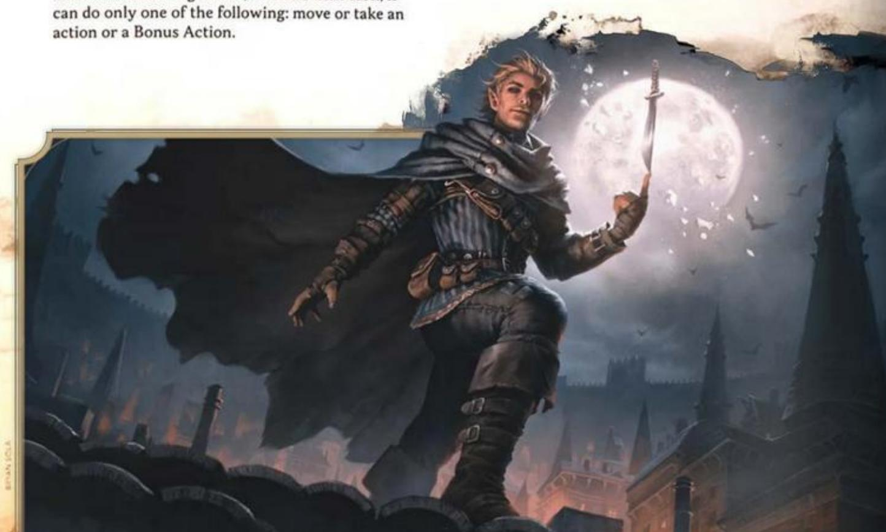
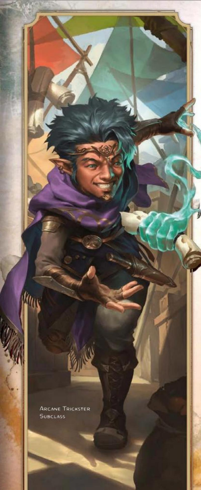
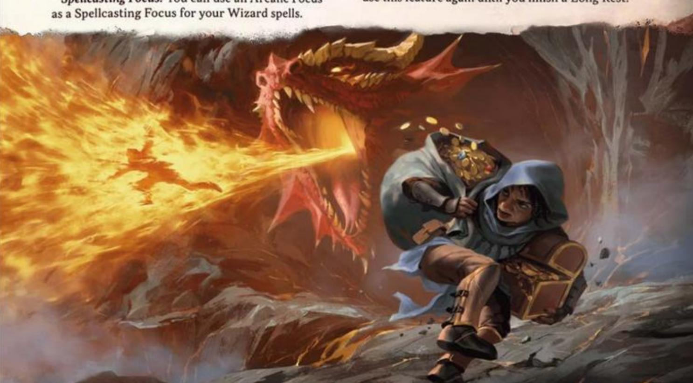
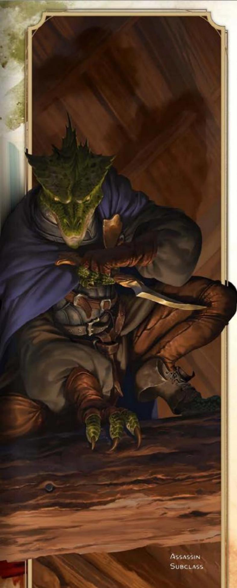
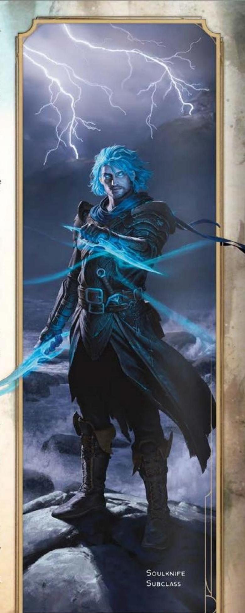
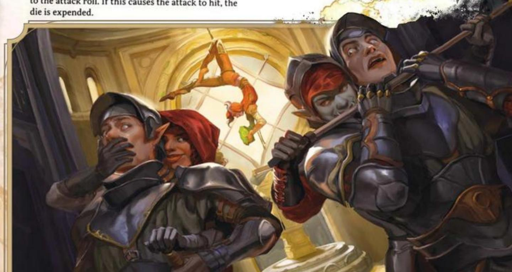
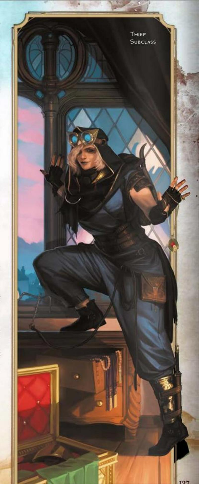
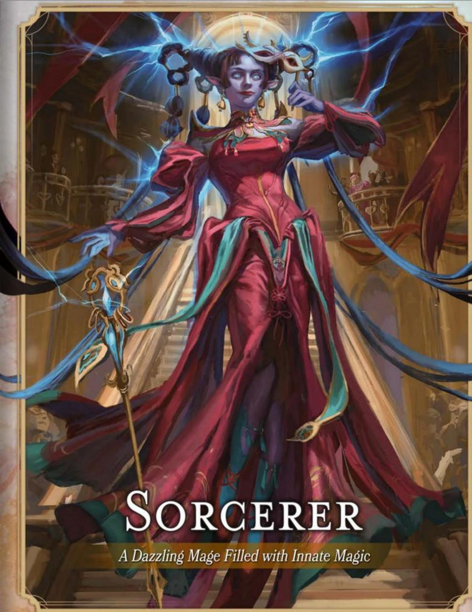

#### CORE ROGUE TRAITS

| Trait | Detail |
|-------|--------|
| **Primary Ability** | Dexterity |
| **Hit Point Die** | D8 per Rogue level |
| **Saving Throw Proficiencies** | Dexterity and Intelligence |
| **Skill Proficiencies** | *Choose 4:* Acrobatics, Athletics, Deception, Insight, Intimidation, Investigation, Perception, Persuasion, Sleight of Hand, or Stealth |
| **Weapon Proficiencies** | Simple weapons and Martial weapons that have the Finesse or Light property |
| **Tool Proficiencies** | Thieves' Tools |
| **Armor Training** | Light armor |
| **Starting Equipment** | *Choose A or B:* (A) Leather Armor, 2 Daggers, Shortsword, Shortbow, 20 Arrows, Quiver, Thieves' Tools, Burglar's Pack, and 8 GP; or (B) 100 GP |

Rogues rely on cunning, stealth, and their foes' vulnerabilities to get the upper hand in any situation. They have a knack for finding the solution to just about any problem. A few even learn magical tricks to supplement their other abilities. Many Rogues focus on stealth and deception, while others refine skills that help them in a dungeon environment, such as climbing, finding and disarming traps, and opening locks.

In combat, Rogues prioritize subtle strikes over brute strength. They would rather make one precise strike than wear an opponent down with a barrage of blows.

Some Rogues began their careers as criminals, while others used their cunning to fight crime. Whatever a Rogue's relation to the law, no common criminal or officer of the law can match the subtle brilliance of the greatest Rogues.

## BECOMING A ROGUE

#### AS A LEVEL 1 CHARACTER

- Gain all the traits in the Core Rogue Traits table.
- Gain the Rogue's level 1 features, which are listed in the Rogue Features table.

#### AS A MULTICLASS CHARACTER

- Gain the following traits from the Core Rogue Traits table: Hit Point Die, proficiency in one skill of your choice from the Rogue's skill list, proficiency with Thieves' Tools, and training with Light armor.
- Gain the Rogue's level 1 features, which are listed in the Rogue Features table.

## ROGUE CLASS FEATURES

As a Rogue, you gain the following class features when you reach the specified Rogue levels. These features are listed in the Rogue Features table.

#### LEVEL 1: EXPERTISE

You gain Expertise in two of your skill proficiencies of your choice. Sleight of Hand and Stealth are recommended if you have proficiency in them.

At Rogue level 6, you gain Expertise in two more of your skill proficiencies of your choice.

#### LEVEL 1: SNEAK ATTACK

You know how to strike subtly and exploit a foe's distraction. Once per turn, you can deal an extra 1d6 damage to one creature you hit with an attack roll if you have Advantage on the roll and the attack uses a Finesse or a Ranged weapon. The extra damage's type is the same as the weapon's type.

You don't need Advantage on the attack roll if at least one of your allies is within 5 feet of the target, the ally doesn't have the Incapacitated condition, and you don't have Disadvantage on the attack roll.

The extra damage increases as you gain Rogue levels, as shown in the Sneak Attack column of the Rogue Features table.

#### LEVEL 1: THIEVES' CANT

You picked up various languages in the communities where you plied your roguish talents. You know Thieves' Cant and one other language of your choice, which you choose from the language tables in chapter 2.

#### LEVEL 1: WEAPON MASTERY

Your training with weapons allows you to use the mastery properties of two kinds of weapons of your choice with which you have proficiency, such as Daggers and Shortbows.

Whenever you finish a Long Rest, you can change the kinds of weapons you chose. For example, you could switch to using the mastery properties of Scimitars and Shortswords.

#### ROGUE FEATURES

| Level | Proficiency Bonus | Class Features                                         | Sneak Attack |
|-------|-------------------|--------------------------------------------------------|--------------|
| 1     | +2                | Expertise, Sneak Attack, Thieves' Cant, Weapon Mastery | 1d6          |
| 2     | +2                | Cunning Action                                         | 1d6          |
| 3     | +2                | Rogue Subclass, Steady Aim                             | 2d6          |
| 4     | +2                | Ability Score Improvement                              | 2d6          |
| 5     | +3                | Cunning Strike, Uncanny Dodge                          | 3d6          |
| 6     | +3                | Expertise                                              | 3d6          |
| 7     | +3                | Evasion, Reliable Talent                               | 4d6          |
| 8     | +3                | Ability Score Improvement                              | 4d6          |
| 9     | +4                | Subclass feature                                       | 5d6          |
| 10    | +4                | Ability Score Improvement                              | 5d6          |
| 11    | +4                | Improved Cunning Strike                                | 6d6          |
| 12    | +4                | Ability Score Improvement                              | 6d6          |
| 13    | +5                | Subclass feature                                       | 7d6          |
| 14    | +5                | Devious Strikes                                        | 7d6          |
| 15    | +5                | Slippery Mind                                          | 8d6          |
| 16    | +5                | Ability Score Improvement                              | 8d6          |
| 17    | +6                | Subclass feature                                       | 9d6          |
| 18    | +6                | Elusive                                                | 9d6          |
| 19    | +6                | Epic Boon                                              | 10d6         |
| 20    | +6                | Stroke of Luck                                         | 10d6         |

#### LEVEL 2: CUNNING ACTION

Your quick thinking and agility allow you to move and act quickly. On your turn, you can take one of the following actions as a Bonus Action: Dash, Disengage, or Hide.

#### LEVEL 3: ROGUE SUBCLASS

You gain a Rogue subclass of your choice. The Arcane Trickster, Assassin, Soulknife, and Thief subclasses are detailed after this class's description. A subclass is a specialization that grants you features at certain Rogue levels. For the rest of your career, you gain each of your subclass's features that are of your Rogue level or lower.

#### LEVEL 3: STEADY AIM

As a Bonus Action, you give yourself Advantage on your next attack roll on the current turn. You can use this feature only if you haven't moved during this turn, and after you use it, your Speed is 0 until the end of the current turn.

#### LEVEL 4: ABILITY SCORE IMPROVEMENT

You gain the Ability Score Improvement feat (see chapter 5) or another feat of your choice for which you qualify. You gain this feature again at Rogue levels 8, 10, 12, and 16.

#### LEVEL 5: CUNNING STRIKE

You've developed cunning ways to use your Sneak Attack. When you deal Sneak Attack damage, you can add one of the following Cunning Strike effects. Each effect has a die cost, which is the number of Sneak Attack damage dice you must forgo to add the effect. You remove the die before rolling, and the effect occurs immediately after the attack's damage is dealt. For example, if you add the Poison effect, remove 1d6 from the Sneak Attack's damage before rolling.

If a Cunning Strike effect requires a saving throw, the DC equals 8 plus your Dexterity modifier and Proficiency Bonus.

Poison (Cost: 1d6). You add a toxin to your strike, forcing the target to make a Constitution saving throw. On a failed save, the target has the Poisoned condition for 1 minute. At the end of each of its turns, the Poisoned target repeats the save, ending the effect on itself on a success.

To use this effect, you must have a Poisoner's Kit on your person.

Trip (Cost: 1d6). If the target is Large or smaller, it must succeed on a Dexterity saving throw or have the Prone condition.

Withdraw (Cost: 1d6). Immediately after the attack, you move up to half your Speed without provoking Opportunity Attacks.

#### LEVEL 5: UNCANNY DODGE

When an attacker that you can see hits you with an attack roll, you can take a Reaction to halve the attack's damage against you (round down).

#### LEVEL 7: EVASION

You can nimbly dodge out of the way of certain dangers. When you're subjected to an effect that allows you to make a Dexterity saving throw to take only half damage, you instead take no damage if you succeed on the saving throw and only half damage if you fail. You can't use this feature if you have the Incapacitated condition.

#### LEVEL 7: RELIABLE TALENT

Whenever you make an ability check that uses one of your skill or tool proficiencies, you can treat a d20 roll of 9 or lower as a 10.

#### LEVEL 11: IMPROVED CUNNING STRIKE

You can use up to two Cunning Strike effects when you deal Sneak Attack damage, paying the die cost for each effect.

#### LEVEL 14: DEVIOUS STRIKES

You've practiced new ways to use your Sneak Attack deviously. The following effects are now among your Cunning Strike options.

Daze (Cost: 2d6). The target must succeed on a Constitution saving throw, or on its next turn, it can do only one of the following: move or take an action or a Bonus Action.

Knock Out (Cost: 6d6). The target must succeed on a Constitution saving throw, or it has the Unconscious condition for 1 minute or until it takes any damage. The Unconscious target repeats the save at the end of each of its turns, ending the effect on itself on a success.

Obscure (Cost: 3d6). The target must succeed on a Dexterity saving throw, or it has the Blinded condition until the end of its next turn.

#### LEVEL 15: SLIPPERY MIND

Your cunning mind is exceptionally difficult to control. You gain proficiency in Wisdom and Charisma saving throws.

#### LEVEL 18: ELUSIVE

You're so evasive that attackers rarely gain the upper hand against you. No attack roll can have Advantage against you unless you have the Incapacitated condition.

#### LEVEL 19: EPIC BOON

You gain an Epic Boon feat (see chapter 5) or another feat of your choice for which you qualify. Boon of the Night Spirit is recommended.

#### LEVEL 20: STROKE OF LUCK

You have a marvelous knack for succeeding when you need to. If you fail a D20 Test, you can turn the roll into a 20.

Once you use this feature, you can't use it again until you finish a Short or Long Rest.

## ROGUE SUBCLASSES

A Rogue subclass is a specialization that grants you features at certain Rogue levels, as specified in the subclass. This section presents the Arcane Trickster, Assassin, Soulknife, and Thief subclasses.

### ARCANE TRICKSTER

Enhance Stealth with Arcane Spells

Some Rogues enhance their fine-honed skills of stealth and agility with spells, learning magical tricks to aid them in their trade. Some Arcane Tricksters use their talents as pickpockets and burglars, while others are pranksters.

#### LEVEL 3: SPELLCASTING

You have learned to cast spells. See chapter 7 for the rules on spellcasting. The information below details how you use those rules as an Arcane Trickster.

Cantrips. You know three cantrips: Mage Hand and two other cantrips of your choice from the Wizard spell list (see that class's section for its list). Mind Sliver and Minor Illusion are recommended.

Whenever you gain a Rogue level, you can replace one of your cantrips, except Mage Hand, with another Wizard cantrip of your choice.

When you reach Rogue level 10, you learn another Wizard cantrip of your choice.

Spell Slots. The Arcane Trickster Spellcasting table shows how many spell slots you have to cast your level 1+ spells. You regain all expended spell slots when you finish a Long Rest.

Prepared Spells of Level 1+. You prepare the list of level 1+ spells that are available for you to cast with this feature. To start, choose three level 1 Wizard spells. Charm Person, Disguise Self, and Fog Cloud are recommended.

The number of spells on your list increases as you gain Rogue levels, as shown in the Prepared Spells column of the Arcane Trickster Spellcasting table. Whenever that number increases, choose additional Wizard spells until the number of spells on your list matches the number in the Arcane Trickster Spellcasting table. The chosen spells must be of a level for which you have spell slots. For example, if you're a level 7 Rogue, your list of prepared spells can include five Wizard spells of level 1 or 2 in any combination.

#### ARCANE TRICKSTER SPELLCASTING

| Rogue Level | Prepared Spells | 1st-Level Slots | 2nd-Level Slots | 3rd-Level Slots | 4th-Level Slots |
|-------------|-----------------|-----------------|-----------------|-----------------|-----------------|
| 3           | 3               | 2               | —               | —               | —               |
| 4           | 4               | 3               | —               | —               | —               |
| 5           | 4               | 3               | —               | —               | —               |
| 6           | 4               | 3               | —               | —               | —               |
| 7           | 5               | 4               | 2               | —               | —               |
| 8           | 6               | 4               | 2               | —               | —               |
| 9           | 6               | 4               | 2               | —               | —               |
| 10          | 7               | 4               | 3               | —               | —               |
| 11          | 8               | 4               | 3               | —               | —               |
| 12          | 8               | 4               | 3               | —               | —               |
| 13          | 9               | 4               | 3               | 2               | —               |
| 14          | 10              | 4               | 3               | 2               | —               |
| 15          | 10              | 4               | 3               | 2               | —               |
| 16          | 11              | 4               | 3               | 3               | —               |
| 17          | 11              | 4               | 3               | 3               | —               |
| 18          | 11              | 4               | 3               | 3               | —               |
| 19          | 12              | 4               | 3               | 3               | 1               |
| 20          | 13              | 4               | 3               | 3               | 1               |

Changing Your Prepared Spells. Whenever you gain a Rogue level, you can replace one spell on your list with another Wizard spell for which you have spell slots.

Spellcasting Ability. Intelligence is your spellcasting ability for your Wizard spells.

Spellcasting Focus. You can use an Arcane Focus as a Spellcasting Focus for your Wizard spells.

#### LEVEL 3: MAGE HAND LEGERDEMAIN

When you cast Mage Hand, you can cast it as a Bonus Action, and you can make the spectral hand Invisible. You can control the hand as a Bonus Action, and through it, you can make Dexterity (Sleight of Hand) checks.

#### LEVEL 9: MAGICAL AMBUSH

If you have the Invisible condition when you cast a spell on a creature, it has Disadvantage on any saving throw it makes against the spell on the same turn.

#### LEVEL 13: VERSATILE TRICKSTER

You gain the ability to distract targets with your Mage Hand. When you use the Trip option of your Cunning Strike on a creature, you can also use that option on another creature within 5 feet of the spectral hand.

#### LEVEL 17: SPELL THIEF

You gain the ability to magically steal the knowledge of how to cast a spell from another spellcaster.

Immediately after a creature casts a spell that targets you or includes you in its area of effect, you can take a Reaction to force the creature to make an Intelligence saving throw. The DC equals your spell save DC. On a failed save, you negate the spell's effect against you, and you steal the knowledge of the spell if it is at least level 1 and of a level you can cast (it doesn't need to be a Wizard spell). For the next 8 hours, you have the spell prepared. The creature can't cast it until the 8 hours have passed.

Once you steal a spell with this feature, you can't use this feature again until you finish a Long Rest.

### ASSASSIN

Practice the Grim Art of Death

An Assassin's training focuses on using stealth, poison, and disguise to eliminate foes with deadly efficiency. While some Rogues who follow this path are hired killers, spies, or bounty hunters, the capabilities of this subclass are equally useful for adventurers facing a variety of monstrous enemies.

#### LEVEL 3: ASSASSINATE

You're adept at ambushing a target, granting you the following benefits.

Initiative. You have Advantage on Initiative rolls.

Surprising Strikes. During the first round of each combat, you have Advantage on attack rolls against any creature that hasn't taken a turn. If your Sneak Attack hits any target during that round, the target takes extra damage of the weapon's type equal to your Rogue level.

#### LEVEL 3: ASSASSIN'S TOOLS

You gain a Disguise Kit and a Poisoner's Kit, and you have proficiency with them.

#### LEVEL 9: INFILTRATION EXPERTISE

You are expert at the following techniques that aid your infiltrations.

Masterful Mimicry. You can unerringly mimic another person's speech, handwriting, or both if you have spent at least 1 hour studying them.

Roving Aim. Your Speed isn't reduced to 0 by using Steady Aim.

#### LEVEL 13: ENVENOM WEAPONS

When you use the Poison option of your Cunning Strike, the target also takes 2d6 Poison damage whenever it fails the saving throw. This damage ignores Resistance to Poison damage.

#### LEVEL 17: DEATH STRIKE

When you hit with your Sneak Attack on the first round of a combat, the target must succeed on a Constitution saving throw (DC 8 plus your Dexterity modifier and Proficiency Bonus), or the attack's damage is doubled against the target.

### SOULKNIFE

Strike Foes with Psionic Blades

A Soulknife strikes with the mind, cutting through barriers both physical and psychic. These Rogues discover psionic power within themselves and channel it to do their roguish work. As a Soulknife, your psionic abilities might have haunted you since childhood, revealing their full potential only as you experienced the stress of adventure. Or you might have sought out an order of psychic adepts and spent years learning how to manifest your power.

#### LEVEL 3: PSIONIC POWER

You harbor a wellspring of psionic energy within yourself. It is represented by your Psionic Energy Dice, which fuel certain powers you have from this subclass. The Soulknife Energy Dice table shows the number of these dice you have when you reach certain Rogue levels, and the table shows the die size.

#### SOULKNIFE ENERGY DICE

| Rogue Level | Die Size | Number |
|-------------|----------|--------|
| 3           | D6       | 4      |
| 5           | D8       | 6      |
| 9           | D8       | 8      |
| 11          | D10      | 8      |
| 13          | D10      | 10     |
| 17          | D12      | 12     |

Any features in this subclass that use a Psionic Energy Die use only the dice from this subclass. Some of your powers expend a Psionic Energy Die, as specified in a power's description, and you can't use a power if it requires you to use a die when your Psionic Energy Dice are all expended.

You regain one of your expended Psionic Energy Dice when you finish a Short Rest, and you regain all of them when you finish a Long Rest.

Psi-Bolstered Knack. If you fail an ability check using a skill or tool with which you have proficiency, you can roll one Psionic Energy Die and add the number rolled to the check, potentially turning failure into success. The die is expended only if the roll then succeeds.

Psychic Whispers. You can establish telepathic communication between yourself and others. As a Magic action, choose one or more creatures you can see, up to a number of creatures equal to your Proficiency Bonus, and then roll one Psionic Energy Die. For a number of hours equal to the number rolled, the chosen creatures can speak telepathically with you, and you can speak telepathically with them. To send or receive a message (no action required), you and the other creature must be within 1 mile of each other. A creature can end the telepathic connection at any time (no action required).

The first time you use this power after each Long Rest, you don't expend the Psionic Energy Die. All other times you use the power, you expend the die.

#### LEVEL 3: PSYCHIC BLADES

You can manifest shimmering blades of psychic energy. Whenever you take the Attack action or make an Opportunity Attack, you can manifest a Psychic Blade in your free hand and make the attack with that blade. The magic blade has the following traits:

Weapon Category: Simple Melee

Damage on a Hit: 1d6 Psychic plus the ability modifier used for the attack roll

Properties: Finesse, Thrown (range 60/120 feet)

Mastery: Vex (you can use this property, and it doesn't count against the number of properties you can use with Weapon Mastery)

The blade vanishes immediately after it hits or misses its target, and it leaves no mark if it deals damage.

After you attack with the blade on your turn, you can make a melee or ranged attack with a second psychic blade as a Bonus Action on the same turn if your other hand is free to create it. The damage die of this bonus attack is 1d4 instead of 1d6.

#### LEVEL 9: SOUL BLADES

You can now use the following powers with your Psychic Blades.

Homing Strikes. If you make an attack roll with your Psychic Blade and miss the target, you can roll one Psionic Energy Die and add the number rolled to the attack roll. If this causes the attack to hit, the die is expended.

Psychic Teleportation. As a Bonus Action, you manifest a Psychic Blade, expend one Psionic Energy Die and roll it, and throw the blade at an unoccupied space you can see up to a number of feet away equal to 10 times the number rolled. You then teleport to that space, and the blade vanishes.

#### LEVEL 13: PSYCHIC VEIL

You can weave a veil of psychic static to mask yourself. As a Magic action, you gain the Invisible condition for 1 hour or until you dismiss this effect (no action required). This invisibility ends early immediately after you deal damage to a creature or you force a creature to make a saving throw.

Once you use this feature, you can't do so again until you finish a Long Rest unless you expend a Psionic Energy Die (no action required) to restore your use of it.

#### LEVEL 17: REND MIND

You can sweep your Psychic Blades through a creature's mind. When you use your Psychic Blades to deal Sneak Attack damage to a creature, you can force that target to make a Wisdom saving throw (DC 8 plus your Dexterity modifier and Proficiency Bonus). If the save fails, the target has the Stunned condition for 1 minute. The Stunned target repeats the save at the end of each of its turns, ending the effect on itself on a success.

Once you use this feature, you can't do so again until you finish a Long Rest unless you expend three Psionic Energy Dice (no action required) to restore your use of it.

### THIEF

Hunt for Treasure as a Classic Adventurer

A mix of burglar, treasure hunter, and explorer, you are the epitome of an adventurer. In addition to improving your agility and stealth, you gain abilities useful for delving into ruins and getting maximum benefit from the magic items you find there.

#### LEVEL 3: FAST HANDS

As a Bonus Action, you can do one of the following.

Sleight of Hand. Make a Dexterity (Sleight of Hand) check to pick a lock or disarm a trap with Thieves' Tools or to pick a pocket.

Use an Object. Take the Utilize action, or take the Magic action to use a magic item that requires that action.

#### LEVEL 3: SECOND-STORY WORK

You've trained to get into especially hard-to-reach places, granting you these benefits.

Climber. You gain a Climb Speed equal to your Speed.

Jumper. You can determine your jump distance using your Dexterity rather than your Strength.

#### LEVEL 9: SUPREME SNEAK

You gain the following Cunning Strike option.

Stealth Attack (Cost: 1d6). If you have the Hide action's Invisible condition, this attack doesn't end that condition on you if you end the turn behind Three-Quarters Cover or Total Cover.

#### LEVEL 13: USE MAGIC DEVICE

You've learned how to maximize use of magic items, granting you the following benefits.

Attunement. You can attune to up to four magic items at once.

Charges. Whenever you use a magic item property that expends charges, roll 1d6. On a roll of 6, you use the property without expending the charges.

Scrolls. You can use any Spell Scroll, using Intelligence as your spellcasting ability for the spell. If the spell is a cantrip or a level 1 spell, you can cast it reliably. If the scroll contains a higher-level spell, you must first succeed on an Intelligence (Arcana) check (DC 10 plus the spell's level). On a successful check, you cast the spell from the scroll. On a failed check, the scroll disintegrates.

#### LEVEL 17: THIEF'S REFLEXES

You are adept at laying ambushes and quickly escaping danger. You can take two turns during the first round of any combat. You take your first turn at your normal Initiative and your second turn at your Initiative minus 10.

