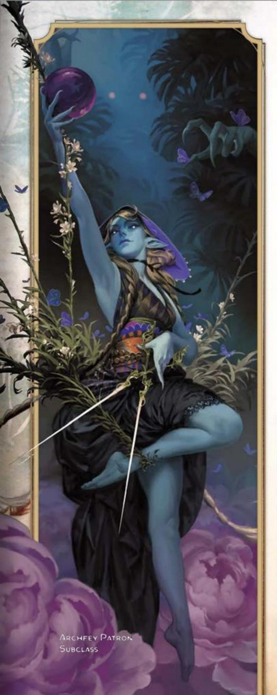
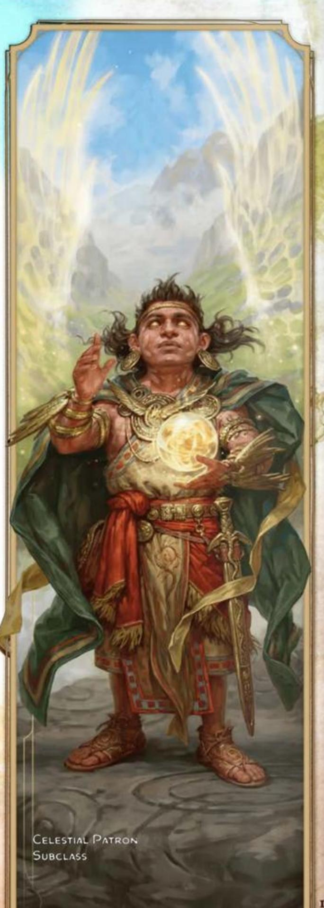
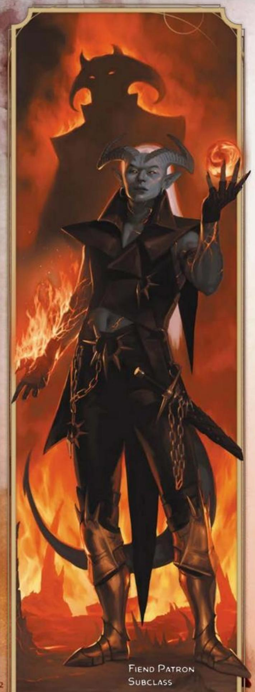
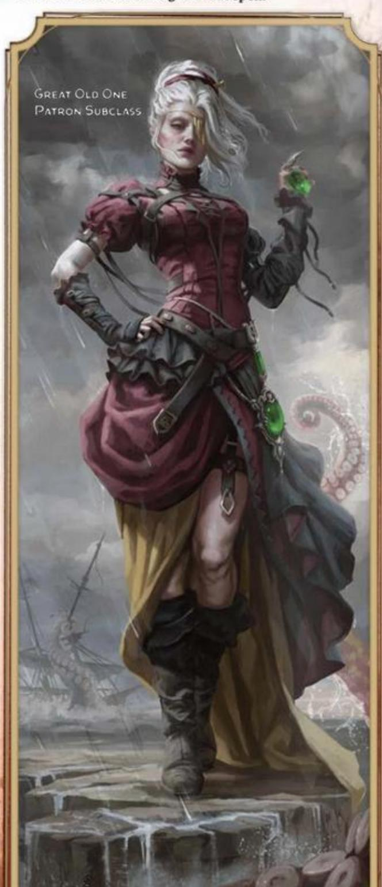

#### CORE WARLOCK TRAITS

| Trait | Detail |
|-------|--------|
| **Primary Ability** | Charisma |
| **Hit Point Die** | D8 per Warlock level |
| **Saving Throw Proficiencies** | Wisdom and Charisma |
| **Skill Proficiencies** | *Choose 2:* Arcana, Deception, History, Intimidation, Investigation, Nature, or Religion |
| **Weapon Proficiencies** | Simple weapons |
| **Armor Training** | Light armor |
| **Starting Equipment** | *Choose A or B:* (A) Leather Armor, Sickle, 2 Daggers, Arcane Focus (orb), Book of Shadows, Scholar's Pack, and 15 GP; or (B) 100 GP |

WARLOCKS QUEST FOR KNOWLEDGE that lies hidden in the fabric of the multiverse. They often begin their search for magical power by delving into tomes of forbidden lore, dabbling in invocations meant to attract the power of extraplanar beings, or seeking places of power where the influence of these beings can be felt. In no time, each Warlock is drawn into a binding pact with a powerful patron. Drawing on the ancient knowledge of beings such as angels, archfey, demons, devils, hags, and alien entities of the Far Realm, Warlocks piece together arcane secrets to bolster their own power.

Warlocks view their patrons as resources, as means to the end of achieving magical power. Some Warlocks respect, revere, or even love their patrons; some serve their patrons grudgingly; and some seek to undermine their patrons even as they wield the power their patrons have given them.

Once a pact is made, a Warlock's thirst for knowledge and power can't be slaked with mere study. Most Warlocks spend their days pursuing greater power and deeper knowledge, which typically means some kind of adventure.

## BECOMING A WARLOCK

#### AS A LEVEL 1 CHARACTER

- Gain all the traits in the Core Warlock Traits
- Gain the Warlock's level 1 features, which are listed in the Warlock Features table.

#### AS A MULTICLASS CHARACTER

- Gain the following traits from the Core Warlock Traits table: Hit Point Die and training with Light armor.
- Gain the Warlock's level 1 features, which are listed in the Warlock Features table. See the multiclassing rules in chapter 2 to determine your available spell slots.

## WARLOCK CLASS FEATURES

As a Warlock, you gain the following class features when you reach the specified Warlock levels. These features are listed in the Warlock Features table.

#### LEVEL 1: ELDRITCH INVOCATIONS

You have unearthed Eldritch Invocations, pieces of forbidden knowledge that imbue you with an abiding magical ability or other lessons. You gain one invocation of your choice, such as Pact of the Tome. Invocations are described in the "Eldritch Invocation Options" section later in this class's description.

Prerequisites. If an invocation has a prerequisite, you must meet it to learn that invocation. For example, if an invocation requires you to be a level 5+ Warlock, you can select the invocation once you reach Warlock level 5.

Replacing and Gaining Invocations. Whenever you gain a Warlock level, you can replace one of your invocations with another one for which you qualify. You can't replace an invocation if it's a prerequisite for another invocation that you have.

When you gain certain Warlock levels, you gain more invocations of your choice, as shown in the Invocations column of the Warlock Features table.

You can't pick the same invocation more than once unless its description says otherwise.

#### LEVEL 1: PACT MAGIC

Through occult ceremony, you have formed a pact with a mysterious entity to gain magical powers. The entity is a voice in the shadows-its identity unclear-but its boon to you is concrete: the ability to cast spells. See chapter 7 for the rules on spellcasting. The information below details how you use those rules with Warlock spells, which appear in the Warlock spell list later in the class's description.

Cantrips. You know two Warlock cantrips of your choice. Eldritch Blast and Prestidigitation are recommended. Whenever you gain a Warlock level, you can replace one of your cantrips from this feature with another Warlock cantrip of your choice.

When you reach Warlock levels 4 and 10, you learn another Warlock cantrip of your choice, as shown in the Cantrips column of the Warlock Features table.

#### WARLOCK FEATURES

| Level | Proficiency Bonus | Class Features                   | Eldritch Invocations | Cantrips | Prepared Spells | Spell Slots | Slot Level |
|-------|-------------------|----------------------------------|----------------------|----------|-----------------|-------------|------------|
| 1     | +2                | Eldritch Invocations, Pact Magic | 1                    | 2        | 2               | 1           | 1          |
| 2     | +2                | Magical Cunning                  | 3                    | 2        | 3               | 2           | 1          |
| 3     | +2                | Warlock Subclass                 | 3                    | 2        | 4               | 2           | 2          |
| 4     | +2                | Ability Score Improvement        | 3                    | 3        | 5               | 2           | 2          |
| 5     | +3                | —                                | 5                    | 3        | 6               | 2           | 3          |
| 6     | +3                | Subclass feature                 | 5                    | 3        | 7               | 2           | 3          |
| 7     | +3                | —                                | 6                    | 3        | 8               | 2           | 4          |
| 8     | +3                | Ability Score Improvement        | 6                    | 3        | 9               | 2           | 4          |
| 9     | +4                | Contact Patron                   | 7                    | 3        | 10              | 2           | 5          |
| 10    | +4                | Subclass feature                 | 7                    | 4        | 10              | 2           | 5          |
| 11    | +4                | Mystic Arcanum (level 6 spell)   | 7                    | 4        | 11              | 3           | 5          |
| 12    | +4                | Ability Score Improvement        | 8                    | 4        | 11              | 3           | 5          |
| 13    | +5                | Mystic Arcanum (level 7 spell)   | 8                    | 4        | 12              | 3           | 5          |
| 14    | +5                | Subclass feature                 | 8                    | 4        | 12              | 3           | 5          |
| 15    | +5                | Mystic Arcanum (level 8 spell)   | 9                    | 4        | 13              | 3           | 5          |
| 16    | +5                | Ability Score Improvement        | 9                    | 4        | 13              | 3           | 5          |
| 17    | +6                | Mystic Arcanum (level 9 spell)   | 9                    | 4        | 14              | 4           | 5          |
| 18    | +6                | —                                | 10                   | 4        | 14              | 4           | 5          |
| 19    | +6                | Epic Boon                        | 10                   | 4        | 15              | 4           | 5          |
| 20    | +6                | Eldritch Master                  | 10                   | 4        | 15              | 4           | 5          |

Spell Slots. The Warlock Features table shows how many spell slots you have to cast your Warlock spells of levels 1–5. The table also shows the level of those slots, all of which are the same level. You regain all expended Pact Magic spell slots when you finish a Short or Long Rest.

For example, when you're a level 5 Warlock, you have two level 3 spell slots. To cast the level 1 spell Witch Bolt, you must spend one of those slots, and you cast it as a level 3 spell.

Prepared Spells of Level 1+. You prepare the list of level 1+ spells that are available for you to cast with this feature. To start, choose two level 1 Warlock spells. Charm Person and Hex are recommended.

The number of spells on your list increases as you gain Warlock levels, as shown in the Prepared Spells column of the Warlock Features table. Whenever that number increases, choose additional Warlock spells until the number of spells on your list matches the number in the table. The chosen spells must be of a level no higher than what's shown in the table's Slot Level column for your level. When you reach level 6, for example, you learn a new Warlock spell, which can be of levels 1–3.

If another Warlock feature gives you spells that you always have prepared, those spells don't count against the number of spells you can prepare with this feature, but those spells otherwise count as Warlock spells for you.

Changing Your Prepared Spells. Whenever you gain a Warlock level, you can replace one spell on your list with another Warlock spell of an eligible level.

Spellcasting Ability. Charisma is the spellcasting ability for your Warlock spells.

Spellcasting Focus. You can use an Arcane Focus as a Spellcasting Focus for your Warlock spells.

#### LEVEL 2: MAGICAL CUNNING

You can perform an esoteric rite for 1 minute. At the end of it, you regain expended Pact Magic spell slots but no more than a number equal to half your maximum (round up). Once you use this feature, you can't do so again until you finish a Long Rest.

#### LEVEL 3: WARLOCK SUBCLASS

You gain a Warlock subclass of your choice. The Archfey Patron, Celestial Patron, Fiend Patron, and Great Old One Patron subclasses are detailed after this class's description. A subclass is a specialization that grants you features at certain Warlock levels. For the rest of your career, you gain each of your subclass's features that are of your Warlock level or lower.

#### LEVEL 4: ABILITY SCORE IMPROVEMENT

You gain the Ability Score Improvement feat (see chapter 5) or another feat of your choice for which you qualify. You gain this feature again at Warlock levels 8, 12, and 16.

#### LEVEL 9: CONTACT PATRON

In the past, you usually contacted your patron through intermediaries. Now you can communicate directly; you always have the *Contact Other Plane* spell prepared. With this feature, you can cast the spell without expending a spell slot to contact your patron, and you automatically succeed on the spell's saving throw.

Once you cast the spell with this feature, you can't do so in this way again until you finish a Long Rest.

#### LEVEL 11: MYSTIC ARCANUM

Your patron grants you a magical secret called an arcanum. Choose one level 6 Warlock spell as this arcanum.

You can cast your arcanum spell once without expending a spell slot, and you must finish a Long Rest before you can cast it in this way again.

As shown in the Warlock Features table, you gain another Warlock spell of your choice that can be cast in this way when you reach Warlock levels 13 (level 7 spell), 15 (level 8 spell), and 17 (level 9 spell). You regain all uses of your Mystic Arcanum when you finish a Long Rest.

Whenever you gain a Warlock level, you can replace one of your arcanum spells with another Warlock spell of the same level.

#### LEVEL 19: EPIC BOON

You gain an Epic Boon feat (see chapter 5) or another feat of your choice for which you qualify. Boon of Fate is recommended.

#### LEVEL 20: ELDRITCH MASTER

When you use your Magical Cunning feature, you regain all your expended Pact Magic spell slots.

## ELDRITCH INVOCATION OPTIONS

Eldritch Invocation options appear in alphabetical order.

#### AGONIZING BLAST

Prerequisite: Level 2+ Warlock, a Warlock Cantrip That Deals Damage

Choose one of your known Warlock cantrips that deals damage. You can add your Charisma modifier to that spell's damage rolls.

Repeatable. You can gain this invocation more than once. Each time you do so, choose a different eligible cantrip.

#### ARMOR OF SHADOWS

You can cast Mage Armor on yourself without expending a spell slot.

#### ASCENDANT STEP

Prerequisite: Level 5+ Warlock

You can cast Levitate on yourself without expending a spell slot.

#### DEVIL'S SIGHT

Prerequisite: Level 2+ Warlock

You can see normally in Dim Light and Darkness both magical and nonmagical—within 120 feet of yourself.

#### DEVOURING BLADE

Prerequisite: Level 12+ Warlock, Thirsting Blade Invocation

The Extra Attack of your Thirsting Blade invocation confers two extra attacks rather than one.

#### ELDRITCH MIND

You have Advantage on Constitution saving throws that you make to maintain Concentration.

#### ELDRITCH SMITE

Prerequisite: Level 5+ Warlock, Pact of the Blade Invocation

Once per turn when you hit a creature with your pact weapon, you can expend a Pact Magic spell slot to deal an extra 1d8 Force damage to the target, plus another 1d8 per level of the spell slot, and you can give the target the Prone condition if it is Huge or smaller.

#### ELDRITCH SPEAR

Prerequisite: Level 2+ Warlock, a Warlock Cantrip That Deals Damage

Choose one of your known Warlock cantrips that deals damage and has a range of 10+ feet. When you cast that spell, its range increases by a number of feet equal to 30 times your Warlock level.

Repeatable. You can gain this invocation more than once. Each time you do so, choose a different eligible cantrip.

#### FIENDISH VIGOR

Prerequisite: Level 2+ Warlock

You can cast False Life on yourself without expending a spell slot. When you cast the spell with this feature, you don't roll the die for the Temporary Hit Points; you automatically get the highest number on the die.

#### GAZE OF TWO MINDS

Prerequisite: Level 5+ Warlock

You can use a Bonus Action to touch a willing creature and perceive through its senses until the end of your next turn. As long as the creature is on the same plane of existence as you, you can take a Bonus Action on subsequent turns to maintain this connection, extending the duration until the end of your next turn. The connection ends if you don't maintain it in this way.

While perceiving through the other creature's senses, you benefit from any special senses possessed by that creature, and you can cast spells as if you were in your space or the other creature's space if the two of you are within 60 feet of each other.

#### GIFT OF THE DEPTHS

Prerequisite: Level 5+ Warlock

You can breathe underwater, and you gain a Swim Speed equal to your Speed.

You can also cast Water Breathing once without expending a spell slot. You regain the ability to cast it in this way again when you finish a Long Rest.

#### GIFT OF THE PROTECTORS

Prerequisite: Level 9+ Warlock, Pact of the Tome Invocation

A new page appears in your Book of Shadows when you conjure it. With your permission, a creature can take an action to write its name on that page, which can contain a number of names equal to your Charisma modifier (minimum of one name).

When any creature whose name is on the page is reduced to 0 Hit Points but not killed outright, the creature magically drops to 1 Hit Point instead. Once this magic is triggered, no creature can benefit from it until you finish a Long Rest.

As a Magic action, you can erase a name on the page by touching it.

#### INVESTMENT OF THE CHAIN MASTER

Prerequisite: Level 5+ Warlock, Pact of the Chain Invocation

When you cast Find Familiar, you infuse the summoned familiar with a measure of your eldritch power, granting the creature the following benefits.

Aerial or Aquatic. The familiar gains either a Fly Speed or a Swim Speed (your choice) of 40 feet.

Quick Attack. As a Bonus Action, you can command the familiar to take the Attack action.

Necrotic or Radiant Damage. Whenever the familiar deals Bludgeoning, Piercing, or Slashing damage, you can make it deal Necrotic or Radiant damage instead.

Your Save DC. If the familiar forces a creature to make a saving throw, it uses your spell save DC.

Resistance. When the familiar takes damage, you can take a Reaction to grant it Resistance against that damage.

#### LESSONS OF THE FIRST ONES

Prerequisite: Level 2+ Warlock

You have received knowledge from an elder entity of the multiverse, allowing you to gain one Origin feat of your choice (see chapter 5).

Repeatable. You can gain this invocation more than once. Each time you do so, choose a different Origin feat.

#### LIFEDRINKER

Prerequisite: Level 9+ Warlock, Pact of the Blade Invocation

Once per turn when you hit a creature with your pact weapon, you can deal an extra 1d6 Necrotic, Psychic, or Radiant damage (your choice) to the creature, and you can expend one of your Hit Point Dice to roll it and regain a number of Hit Points equal to the roll plus your Constitution modifier (minimum of 1 Hit Point).

#### MASK OF MANY FACES

Prerequisite: Level 2+ Warlock

You can cast Disguise Self without expending a spell slot.

#### MASTER OF MYRIAD FORMS

Prerequisite: Level 5+ Warlock

You can cast Alter Self without expending a spell slot.

#### MISTY VISIONS

Prerequisite: Level 2+ Warlock

You can cast Silent Image without expending a spell slot.

#### ONE WITH SHADOWS

Prerequisite: Level 5+ Warlock

While you're in an area of Dim Light or Darkness, you can cast *Invisibility* on yourself without expending a spell slot.

#### OTHERWORLDLY LEAP

Prerequisite: Level 2+ Warlock

You can cast Jump on yourself without expending a spell slot.

#### PACT OF THE BLADE

As a Bonus Action, you can conjure a pact weapon in your hand—a Simple or Martial Melee weapon of your choice with which you bond—or create a bond with a magic weapon you touch; you can't bond with a magic weapon if someone else is attuned to it or another Warlock is bonded with it. Until the bond ends, you have proficiency with the weapon, and you can use it as a Spellcasting Focus.

Whenever you attack with the bonded weapon, you can use your Charisma modifier for the attack and damage rolls instead of using Strength or Dexterity; and you can cause the weapon to deal Necrotic, Psychic, or Radiant damage or its normal damage type.

Your bond with the weapon ends if you use this feature's Bonus Action again, if the weapon is more than 5 feet away from you for 1 minute or more, or if you die. A conjured weapon disappears when the bond ends.

#### PACT OF THE CHAIN

You learn the Find Familiar spell and can cast it as a Magic action without expending a spell slot.

When you cast the spell, you choose one of the normal forms for your familiar or one of the following special forms: Imp, Pseudodragon, Quasit, Skeleton, Slaad Tadpole, Sphinx of Wonder, Sprite, or Venomous Snake (see appendix B for the familiar's stat block).

Additionally, when you take the Attack action, you can forgo one of your own attacks to allow your familiar to make one attack of its own with its Reaction.

#### PACT OF THE TOME

Stitching together strands of shadow, you conjure forth a book in your hand at the end of a Short or Long Rest. This *Book of Shadows* (you determine its appearance) contains eldritch magic that only you can access, granting you the benefits below. The book disappears if you conjure another book with this feature or if you die.

Cantrips and Rituals. When the book appears, choose three cantrips, and choose two level 1 spells that have the Ritual tag. The spells can be from any class's spell list, and they must be spells you don't already have prepared. While the book is on your person, you have the chosen spells prepared, and they function as Warlock spells for you.

Spellcasting Focus. You can use the book as a Spellcasting Focus.

#### REPELLING BLAST

Prerequisite: Level 2+ Warlock, a Warlock Cantrip That Deals Damage via an Attack Roll

Choose one of your known Warlock cantrips that requires an attack roll. When you hit a Large or smaller creature with that cantrip, you can push the creature up to 10 feet straight away from you.

Repeatable. You can gain this invocation more than once. Each time you do so, choose a different eligible cantrip.

#### THIRSTING BLADE

Prerequisite: Level 5+ Warlock, Pact of the Blade Invocation

You gain the Extra Attack feature for your pact weapon only. With that feature, you can attack twice with the weapon instead of once when you take the Attack action on your turn.

#### VISIONS OF DISTANT REALMS

Prerequisite: Level 9+ Warlock

You can cast Arcane Eye without expending a spell slot.

#### WHISPERS OF THE GRAVE

Prerequisite: Level 7+ Warlock

You can cast Speak with Dead without expending a spell slot.

#### WITCH SIGHT

Prerequisite: Level 15+ Warlock

You have Truesight with a range of 30 feet.

# WARLOCK SPELL LIST

This section presents the Warlock spell list. The spells are organized by spell level and then alphabetized, and each spell's school of magic is listed. In the Special column, C means the spell requires Concentration, R means it's a Ritual, and M means it requires a specific Material component.

### CANTRIP WARLOCK SPELLS

| Spell | School | Special |
|-------|--------|---------|
| Blade Ward | Abjuration | C |
| Chill Touch | Necromancy | — |
| Eldritch Blast | Evocation | — |
| Friends | Enchantment | C |
| Mage Hand | Conjuration | — |
| Mind Sliver | Enchantment | — |
| Minor Illusion | Illusion | — |
| Poison Spray | Necromancy | — |
| Prestidigitation | Transmutation | — |
| Thunderclap | Evocation | — |
| Toll the Dead | Necromancy | — |
| True Strike | Divination | — |

### LEVEL 1 WARLOCK SPELLS

| Spell | School | Special |
|-------|--------|---------|
| Armor of Agathys | Abjuration | — |
| Arms of Hadar | Conjuration | C |
| Bane | Enchantment | C |
| Charm Person | Enchantment | — |
| Comprehend Languages | Divination | R |
| Detect Magic | Divination | C, R |
| Expeditious Retreat | Transmutation | C |
| Hellish Rebuke | Evocation | — |
| Hex | Enchantment | C |
| Illusory Script | Illusion | R, M |
| Protection from Evil and Good | Abjuration | C, M |
| Speak with Animals | Divination | R |
| Tasha's Hideous Laughter | Enchantment | C |
| Unseen Servant | Conjuration | R |
| Witch Bolt | Evocation | C |

### LEVEL 2 WARLOCK SPELLS

| Spell | School | Special |
|-------|--------|---------|
| Cloud of Daggers | Conjuration | C |
| Crown of Madness | Enchantment | C |
| Darkness | Evocation | C |
| Enthrall | Enchantment | C |
| Hold Person | Enchantment | C |
| Invisibility | Illusion | C |
| Mind Spike | Divination | C |
| Mirror Image | Illusion | — |
| Misty Step | Conjuration | — |
| Ray of Enfeeblement | Necromancy | — |
| Spider Climb | Transmutation | C |
| Suggestion | Enchantment | C |

### LEVEL 3 WARLOCK SPELLS

| Spell | School | Special |
|-------|--------|---------|
| Counterspell | Abjuration | — |
| Dispel Magic | Abjuration | — |
| Fear | Illusion | C |
| Fly | Transmutation | C |
| Gaseous Form | Transmutation | C |
| Hunger of Hadar | Conjuration | C |
| Hypnotic Pattern | Illusion | C |
| Magic Circle | Abjuration | M |
| Major Image | Illusion | C |
| Remove Curse | Abjuration | — |
| Summon Fey | Conjuration | C, M |
| Summon Undead | Necromancy | C, M |
| Tongues | Divination | — |
| Vampiric Touch | Necromancy | C |

### LEVEL 4 WARLOCK SPELLS

| Spell | School | Special |
|-------|--------|---------|
| Banishment | Abjuration | C |
| Blight | Necromancy | — |
| Charm Monster | Enchantment | C |
| Dimension Door | Conjuration | — |
| Hallucinatory Terrain | Illusion | — |
| Summon Aberration | Conjuration | C, M |

### LEVEL 5 WARLOCK SPELLS

| Spell | School | Special |
|-------|--------|---------|
| Contact Other Plane | Divination | R |
| Dream | Illusion | — |
| Hold Monster | Enchantment | C |
| Jallarzi's Storm of Radiance | Evocation | C |
| Mislead | Illusion | C |
| Planar Binding | Abjuration | M |
| Scrying | Divination | C, M |
| Synaptic Static | Enchantment | — |
| Teleportation Circle | Conjuration | M |

### LEVEL 6 WARLOCK SPELLS

| Spell | School | Special |
|-------|--------|---------|
| Arcane Gate | Conjuration | C |
| Circle of Death | Necromancy | M |
| Create Undead | Necromancy | M |
| Eyebite | Necromancy | C |
| Summon Fiend | Conjuration | C, M |
| Tasha's Bubbling Cauldron | Conjuration | M |
| True Seeing | Divination | M |

### LEVEL 7 WARLOCK SPELLS

| Spell | School | Special |
|-------|--------|---------|
| Etherealness | Conjuration | — |
| Finger of Death | Necromancy | — |
| Forcecage | Evocation | C, M |
| Plane Shift | Conjuration | M |

### LEVEL 8 WARLOCK SPELLS

| Spell | School | Special |
|-------|--------|---------|
| Befuddlement | Enchantment | C |
| Demiplane | Conjuration | — |
| Dominate Monster | Enchantment | C |
| Glibness | Enchantment | — |
| Power Word Stun | Enchantment | — |

### LEVEL 9 WARLOCK SPELLS

| Spell | School | Special |
|-------|--------|---------|
| Astral Projection | Necromancy | M |
| Foresight | Divination | — |
| Gate | Conjuration | C, M |
| Imprisonment | Abjuration | M |
| Power Word Kill | Enchantment | — |
| True Polymorph | Transmutation | C |
| Weird | Illusion | C |

## WARLOCK SUBCLASSES

A Warlock subclass is a specialization that grants you features at certain Warlock levels, as specified in the subclass.

### ARCHFEY PATRON

Bargain with Whimsical Fey

Your pact draws on the power of the Feywild. When you choose this subclass, you might make a deal with an archfey, such as the Prince of Frost; the Queen of Air and Darkness, ruler of the Gloaming Court; Titania of the Summer Court; or an ancient hag. Or you might call on a spectrum of Fey, weaving a web of favors and debts. Whoever they are, your patron is often inscrutable and whimsical.

#### LEVEL 3: ARCHFEY SPELLS

The magic of your patron ensures you always have certain spells ready; when you reach a Warlock level specified in the Archfey Spells table, you thereafter always have the listed spells prepared.

#### ARCHFEY SPELLS

| Warlock Level | Spells |
|---------------|--------|
| 3 | Calm Emotions, Faerie Fire, Misty Step, Phantasmal Force, Sleep |
| 5 | Blink, Plant Growth |
| 7 | Dominate Beast, Greater Invisibility |
| 9 | Dominate Person, Seeming |

#### LEVEL 3: STEPS OF THE FEY

Your patron grants you the ability to move between the boundaries of the planes. You can cast *Misty Step* without expending a spell slot a number of times equal to your Charisma modifier (minimum of once), and you regain all expended uses when you finish a Long Rest.

In addition, whenever you cast that spell, you can choose one of the following additional effects.

Refreshing Step. Immediately after you teleport, you or one creature you can see within 10 feet of yourself gains 1d10 Temporary Hit Points.

Taunting Step. Creatures within 5 feet of the space you left must succeed on a Wisdom saving throw against your spell save DC or have Disadvantage on attack rolls against creatures other than you until the start of your next turn.

#### LEVEL 6: MISTY ESCAPE

You can cast Misty Step as a Reaction in response to taking damage.

In addition, the following effects are now among your Steps of the Fey options.

Disappearing Step. You have the Invisible condition until the start of your next turn or until immediately after you make an attack roll, deal damage, or cast a spell.

Dreadful Step. Creatures within 5 feet of the space you left or the space you appear in (your choice) must succeed on a Wisdom saving throw against your spell save DC or take 2d10 Psychic damage.

#### LEVEL 10: BEGUILING DEFENSES

Your patron teaches you how to guard your mind and body. You are immune to the Charmed condition.

In addition, immediately after a creature you can see hits you with an attack roll, you can take a Reaction to reduce the damage you take by half (round down), and you can force the attacker to make a Wisdom saving throw against your spell save DC. On a failed save, the attacker takes Psychic damage equal to the damage you take. Once you use this Reaction, you can't use it again until you finish a Long Rest unless you expend a Pact Magic spell slot (no action required) to restore your use of it.

#### LEVEL 14: BEWITCHING MAGIC

Your patron grants you the ability to weave your magic with teleportation. Immediately after you cast an Enchantment or Illusion spell using an action and a spell slot, you can cast *Misty Step* as part of the same action and without expending a spell slot.

### CELESTIAL PATRON

Call on the Power of the Heavens

Your pact draws on the Upper Planes, the realms of everlasting bliss. You might enter an agreement with an empyrean, a couatl, a sphinx, a unicorn, or another heavenly entity. Or you might call on numerous such beings as you pursue goals aligned with theirs. Your pact allows you to experience a hint of the holy light that illuminates the multiverse.

#### LEVEL 3: CELESTIAL SPELLS

The magic of your patron ensures you always have certain spells ready; when you reach a Warlock level specified in the Celestial Spells table, you thereafter always have the listed spells prepared.

#### CELESTIAL SPELLS

| Warlock Level | Spells |
|---------------|--------|
| 3 | Aid, Cure Wounds, Guiding Bolt, Lesser Restoration, Light, Sacred Flame |
| 5 | Daylight, Revivify |
| 7 | Guardian of Faith, Wall of Fire |
| 9 | Greater Restoration, Summon Celestial |

#### LEVEL 3: HEALING LIGHT

You gain the ability to channel celestial energy to heal wounds. You have a pool of d6s to fuel this healing. The number of dice in the pool equals 1 plus your Warlock level.

As a Bonus Action, you can heal yourself or one creature you can see within 60 feet of yourself, expending dice from the pool. The maximum number of dice you can expend at once equals your Charisma modifier (minimum of one die). Roll the dice you expend, and restore a number of Hit Points equal to the roll's total. Your pool regains all expended dice when you finish a Long Rest.

#### LEVEL 6: RADIANT SOUL

Your link to your patron allows you to serve as a conduit for radiant energy. You have Resistance to Radiant damage. Once per turn, when a spell you cast deals Radiant or Fire damage, you can add your Charisma modifier to that spell's damage against one of the spell's targets.

#### LEVEL 14: SEARING VENGEANCE

When you or an ally within 60 feet of you is about to make a Death Saving Throw, you can unleash radiant energy to save the creature. The creature regains Hit Points equal to half its Hit Point maximum and can end the Prone condition on itself. Each creature of your choice that is within 30 feet of the creature takes Radiant damage equal to 2d8 plus your Charisma modifier, and each has the Blinded condition until the end of the current turn.

Once you use this feature, you can't use it again until you finish a Long Rest.

### FIEND PATRON

Make a Deal with the Lower Planes

Your pact draws on the Lower Planes, the realms of perdition. You might forge a bargain with a demon lord such as Demogorgon or Orcus; an archdevil such as Asmodeus; or a pit fiend, balor, yugoloth, or night hag that is especially mighty. That patron's aims are evil—the corruption or destruction of all things, ultimately including you—and your path is defined by the extent to which you strive against those aims.

#### LEVEL 3: DARK ONE'S BLESSING

When you reduce an enemy to 0 Hit Points, you gain Temporary Hit Points equal to your Charisma modifier plus your Warlock level (minimum of 1 Temporary Hit Point). You also gain this benefit if someone else reduces an enemy within 10 feet of you to 0 Hit Points.

#### LEVEL 3: FIEND SPELLS

The magic of your patron ensures you always have certain spells ready; when you reach a Warlock level specified in the Fiend Spells table, you thereafter always have the listed spells prepared.

#### FIEND SPELLS

| Warlock Level | Spells |
|---------------|--------|
| 3 | Burning Hands, Command, Scorching Ray, Suggestion |
| 5 | Fireball, Stinking Cloud |
| 7 | Fire Shield, Wall of Fire |
| 9 | Geas, Insect Plague |

#### LEVEL 6: DARK ONE'S OWN LUCK

You can call on your fiendish patron to alter fate in your favor. When you make an ability check or a saving throw, you can use this feature to add 1d10 to your roll. You can do so after seeing the roll but before any of the roll's effects occur.

You can use this feature a number of times equal to your Charisma modifier (minimum of once), but you can use it no more than once per roll. You regain all expended uses when you finish a Long Rest.

#### LEVEL 10: FIENDISH RESILIENCE

Choose one damage type, other than Force, whenever you finish a Short or Long Rest. You have Resistance to that damage type until you choose a different one with this feature.

#### LEVEL 14: HURL THROUGH HELL

Once per turn when you hit a creature with an attack roll, you can try to instantly transport the target through the Lower Planes. The target must succeed on a Charisma saving throw against your spell save DC, or the target disappears and hurtles through a nightmare landscape. The target takes 8d10 Psychic damage if it isn't a Fiend, and it has the Incapacitated condition until the end of your next turn, when it returns to the space it previously occupied or the nearest unoccupied space.

Once you use this feature, you can't use it again until you finish a Long Rest unless you expend a Pact Magic spell slot (no action required) to restore your use of it.

### GREAT OLD ONE PATRON

Unearth Forbidden Lore of Ineffable Beings

When you choose this subclass, you might bind yourself to an unspeakable being from the Far Realm or an elder god—a being such as Tharizdun, the Chained God; Zargon, the Returner; Hadar, the Dark Hunger; or Great Cthulhu. Or you might invoke several entities without yoking yourself to one. The motives of these beings are incomprehensible, and the Great Old One might be indifferent to your existence. But the secrets you've learned nevertheless allow you to draw strange magic from it.

#### LEVEL 3: AWAKENED MIND

You can form a telepathic connection between your mind and the mind of another. As a Bonus Action, choose one creature you can see within 30 feet of yourself. You and the chosen creature can communicate telepathically with each other while the two of you are within a number of miles of each other equal to your Charisma modifier (minimum of 1 mile). To understand each other, you each must mentally use a language the other knows.

The telepathic connection lasts for a number of minutes equal to your Warlock level. It ends early if you use this feature to connect with a different creature.

#### LEVEL 3: PSYCHIC SPELLS

The magic of your patron ensures you always have certain spells ready; when you reach a Warlock level specified in the Great Old One Spells table, you thereafter always have the listed spells prepared.

#### GREAT OLD ONE SPELLS

| Warlock Level | Spells |
|---------------|--------|
| 3 | Detect Thoughts, Dissonant Whispers, Phantasmal Force, Tasha's Hideous Laughter |
| 5 | Clairvoyance, Hunger of Hadar |
| 7 | Confusion, Summon Aberration |
| 9 | Modify Memory, Telekinesis |

#### LEVEL 6: CLAIRVOYANT COMBATANT

When you form a telepathic bond with a creature using your Awakened Mind, you can force that creature to make a Wisdom saving throw against your spell save DC. On a failed save, the creature has Disadvantage on attack rolls against you, and you have Advantage on attack rolls against that creature for the duration of the bond.

Once you use this feature, you can't use it again until you finish a Short or Long Rest unless you expend a Pact Magic spell slot (no action required) to restore your use of it.

#### LEVEL 10: ELDRITCH HEX

Your alien patron grants you a powerful curse. You always have the *Hex* spell prepared. When you cast *Hex* and choose an ability, the target also has Disadvantage on saving throws of the chosen ability for the duration of the spell.

#### LEVEL 10: THOUGHT SHIELD

Your thoughts can't be read by telepathy or other means unless you allow it. You also have Resistance to Psychic damage, and whenever a creature deals Psychic damage to you, that creature takes the same amount of damage that you take.

#### LEVEL 14: CREATE THRALL

When you cast Summon Aberration, you can modify it so that it doesn't require Concentration. If you do so, the spell's duration becomes 1 minute for that casting, and when summoned, the Aberration has a number of Temporary Hit Points equal to your Warlock level plus your Charisma modifier.

In addition, the first time each turn the Aberration hits a creature under the effect of your Hex, the Aberration deals extra Psychic damage to the target equal to the bonus damage of that spell.

