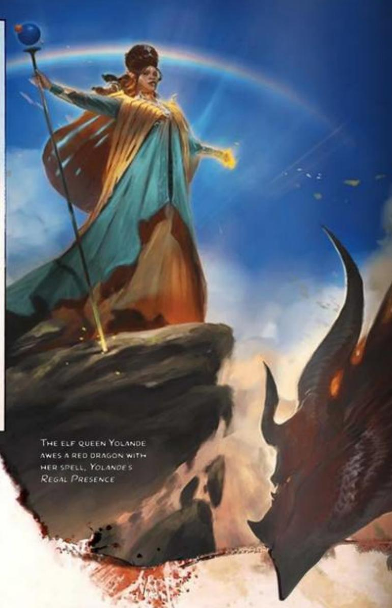
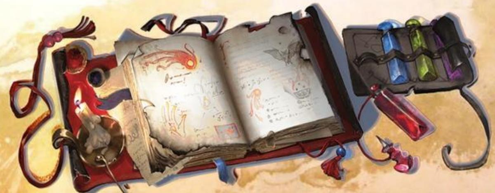
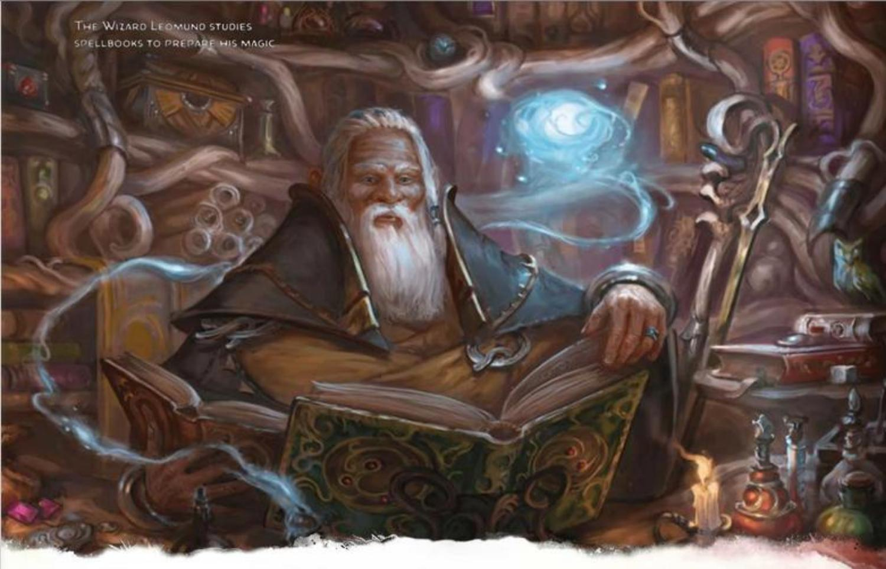
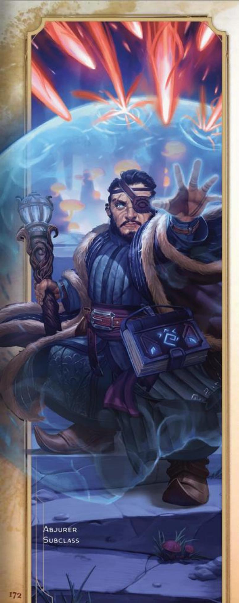
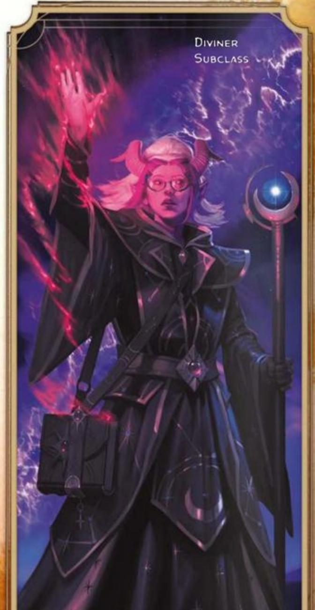
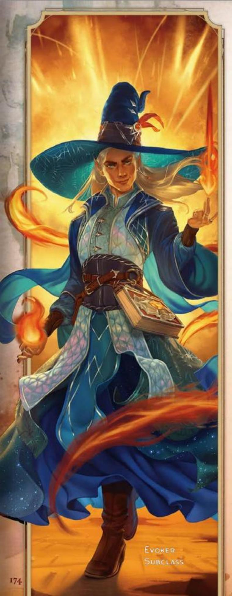
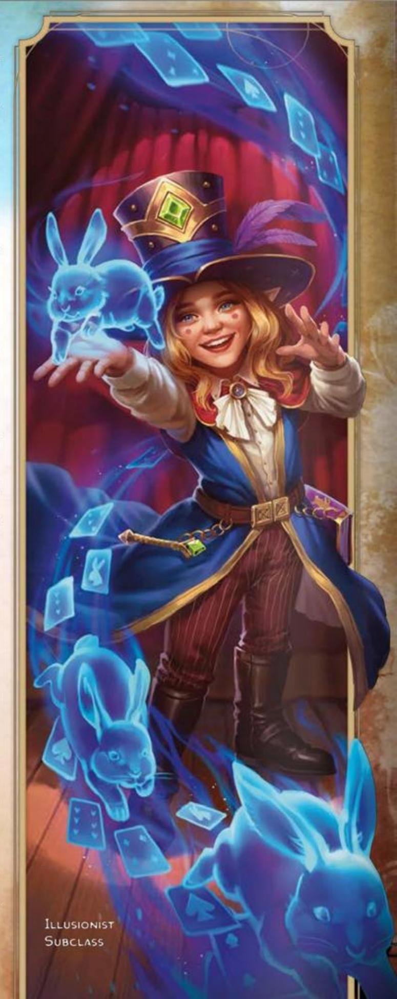
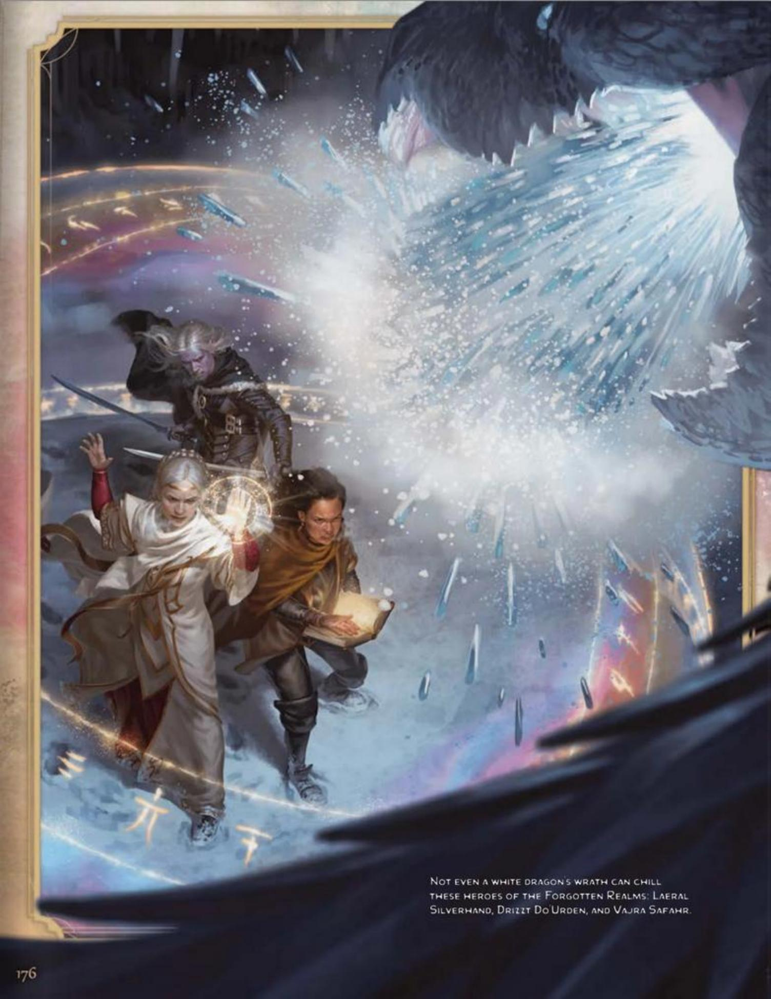

#### CORE WIZARD TRAITS

| Trait | Detail |
|-------|--------|
| **Primary Ability** | Intelligence |
| **Hit Point Die** | D6 per Wizard level |
| **Saving Throw Proficiencies** | Intelligence and Wisdom |
| **Skill Proficiencies** | *Choose 2:* Arcana, History, Insight, Investigation, Medicine, Nature, or Religion |
| **Weapon Proficiencies** | Simple weapons |
| **Armor Training** | None |
| **Starting Equipment** | *Choose A or B:* (A) 2 Daggers, Arcane Focus (Quarterstaff), Robe, Spellbook, Scholar's Pack, and 5 GP; or (B) 55 GP |

Wizards are defined by their exhaustive study of magic's inner workings. They cast spells of explosive fire, arcing lightning, subtle deception, and spectacular transformations. Their magic conjures monsters from other planes of existence, glimpses the future, or forms protective barriers. Their mightiest spells change one substance into another, call meteors from the sky, or open portals to other worlds.

Most Wizards share a scholarly approach to magic. They examine the theoretical underpinnings of magic, particularly the categorization of spells into schools of magic. Renowned Wizards such as Bigby, Tasha, Mordenkainen, and Yolande have built on their studies to invent iconic spells now used across the multiverse.

The closest a Wizard is likely to come to an ordinary life is working as a sage or lecturer. Other Wizards sell their services as advisers, serve in military forces, or pursue lives of crime or domination.

But the lure of knowledge calls even the most unadventurous Wizards from the safety of their libraries and laboratories and into crumbling ruins and lost cities. Most Wizards believe that their counterparts in ancient civilizations knew secrets of magic that have been lost to the ages, and discovering those secrets could unlock the path to a power greater than any magic available in the present age.

## BECOMING A WIZARD

#### AS A LEVEL 1 CHARACTER

- Gain all the traits in the Core Wizard Traits table.
- Gain the Wizard's level 1 features, which are listed in the Wizard Features table.

#### AS A MULTICLASS CHARACTER

- Gain the Hit Point Die from the Core Wizard Traits table.
- Gain the Wizard's level 1 features, which are listed in the Wizard Features table. See the multiclassing rules in chapter 2 to determine your available spell slots.

## WIZARD CLASS FEATURES

As a Wizard, you gain the following class features when you reach the specified Wizard levels. These features are listed in the Wizard Features table.

#### LEVEL 1: SPELLCASTING

As a student of arcane magic, you have learned to cast spells. See chapter 7 for the rules on spellcasting. The information below details how you use those rules with Wizard spells, which appear in the Wizard spell list later in the class's description.

Cantrips. You know three Wizard cantrips of your choice. Light, Mage Hand, and Ray of Frost are recommended. Whenever you finish a Long Rest, you can replace one of your cantrips from this feature with another Wizard cantrip of your choice.

When you reach Wizard levels 4 and 10, you learn another Wizard cantrip of your choice, as shown in the Cantrips column of the Wizard Features table.

Spellbook. Your wizardly apprenticeship culminated in the creation of a unique book: your spellbook. It is a Tiny object that weighs 3 pounds, contains 100 pages, and can be read only by you or someone casting Identify. You determine the book's appearance and materials, such as a gilt-edged tome or a collection of vellum bound with twine.

The book contains the level 1+ spells you know. It starts with six level 1 Wizard spells of your choice. Detect Magic, Feather Fall, Mage Armor, Magic Missile, Sleep, and Thunderwave are recommended.

Whenever you gain a Wizard level after 1, add two Wizard spells of your choice to your spellbook. Each of these spells must be of a level for which you have spell slots, as shown in the Wizard Features table. The spells are the culmination of arcane research you do regularly.

Spell Slots. The Wizard Features table shows how many spell slots you have to cast your level 1+ spells. You regain all expended slots when you finish a Long Rest.

Prepared Spells of Level 1+. You prepare the list of level 1+ spells that are available for you to cast with this feature. To do so, choose four spells from your spellbook. The chosen spells must be of a level for which you have spell slots.

#### WIZARD FEATURES

| Level | Proficiency Bonus | Class Features | Cantrips | Prepared Spells | 1 | 2 | 3 | 4 | 5 | 6 | 7 | 8 | 9 |
|-------|-------------------|------------------------------------------------|----------|-----------------|---|---|---|---|---|---|---|---|---|
| 1     | +2                | Spellcasting, Ritual Adept, Arcane Recovery    | 3        | 4               | 2 | — | — | — | — | — | — | — | — |
| 2     | +2                | Scholar                                        | 3        | 5               | 3 | — | — | — | — | — | — | — | — |
| 3     | +2                | Wizard Subclass                                | 3        | 6               | 4 | 2 | — | — | — | — | — | — | — |
| 4     | +2                | Ability Score Improvement                      | 4        | 7               | 4 | 3 | — | — | — | — | — | — | — |
| 5     | +3                | Memorize Spell                                 | 4        | 9               | 4 | 3 | 2 | — | — | — | — | — | — |
| 6     | +3                | Subclass feature                               | 4        | 10              | 4 | 3 | 3 | — | — | — | — | — | — |
| 7     | +3                | —                                              | 4        | 11              | 4 | 3 | 3 | 1 | — | — | — | — | — |
| 8     | +3                | Ability Score Improvement                      | 4        | 12              | 4 | 3 | 3 | 2 | — | — | — | — | — |
| 9     | +4                | —                                              | 4        | 14              | 4 | 3 | 3 | 3 | 1 | — | — | — | — |
| 10    | +4                | Subclass feature                               | 5        | 15              | 4 | 3 | 3 | 3 | 2 | — | — | — | — |
| 11    | +4                | —                                              | 5        | 16              | 4 | 3 | 3 | 3 | 2 | 1 | — | — | — |
| 12    | +4                | Ability Score Improvement                      | 5        | 16              | 4 | 3 | 3 | 3 | 2 | 1 | — | — | — |
| 13    | +5                | —                                              | 5        | 17              | 4 | 3 | 3 | 3 | 2 | 1 | 1 | — | — |
| 14    | +5                | Subclass feature                               | 5        | 18              | 4 | 3 | 3 | 3 | 2 | 1 | 1 | — | — |
| 15    | +5                | —                                              | 5        | 19              | 4 | 3 | 3 | 3 | 2 | 1 | 1 | 1 | — |
| 16    | +5                | Ability Score Improvement                      | 5        | 21              | 4 | 3 | 3 | 3 | 2 | 1 | 1 | 1 | — |
| 17    | +6                | —                                              | 5        | 22              | 4 | 3 | 3 | 3 | 2 | 1 | 1 | 1 | 1 |
| 18    | +6                | Spell Mastery                                  | 5        | 23              | 4 | 3 | 3 | 3 | 3 | 1 | 1 | 1 | 1 |
| 19    | +6                | Epic Boon                                      | 5        | 24              | 4 | 3 | 3 | 3 | 3 | 2 | 1 | 1 | 1 |
| 20    | +6                | Signature Spells                               | 5        | 25              | 4 | 3 | 3 | 3 | 3 | 2 | 2 | 1 | 1 |

The number of spells on your list increases as you gain Wizard levels, as shown in the Prepared Spells column of the Wizard Features table. Whenever that number increases, choose additional Wizard spells until the number of spells on your list matches the number in the table. The chosen spells must be of a level for which you have spell slots. For example, if you're a level 3 Wizard, your list of prepared spells can include six spells of levels 1 and 2 in any combination, chosen from your spellbook.

If another Wizard feature gives you spells that you always have prepared, those spells don't count against the number of spells you can prepare with this feature, but those spells otherwise count as Wizard spells for you.

Changing Your Prepared Spells. Whenever you finish a Long Rest, you can change your list of prepared spells, replacing any of the spells there with spells from your spellbook.

Spellcasting Ability. Intelligence is your spellcasting ability for your Wizard spells.

Spellcasting Focus. You can use an Arcane Focus or your spellbook as a Spellcasting Focus for your Wizard spells.

#### LEVEL 1: RITUAL ADEPT

You can cast any spell as a Ritual if that spell has the Ritual tag and the spell is in your spellbook. You needn't have the spell prepared, but you must read from the book to cast a spell in this way.

#### LEVEL 1: ARCANE RECOVERY

You can regain some of your magical energy by studying your spellbook. When you finish a Short Rest, you can choose expended spell slots to recover. The spell slots can have a combined level equal to no more than half your Wizard level (round up), and none of the slots can be level 6 or higher. For example, if you're a level 4 Wizard, you can recover up to two levels' worth of spell slots, regaining either one level 2 spell slot or two level 1 spell slots.

Once you use this feature, you can't do so again until you finish a Long Rest.

#### LEVEL 2: SCHOLAR

While studying magic, you also specialized in another field of study. Choose one of the following skills in which you have proficiency: Arcana, History, Investigation, Medicine, Nature, or Religion. You have Expertise in the chosen skill.

The spells you add to your spellbook as you gain levels reflect your ongoing magical research, but you might find other spells during your adventures that you can add to the book. You could discover a Wizard spell on a Spell Scroll, for example, and then copy it into your spellbook.

Copying a Spell into the Book. When you find a level 1+ Wizard spell, you can copy it into your spellbook if it's of a level you can prepare and if you have time to copy it. For each level of the spell, the transcription takes 2 hours and costs 50 GP. Afterward you can prepare the spell like the other spells in your spellbook.

Copying the Book. You can copy a spell from your spellbook into another book. This is like copying a new spell into your spellbook but faster, since you already know how to cast the spell. You need spend only 1 hour and 10 GP for each level of the copied spell.

If you lose your spellbook, you can use the same procedure to transcribe the Wizard spells that you have prepared into a new spellbook. Filling out the remainder of the new book requires you to find new spells to do so. For this reason, many wizards keep a backup spellbook.

#### LEVEL 3: WIZARD SUBCLASS

You gain a Wizard subclass of your choice. The Abjurer, Diviner, Evoker, and Illusionist subclasses are detailed after this class's description. A subclass is a specialization that grants you features at certain Wizard levels. For the rest of your career, you gain each of your subclass's features that are of your Wizard level or lower.

#### LEVEL 4: ABILITY SCORE IMPROVEMENT

You gain the Ability Score Improvement feat (see chapter 5) or another feat of your choice for which you qualify. You gain this feature again at Wizard levels 8, 12, and 16.

#### LEVEL 5: MEMORIZE SPELL

Whenever you finish a Short Rest, you can study your spellbook and replace one of the level 1+ Wizard spells you have prepared for your Spellcasting feature with another level 1+ spell from the book.

#### LEVEL 18: SPELL MASTERY

You have achieved such mastery over certain spells that you can cast them at will. Choose a level 1 and a level 2 spell in your spellbook that have a casting time of an action. You always have those spells prepared, and you can cast them at their lowest level without expending a spell slot. To cast either spell at a higher level, you must expend a spell slot.

Whenever you finish a Long Rest, you can study your spellbook and replace one of those spells with an eligible spell of the same level from the book.

#### LEVEL 19: EPIC BOON

You gain an Epic Boon feat (see chapter 5) or another feat of your choice for which you qualify. Boon of Spell Recall is recommended.

#### LEVEL 20: SIGNATURE SPELLS

Choose two level 3 spells in your spellbook as your signature spells. You always have these spells prepared, and you can cast each of them once at level 3 without expending a spell slot. When you do so, you can't cast them in this way again until you finish a Short or Long Rest. To cast either spell at a higher level, you must expend a spell slot.

# WIZARD SPELL LIST

This section presents the Wizard spell list. The spells are organized by spell level and then alphabetized, and each spell's school of magic is listed. In the Special column, C means the spell requires Concentration, R means it's a Ritual, and M means it requires a specific Material component.

### CANTRIP WIZARD SPELLS

| Spell            | School        | Special |
|------------------|---------------|---------|
| Acid Splash      | Evocation     | —       |
| Blade Ward       | Abjuration    | C       |
| Chill Touch      | Necromancy    | —       |
| Dancing Lights   | Illusion      | C       |
| Elementalism     | Transmutation | —       |
| Fire Bolt        | Evocation     | —       |
| Friends          | Enchantment   | C       |
| Light            | Evocation     | —       |
| Mage Hand        | Conjuration   | —       |
| Mending          | Transmutation | —       |
| Message          | Transmutation | —       |
| Mind Sliver      | Enchantment   | —       |
| Minor Illusion   | Illusion      | —       |
| Poison Spray     | Necromancy    | —       |
| Prestidigitation | Transmutation | —       |
| Ray of Frost     | Evocation     | —       |
| Shocking Grasp   | Evocation     | —       |
| Thunderclap      | Evocation     | —       |
| Toll the Dead    | Necromancy    | —       |
| True Strike      | Divination    | —       |

### LEVEL 1 WIZARD SPELLS

| Spell                        | School        | Special |
|------------------------------|---------------|---------|
| Alarm                        | Abjuration    | R       |
| Burning Hands                | Evocation     | —       |
| Charm Person                 | Enchantment   | —       |
| Chromatic Orb                | Evocation     | M       |
| Color Spray                  | Illusion      | —       |
| Comprehend Languages         | Divination    | R       |
| Detect Magic                 | Divination    | C, R    |
| Disguise Self                | Illusion      | —       |
| Expeditious Retreat          | Transmutation | C       |
| False Life                   | Necromancy    | —       |
| Feather Fall                 | Transmutation | —       |
| Find Familiar                | Conjuration   | R, M    |
| Fog Cloud                    | Conjuration   | C       |
| Grease                       | Conjuration   | —       |
| Ice Knife                    | Conjuration   | —       |
| Identify                     | Divination    | R, M    |
| Illusory Script              | Illusion      | R, M    |
| Jump                         | Transmutation | —       |
| Longstrider                  | Transmutation | —       |
| Mage Armor                   | Abjuration    | —       |
| Magic Missile                | Evocation     | —       |
| Protection from Evil and Good | Abjuration   | C, M    |
| Ray of Sickness              | Necromancy    | —       |
| Shield                       | Abjuration    | —       |
| Silent Image                 | Illusion      | C       |
| Sleep                        | Enchantment   | C       |
| Tasha's Hideous Laughter     | Enchantment   | C       |
| Tenser's Floating Disk       | Conjuration   | R       |
| Thunderwave                  | Evocation     | —       |
| Unseen Servant               | Conjuration   | R       |
| Witch Bolt                   | Evocation     | C       |

### LEVEL 2 WIZARD SPELLS

| Spell               | School        | Special |
|---------------------|---------------|---------|
| Alter Self          | Transmutation | C       |
| Arcane Lock         | Abjuration    | M       |
| Arcane Vigor        | Abjuration    | —       |
| Augury              | Divination    | R, M    |
| Blindness/Deafness  | Transmutation | —       |
| Blur                | Illusion      | C       |
| Cloud of Daggers    | Conjuration   | C       |
| Continual Flame     | Evocation     | M       |
| Crown of Madness    | Enchantment   | C       |
| Darkness            | Evocation     | C       |
| Darkvision          | Transmutation | —       |
| Detect Thoughts     | Divination    | C       |
| Dragon's Breath     | Transmutation | C       |
| Enhance Ability     | Transmutation | C       |
| Enlarge/Reduce      | Transmutation | C       |
| Flaming Sphere      | Evocation     | C       |
| Gentle Repose       | Necromancy    | R, M    |
| Gust of Wind        | Evocation     | C       |
| Hold Person         | Enchantment   | C       |
| Invisibility        | Illusion      | C       |
| Knock               | Transmutation | —       |
| Levitate            | Transmutation | C       |
| Locate Object       | Divination    | C       |
| Magic Mouth         | Illusion      | R, M    |
| Magic Weapon        | Transmutation | —       |
| Melf's Acid Arrow   | Evocation     | —       |
| Mind Spike          | Divination    | C       |
| Mirror Image        | Illusion      | —       |
| Misty Step          | Conjuration   | —       |
| Nystul's Magic Aura | Illusion      | —       |
| Phantasmal Force    | Illusion      | C       |
| Ray of Enfeeblement | Necromancy    | C       |
| Rope Trick          | Transmutation | —       |
| Scorching Ray       | Evocation     | —       |
| See Invisibility    | Divination    | —       |
| Shatter             | Evocation     | —       |
| Spider Climb        | Transmutation | C       |
| Suggestion          | Enchantment   | C       |
| Web                 | Conjuration   | C       |

### LEVEL 3 WIZARD SPELLS

| Spell                  | School        | Special |
|------------------------|---------------|---------|
| Animate Dead           | Necromancy    | —       |
| Bestow Curse           | Necromancy    | C       |
| Blink                  | Transmutation | —       |
| Clairvoyance           | Divination    | C, M    |
| Counterspell           | Abjuration    | —       |
| Dispel Magic           | Abjuration    | —       |
| Fear                   | Illusion      | C       |
| Feign Death            | Necromancy    | R       |
| Fireball               | Evocation     | —       |
| Fly                    | Transmutation | C       |
| Gaseous Form           | Transmutation | C       |
| Glyph of Warding       | Abjuration    | M       |
| Haste                  | Transmutation | C       |
| Hypnotic Pattern       | Illusion      | C       |
| Leomund's Tiny Hut     | Evocation     | R       |
| Lightning Bolt         | Evocation     | —       |
| Magic Circle           | Abjuration    | M       |
| Major Image            | Illusion      | C       |
| Nondetection           | Abjuration    | M       |
| Phantom Steed          | Illusion      | R       |
| Protection from Energy | Abjuration    | C       |
| Remove Curse           | Abjuration    | —       |
| Sending                | Divination    | —       |
| Sleet Storm            | Conjuration   | C       |
| Slow                   | Transmutation | C       |
| Speak with Dead        | Necromancy    | —       |
| Stinking Cloud         | Conjuration   | C       |
| Summon Fey             | Conjuration   | C, M    |
| Summon Undead          | Necromancy    | C, M    |
| Tongues                | Divination    | —       |
| Vampiric Touch         | Necromancy    | C       |
| Water Breathing        | Transmutation | R       |

### LEVEL 4 WIZARD SPELLS

| Spell                        | School        | Special |
|------------------------------|---------------|---------|
| Arcane Eye                   | Divination    | C       |
| Banishment                   | Abjuration    | C       |
| Blight                       | Necromancy    | —       |
| Charm Monster                | Enchantment   | —       |
| Confusion                    | Enchantment   | C       |
| Conjure Minor Elementals     | Conjuration   | C       |
| Control Water                | Transmutation | C       |
| Dimension Door               | Conjuration   | —       |
| Divination                   | Divination    | R, M    |
| Evard's Black Tentacles      | Conjuration   | C       |
| Fabricate                    | Transmutation | —       |
| Fire Shield                  | Evocation     | —       |
| Greater Invisibility         | Illusion      | C       |
| Hallucinatory Terrain        | Illusion      | —       |
| Ice Storm                    | Evocation     | —       |
| Leomund's Secret Chest       | Conjuration   | M       |
| Locate Creature              | Divination    | C       |
| Mordenkainen's Faithful Hound | Conjuration  | —       |
| Mordenkainen's Private Sanctum | Abjuration  | —       |
| Otiluke's Resilient Sphere   | Abjuration    | C       |
| Phantasmal Killer            | Illusion      | C       |
| Polymorph                    | Transmutation | C       |
| Stone Shape                  | Transmutation | —       |
| Stoneskin                    | Transmutation | C, M    |
| Summon Aberration            | Conjuration   | C, M    |
| Summon Construct             | Conjuration   | C, M    |
| Summon Elemental             | Conjuration   | C, M    |
| Vitriolic Sphere             | Evocation     | —       |
| Wall of Fire                 | Evocation     | C       |

### LEVEL 5 WIZARD SPELLS

| Spell                     | School        | Special |
|---------------------------|---------------|---------|
| Animate Objects           | Transmutation | C       |
| Bigby's Hand              | Evocation     | C       |
| Circle of Power           | Abjuration    | C       |
| Cloudkill                 | Conjuration   | C       |
| Cone of Cold              | Evocation     | —       |
| Conjure Elemental         | Conjuration   | C       |
| Contact Other Plane       | Divination    | R       |
| Creation                  | Illusion      | —       |
| Dominate Person           | Enchantment   | C       |
| Dream                     | Illusion      | —       |
| Geas                      | Enchantment   | —       |
| Hold Monster              | Enchantment   | C       |
| Jallarzi's Storm of Radiance | Evocation  | C       |
| Legend Lore               | Divination    | M       |
| Mislead                   | Illusion      | C       |
| Modify Memory             | Enchantment   | C       |
| Passwall                  | Transmutation | —       |
| Planar Binding            | Abjuration    | M       |
| Rary's Telepathic Bond    | Divination    | R       |
| Scrying                   | Divination    | C, M    |
| Seeming                   | Illusion      | —       |
| Steel Wind Strike         | Conjuration   | M       |
| Summon Dragon             | Conjuration   | C, M    |
| Synaptic Static           | Enchantment   | —       |
| Telekinesis               | Transmutation | C       |
| Teleportation Circle      | Conjuration   | M       |
| Wall of Force             | Evocation     | C       |
| Wall of Stone             | Evocation     | C       |
| Yolande's Regal Presence  | Enchantment   | C       |

### LEVEL 6 WIZARD SPELLS

| Spell                     | School        | Special |
|---------------------------|---------------|---------|
| Arcane Gate               | Conjuration   | C       |
| Chain Lightning           | Evocation     | —       |
| Circle of Death           | Necromancy    | M       |
| Contingency               | Abjuration    | M       |
| Create Undead             | Necromancy    | M       |
| Disintegrate              | Transmutation | —       |
| Drawmij's Instant Summons | Conjuration   | R, M    |
| Eyebite                   | Necromancy    | C       |
| Flesh to Stone            | Transmutation | C       |
| Globe of Invulnerability  | Abjuration    | C       |
| Guards and Wards          | Abjuration    | M       |
| Magic Jar                 | Necromancy    | M       |
| Mass Suggestion           | Enchantment   | —       |
| Move Earth                | Transmutation | C       |
| Otiluke's Freezing Sphere | Evocation     | —       |
| Otto's Irresistible Dance | Enchantment   | C       |
| Programmed Illusion       | Illusion      | M       |
| Summon Fiend              | Conjuration   | C, M    |
| Sunbeam                   | Evocation     | C       |
| Tasha's Bubbling Cauldron | Conjuration   | M       |
| True Seeing               | Divination    | M       |
| Wall of Ice               | Evocation     | C       |

### LEVEL 7 WIZARD SPELLS

| Spell                              | School        | Special |
|------------------------------------|---------------|---------|
| Delayed Blast Fireball             | Evocation     | C       |
| Etherealness                       | Conjuration   | —       |
| Finger of Death                    | Necromancy    | —       |
| Forcecage                          | Evocation     | C, M    |
| Mirage Arcane                      | Illusion      | —       |
| Mordenkainen's Magnificent Mansion | Conjuration   | M       |
| Mordenkainen's Sword               | Evocation     | C, M    |
| Plane Shift                        | Conjuration   | M       |
| Prismatic Spray                    | Evocation     | —       |
| Project Image                      | Illusion      | C, M    |
| Reverse Gravity                    | Transmutation | C       |
| Sequester                          | Transmutation | M       |
| Simulacrum                         | Illusion      | M       |
| Symbol                             | Abjuration    | M       |
| Teleport                           | Conjuration   | —       |

### LEVEL 8 WIZARD SPELLS

| Spell              | School        | Special |
|--------------------|---------------|---------|
| Antimagic Field    | Abjuration    | C       |
| Antipathy/Sympathy | Enchantment   | —       |
| Befuddlement       | Enchantment   | —       |
| Clone              | Necromancy    | M       |
| Control Weather    | Transmutation | C       |
| Demiplane          | Conjuration   | —       |
| Dominate Monster   | Enchantment   | C       |
| Incendiary Cloud   | Conjuration   | C       |
| Maze               | Conjuration   | C       |
| Mind Blank         | Abjuration    | —       |
| Power Word Stun    | Enchantment   | —       |
| Sunburst           | Evocation     | —       |
| Telepathy          | Divination    | —       |

### LEVEL 9 WIZARD SPELLS

| Spell             | School        | Special |
|-------------------|---------------|---------|
| Astral Projection | Necromancy    | M       |
| Foresight         | Divination    | —       |
| Gate              | Conjuration   | C, M    |
| Imprisonment      | Abjuration    | M       |
| Meteor Swarm      | Evocation     | —       |
| Power Word Kill   | Enchantment   | —       |
| Prismatic Wall    | Abjuration    | —       |
| Shapechange       | Transmutation | C, M    |
| Time Stop         | Transmutation | —       |
| True Polymorph    | Transmutation | C       |
| Weird             | Illusion      | C       |
| Wish              | Conjuration   | —       |

## WIZARD SUBCLASSES

A Wizard subclass is a specialization that grants you features at certain Wizard levels, as specified in the subclass. This section presents the Abjurer, Diviner, Evoker, and Illusionist subclasses.

### ABJURER

Shield Companions and Banish Foes

Your study of magic is focused on spells that block, banish, or protect—ending harmful effects, banishing evil influences, and protecting the weak. Abjurers are sought when baleful spirits require exorcism, when important locations must be guarded against magical spying, and when portals to other planes of existence must be closed.

#### LEVEL 3: ABJURATION SAVANT

Choose two Wizard spells from the Abjuration school, each of which must be no higher than level 2, and add them to your spellbook for free.

In addition, whenever you gain access to a new level of spell slots in this class, you can add one Wizard spell from the Abjuration school to your spellbook for free. The chosen spell must be of a level for which you have spell slots.

#### LEVEL 3: ARCANE WARD

You can weave magic around yourself for protection. When you cast an Abjuration spell with a spell slot, you can simultaneously use a strand of the spell's magic to create a magical ward on yourself that lasts until you finish a Long Rest. The ward has Hit Points equal to twice your Wizard level plus your Intelligence modifier. Whenever you take damage, the ward takes the damage instead. If this damage reduces the ward to 0 Hit Points, you take any remaining damage.

Whenever you cast an Abjuration spell with a spell slot, the ward regains a number of Hit Points equal to twice the level of the spell slot. Alternatively, as a Bonus Action, you can expend a spell slot, and the ward regains a number of Hit Points equal to twice the level of the spell slot expended.

Once you create the ward, you can't create it again until you finish a Long Rest.

#### LEVEL 6: PROJECTED WARD

When a creature that you can see within 30 feet of yourself takes damage, you can take a Reaction to cause your Arcane Ward to absorb that damage. If this damage reduces the ward to 0 Hit Points, the warded creature takes any remaining damage. If that creature has any Resistances or Vulnerabilities, apply them before reducing the ward's Hit Points.

#### LEVEL 10: SPELL BREAKER

You always have the Counterspell and Dispel Magic spells prepared. In addition, you can cast Dispel Magic as a Bonus Action, and you can add your Proficiency Bonus to its ability check.

When you cast either spell with a spell slot, that slot isn't expended if the spell fails to stop a spell.

#### LEVEL 14: SPELL RESISTANCE

You have Advantage on saving throws against spells, and you have Resistance to the damage of spells.

### DIVINER

Learn the Secrets of the Multiverse

The counsel of a Diviner is sought by those who want a clearer understanding of the past, present, and future. As a Diviner, you strive to part the veils of space, time, and consciousness. You work to master spells of discernment, remote viewing, supernatural knowledge, and foresight.

#### LEVEL 3: DIVINATION SAVANT

Choose two Wizard spells from the Divination school, each of which must be no higher than level 2, and add them to your spellbook for free.

In addition, whenever you gain access to a new level of spell slots in this class, you can add one Wizard spell from the Divination school to your spellbook for free. The chosen spell must be of a level for which you have spell slots.

#### LEVEL 3: PORTENT

Glimpses of the future begin to press on your awareness. Whenever you finish a Long Rest, roll two d20s and record the numbers rolled. You can replace any D20 Test made by you or a creature that you can see with one of these foretelling rolls. You must choose to do so before the roll, and you can replace a roll in this way only once per turn.

Each foretelling roll can be used only once. When you finish a Long Rest, you lose any unused foretelling rolls.

#### LEVEL 6: EXPERT DIVINATION

Casting Divination spells comes so easily to you that it expends only a fraction of your spellcasting efforts. When you cast a Divination spell using a level 2+ spell slot, you regain one expended spell slot. The slot you regain must be of a lower level than the slot you expended and can't be level 6 or higher.

#### LEVEL 10: THE THIRD EYE

You can increase your powers of perception. As a Bonus Action, choose one of the following benefits, which lasts until you start a Short or Long Rest. You can't use this feature again until you finish a Short or Long Rest.

Darkvision. You gain Darkvision with a range of 120 feet.

Greater Comprehension. You can read any language.

See Invisibility. You can cast See Invisibility without expending a spell slot.

#### LEVEL 14: GREATER PORTENT

The visions in your dreams intensify and paint a more accurate picture in your mind of what is to come. Roll three d20s for your Portent feature rather than two.

### EVOKER

Create Explosive Elemental Effects

Your studies focus on magic that creates powerful elemental effects such as bitter cold, searing flame, rolling thunder, crackling lightning, and burning acid. Some Evokers find employment in military forces, serving as artillery to blast enemy armies. Others use their spectacular power to protect the weak, while some seek their own gain as bandits, adventurers, or aspiring tyrants.

#### LEVEL 3: EVOCATION SAVANT

Choose two Wizard spells from the Evocation school, each of which must be no higher than level 2, and add them to your spellbook for free.

In addition, whenever you gain access to a new level of spell slots in this class, you can add one Wizard spell from the Evocation school to your spellbook for free. The chosen spell must be of a level for which you have spell slots.

#### LEVEL 3: POTENT CANTRIP

Your damaging cantrips affect even creatures that avoid the brunt of the effect. When you cast a cantrip at a creature and you miss with the attack roll or the target succeeds on a saving throw against the cantrip, the target takes half the cantrip's damage (if any) but suffers no additional effect from the cantrip.

#### LEVEL 6: SCULPT SPELLS

You can create pockets of relative safety within the effects of your evocations. When you cast an Evocation spell that affects other creatures that you can see, you can choose a number of them equal to 1 plus the spell's level. The chosen creatures automatically succeed on their saving throws against the spell, and they take no damage if they would normally take half damage on a successful save.

#### LEVEL 10: EMPOWERED EVOCATION

Whenever you cast a Wizard spell from the Evocation school, you can add your Intelligence modifier to one damage roll of that spell.

#### LEVEL 14: OVERCHANNEL

You can increase the power of your spells. When you cast a Wizard spell with a spell slot of levels 1-5 that deals damage, you can deal maximum damage with that spell on the turn you cast it.

The first time you do so, you suffer no adverse effect. If you use this feature again before you finish a Long Rest, you take 2d12 Necrotic damage for each level of the spell slot immediately after you cast it. Each time you use this feature again before finishing a Long Rest, the Necrotic damage per spell level increases by 1d12.

### ILLUSIONIST

You specialize in magic that dazzles the senses and tricks the mind, and the illusions you craft make the impossible seem real.

#### LEVEL 3: ILLUSION SAVANT

Choose two Wizard spells from the Illusion school, each of which must be no higher than level 2, and add them to your spellbook for free.

In addition, whenever you gain access to a new level of spell slots in this class, you can add one Wizard spell from the Illusion school to your spellbook for free. The chosen spell must be of a level for which you have spell slots.

#### LEVEL 3: IMPROVED ILLUSIONS

You can cast Illusion spells without providing Verbal components, and if an Illusion spell you cast has a range of 10+ feet, the range increases by 60 feet.

You also know the Minor Illusion cantrip. If you already know it, you learn a different Wizard cantrip of your choice. The cantrip doesn't count against your number of cantrips known. You can create both a sound and an image with a single casting of Minor Illusion, and you can cast it as a Bonus Action.

#### LEVEL 6: PHANTASMAL CREATURES

You always have the Summon Beast and Summon Fey spells prepared. Whenever you cast either spell, you can change its school to Illusion, which causes the summoned creature to appear spectral. You can cast the spell without expending a spell slot a number of times equal to your Intelligence modifier (minimum of once), and you regain all expended uses when you finish a Long Rest.

#### LEVEL 10: ILLUSORY SELF

When a creature hits you with an attack roll, you can take a Reaction to interpose an illusory duplicate of yourself between the attacker and yourself. The attack automatically misses you, then the illusion dissipates.

Once you use this feature, you can't use it again until you finish a Short or Long Rest. You can also restore your use of it by expending a level 2+ spell slot (no action required).

#### LEVEL 14: ILLUSORY REALITY

You have learned to weave shadow magic into your illusions to give them a semi-reality. When you cast an Illusion spell with a spell slot, you can choose one inanimate, nonmagical object that is part of the illusion and make that object real. You can do this on your turn as a Bonus Action while the spell is ongoing. The object remains real for 1 minute, during which it can't deal damage or directly harm anyone.

