# SPECIES DESCRIPTIONS

Ten species are presented in this section in alphabetical order: Aasimar, Dragonborn, Dwarf, Elf, Gnome, Goliath, Halfling, Human, Orc, and Tiefling.

### AASIMAR

Aasimar (pronounced AH-sih-mar) are mortals who carry a spark of the Upper Planes within their souls. Whether descended from an angelic being or infused with celestial power, they can fan that spark to bring light, healing, and heavenly fury.

Aasimar can arise among any population of mortals. They resemble their parents, but they live for up to 160 years and have features that hint at their celestial heritage, such as metallic freckles, luminous eyes, a halo, or the skin color of an angel (silver, opalescent green, or coppery red). These features start subtle and become obvious when the Aasimar learns to reveal their full celestial nature.

### AASIMAR TRAITS

Creature Type: Humanoid

Size: Medium (about 4–7 feet tall) or Small (about 2–4 feet tall), chosen when you select this species

Speed: 30 feet

As an Aasimar, you have these special traits.

Celestial Resistance. You have Resistance to Necrotic damage and Radiant damage.

Darkvision. You have Darkvision with a range of 60 feet.

Healing Hands. As a Magic action, you touch a creature and roll a number of d4s equal to your Proficiency Bonus. The creature regains a number of Hit Points equal to the total rolled. Once you use this trait, you can't use it again until you finish a Long Rest.

Light Bearer. You know the Light cantrip. Charisma is your spellcasting ability for it.

Celestial Revelation. When you reach character level 3, you can transform as a Bonus Action using one of the options below (choose the option each time you transform). The transformation lasts for 1 minute or until you end it (no action required). Once you transform, you can't do so again until you finish a Long Rest.

Once on each of your turns before the transformation ends, you can deal extra damage to one target when you deal damage to it with an attack or a spell. The extra damage equals your Proficiency Bonus, and the extra damage's type is either Necrotic for Necrotic Shroud or Radiant for Heavenly Wings and Inner Radiance.

Here are the transformation options:

Heavenly Wings. Two spectral wings sprout from your back temporarily. Until the transformation ends, you have a Fly Speed equal to your Speed.

Inner Radiance. Searing light temporarily radiates from your eyes and mouth. For the duration, you shed Bright Light in a 10-foot radius and Dim Light for an additional 10 feet, and at the end of each of your turns, each creature within 10 feet of you takes Radiant damage equal to your Proficiency Bonus.

Necrotic Shroud. Your eyes briefly become pools of darkness, and flightless wings sprout from your back temporarily. Creatures other than your allies within 10 feet of you must succeed on a Charisma saving throw (DC 8 plus your Charisma modifier and Proficiency Bonus) or have the Frightened condition until the end of your next turn.

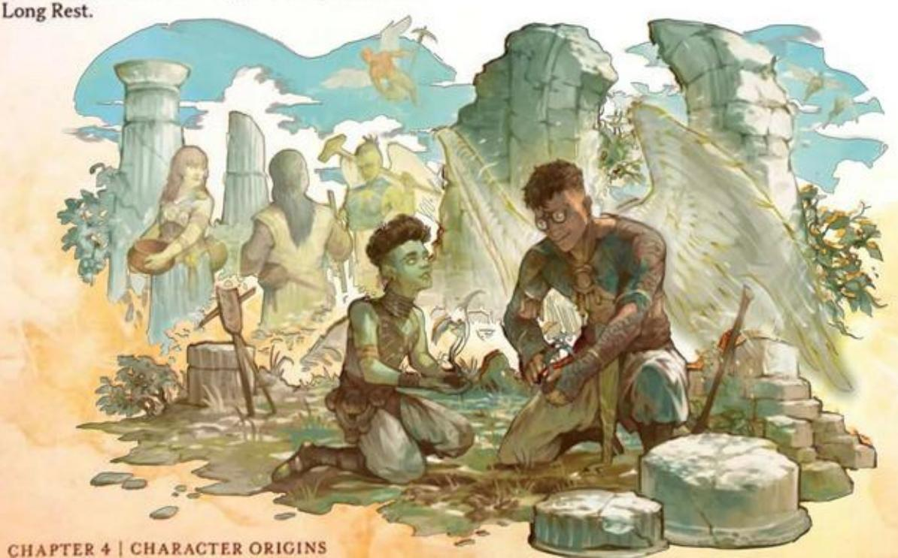

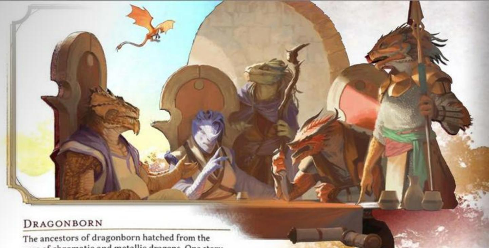

### DRAGONBORN

The ancestors of dragonborn hatched from the eggs of chromatic and metallic dragons. One story holds that these eggs were blessed by the dragon gods Bahamut and Tiamat, who wanted to populate the multiverse with people created in their image. Another story claims that dragons created the first dragonborn without the gods' blessings. Whatever their origin, dragonborn have made homes for themselves on the Material Plane.

Dragonborn look like wingless, bipedal dragons—scaly, bright-eyed, and thick-boned with horns on their heads—and their coloration and other features are reminiscent of their draconic ancestors.

### DRAGONBORN TRAITS

Creature Type: Humanoid

Size: Medium (about 5-7 feet tall)

Speed: 30 feet

As a Dragonborn, you have these special traits.

Draconic Ancestry. Your lineage stems from a dragon progenitor. Choose the kind of dragon from the Draconic Ancestors table. Your choice affects your Breath Weapon and Damage Resistance traits as well as your appearance.

#### DRACONIC ANCESTORS

| Dragon | Damage Type | Dragon | Damage Type |
|--------|-------------|--------|-------------|
| Black  | Acid        | Gold   | Fire        |
| Blue   | Lightning   | Green  | Poison      |
| Brass  | Fire        | Red    | Fire        |
| Bronze | Lightning   | Silver | Cold        |
| Copper | Acid        | White  | Cold        |

Breath Weapon. When you take the Attack action on your turn, you can replace one of your attacks with an exhalation of magical energy in either a 15-foot Cone or a 30-foot Line that is 5 feet wide (choose the shape each time). Each creature in that area must make a Dexterity saving throw (DC 8 plus your Constitution modifier and Proficiency Bonus). On a failed save, a creature takes 1d10 damage of the type determined by your Draconic Ancestry trait. On a successful save, a creature takes half as much damage. This damage increases by 1d10 when you reach character levels 5 (2d10), 11 (3d10), and 17 (4d10).

You can use this Breath Weapon a number of times equal to your Proficiency Bonus, and you regain all expended uses when you finish a Long Rest.

Damage Resistance. You have Resistance to the damage type determined by your Draconic Ancestry trait.

Darkvision. You have Darkvision with a range of 60 feet.

Draconic Flight. When you reach character level 5, you can channel draconic magic to give yourself temporary flight. As a Bonus Action, you sprout spectral wings on your back that last for 10 minutes or until you retract the wings (no action required) or have the Incapacitated condition. During that time, you have a Fly Speed equal to your Speed. Your wings appear to be made of the same energy as your Breath Weapon. Once you use this trait, you can't use it again until you finish a Long Rest.

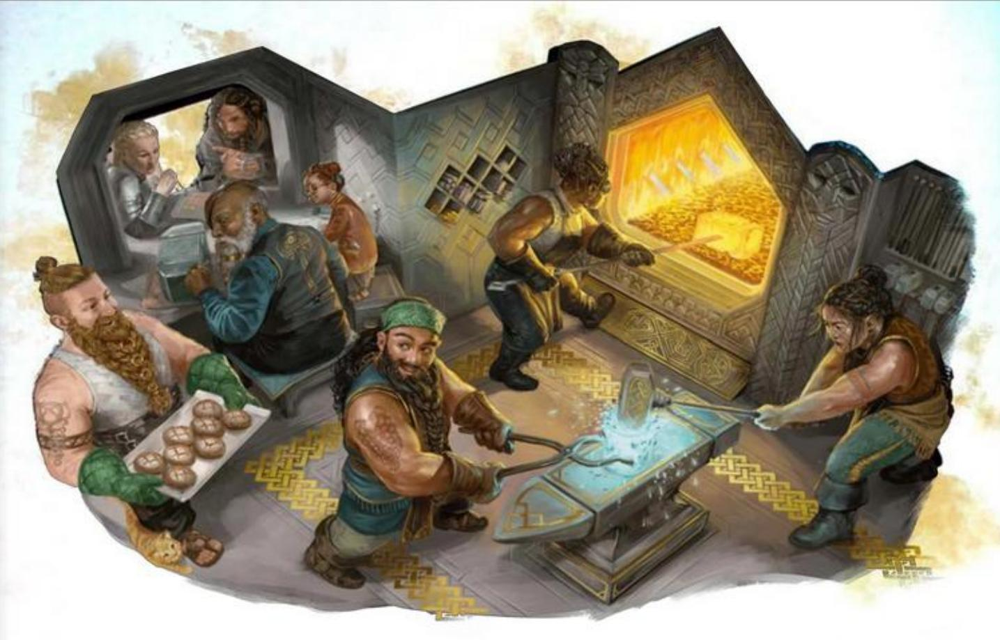

### DWARF

Dwarves were raised from the earth in the elder days by a deity of the forge. Called by various names on different worlds—Moradin, Reorx, and others—that god gave dwarves an affinity for stone and metal and for living underground. The god also made them resilient like the mountains, with a life span of about 350 years.

Squat and often bearded, the original dwarves carved cities and strongholds into mountainsides and under the earth. Their oldest legends tell of conflicts with the monsters of mountaintops and the Underdark, whether those monsters were towering giants or subterranean horrors. Inspired by those tales, dwarves of any culture often sing of valorous deeds—especially of the little overcoming the mighty.

On some worlds in the multiverse, the first settlements of dwarves were built in hills or mountains, and the families who trace their ancestry to those settlements call themselves hill dwarves or mountain dwarves, respectively. The Greyhawk and Dragonlance settings have such communities.

### DWARF TRAITS

Creature Type: Humanoid

Size: Medium (about 4-5 feet tall)

Speed: 30 feet

As a Dwarf, you have these special traits.

Darkvision. You have Darkvision with a range of 120 feet.

Dwarven Resilience. You have Resistance to Poison damage. You also have Advantage on saving throws you make to avoid or end the Poisoned condition.

Dwarven Toughness. Your Hit Point maximum increases by 1, and it increases by 1 again whenever you gain a level.

Stonecunning. As a Bonus Action, you gain Tremorsense with a range of 60 feet for 10 minutes. You must be on a stone surface or touching a stone surface to use this Tremorsense. The stone can be natural or worked.

You can use this Bonus Action a number of times equal to your Proficiency Bonus, and you regain all expended uses when you finish a Long Rest.

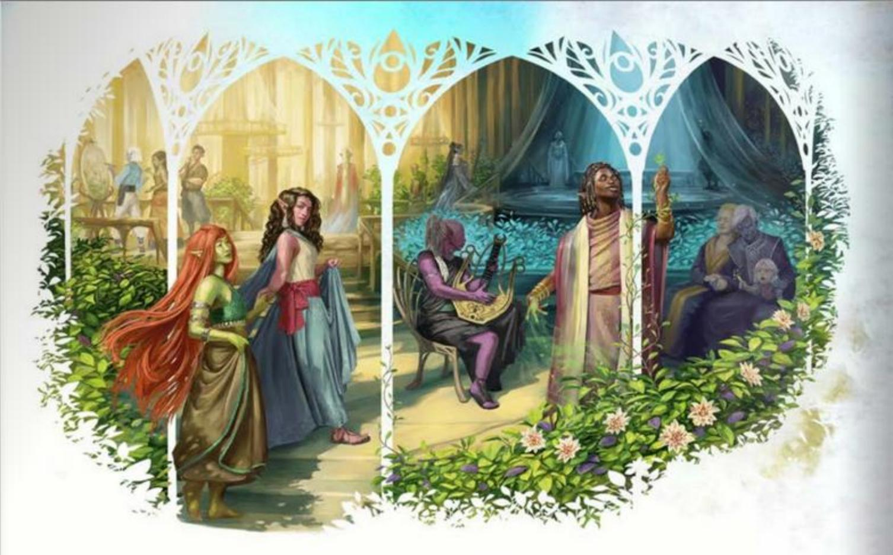

### ELF

Created by the god Corellon, the first elves could change their forms at will. They lost this ability when Corellon cursed them for plotting with the deity Lolth, who tried and failed to usurp Corellon's dominion. When Lolth was cast into the Abyss, most elves renounced her and earned Corellon's forgiveness, but that which Corellon had taken from them was lost forever.

No longer able to shape-shift at will, the elves retreated to the Feywild, where their sorrow was deepened by that plane's influence. Over time, curiosity led many of them to explore other planes of existence, including worlds in the Material Plane.

Elves have pointed ears and lack facial and body hair. They live for around 750 years, and they don't sleep but instead enter a trance when they need to rest. In that state, they remain aware of their surroundings while immersing themselves in memories and meditations.

An environment subtly transforms elves after they inhabit it for a millennium or more, and it grants them certain kinds of magic. Drow, high elves, and wood elves are examples of elves who have been transformed thus.

#### DROW

Drow typically dwell in the Underdark and have been shaped by it. Some drow individuals and societies avoid the Underdark altogether yet carry its magic. In the Eberron setting, for example, drow dwell in rainforests and cyclopean ruins on the continent of Xen'drik.

#### HIGH ELVES

High elves have been infused with the magic of crossings between the Feywild and the Material Plane. On some worlds, high elves refer to themselves by other names. For example, they call themselves sun or moon elves in the Forgotten Realms setting, Silvanesti and Qualinesti in the Dragonlance setting, and Aereni in the Eberron setting.

#### WOOD ELVES

Wood elves carry the magic of primeval forests within themselves. They are known by many other names, including wild elves, green elves, and forest elves. Grugach are reclusive wood elves of the Greyhawk setting, while the Kagonesti and the Tairnadal are wood elves of the Dragonlance and Eberron settings, respectively.

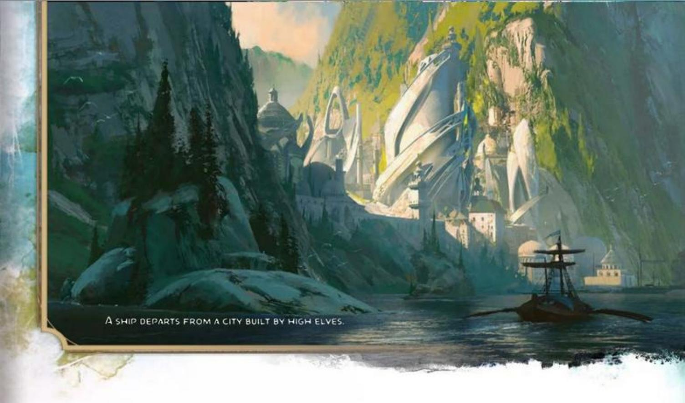

### ELF TRAITS

Creature Type: Humanoid

Size: Medium (about 5-6 feet tall)

Speed: 30 feet

As an Elf, you have these special traits.

Darkvision. You have Darkvision with a range of 60 feet.

Elven Lineage. You are part of a lineage that grants you supernatural abilities. Choose a lineage from the Elven Lineages table. You gain the level 1 benefit of that lineage.

When you reach character levels 3 and 5, you learn a higher-level spell, as shown on the table. You always have that spell prepared. You can cast it once without a spell slot, and you regain the ability to cast it in that way when you finish a Long Rest. You can also cast the spell using any spell slots you have of the appropriate level.

Intelligence, Wisdom, or Charisma is your spellcasting ability for the spells you cast with this trait (choose the ability when you select the lineage).

Fey Ancestry. You have Advantage on saving throws you make to avoid or end the Charmed condition.

Keen Senses. You have proficiency in the Insight, Perception, or Survival skill.

Trance. You don't need to sleep, and magic can't put you to sleep. You can finish a Long Rest in 4 hours if you spend those hours in a trancelike meditation, during which you retain consciousness.

#### ELVEN LINEAGES

| Lineage  | Level 1                                                                                                                                                   | Level 3      | Level 5            |
|----------|-----------------------------------------------------------------------------------------------------------------------------------------------------------|--------------|--------------------|
| Drow     | The range of your Darkvision increases to 120 feet. You also know the Dancing Lights cantrip.                                                             | Faerie Fire  | Darkness           |
| High Elf | You know the Prestidigitation cantrip. Whenever you finish a Long Rest, you can replace that cantrip with a different cantrip from the Wizard spell list. | Detect Magic | Misty Step         |
| Wood Elf | Your Speed increases to 35 feet. You also know the Druidcraft cantrip.                                                                                    | Longstrider  | Pass without Trace |

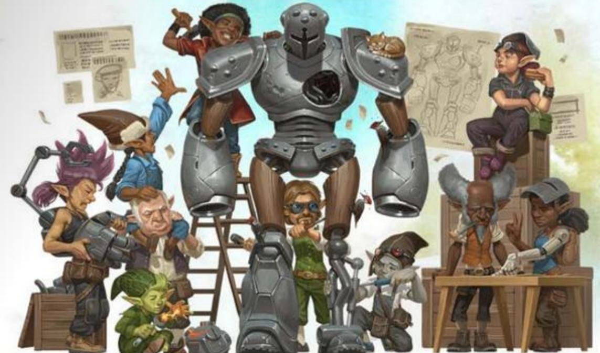

### GNOME

Gnomes are magical folk created by gods of invention, illusions, and life underground. The earliest gnomes were seldom seen by other folk due to the gnomes' secretive nature and their propensity for living in forests and burrows. What they lacked in size, they made up for in cleverness. They confounded predators with traps and labyrinthine tunnels. They also learned magic from gods like Garl Glittergold, Baervan Wildwanderer, and Baravar Cloakshadow, who visited them in disguise. That magic eventually created the lineages of forest gnomes and rock gnomes.

Gnomes are petite folk with big eyes and pointed ears, who live around 425 years. Many gnomes like the feeling of a roof over their head, even if that "roof" is nothing more than a hat.

### GNOME TRAITS

Creature Type: Humanoid

Size: Small (about 3-4 feet tall)

Speed: 30 feet

As a Gnome, you have these special traits.

Darkvision. You have Darkvision with a range of 60 feet.

Gnomish Cunning. You have Advantage on Intelligence, Wisdom, and Charisma saving throws.

Gnomish Lineage. You are part of a lineage that grants you supernatural abilities. Choose one of the following options; whichever one you choose, Intelligence, Wisdom, or Charisma is your spellcasting ability for the spells you cast with this trait (choose the ability when you select the lineage):

Forest Gnome. You know the Minor Illusion cantrip. You also always have the Speak with Animals spell prepared. You can cast it without a spell slot a number of times equal to your Proficiency Bonus, and you regain all expended uses when you finish a Long Rest. You can also use any spell slots you have to cast the spell.

Rock Gnome. You know the Mending and Prestidigitation cantrips. In addition, you can spend 10 minutes casting Prestidigitation to create a Tiny clockwork device (AC 5, 1 HP), such as a toy, fire starter, or music box. When you create the device, you determine its function by choosing one effect from Prestidigitation; the device produces that effect whenever you or another creature takes a Bonus Action to activate it with a touch. If the chosen effect has options within it, you choose one of those options for the device when you create it. For example, if you choose the spell's ignite-extinguish effect, you determine whether the device ignites or extinguishes fire; the device doesn't do both. You can have three such devices in existence at a time, and each falls apart 8 hours after its creation or when you dismantle it with a touch as a Utilize action.

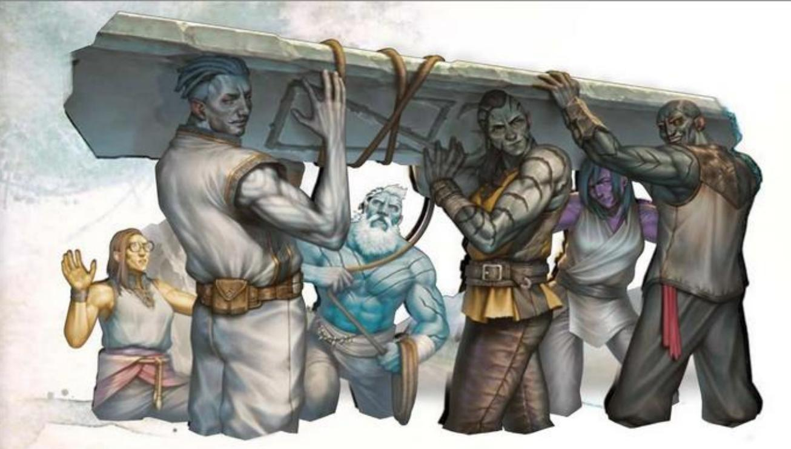

### GOLIATH

Towering over most folk, goliaths are distant descendants of giants. Each goliath bears the favors of the first giants—favors that manifest in various supernatural boons, including the ability to quickly grow and temporarily approach the height of goliaths' gigantic kin.

Goliaths have physical characteristics that are reminiscent of the giants in their family lines. For example, some goliaths look like stone giants, while others resemble fire giants. Whatever giants they count as kin, goliaths have forged their own path in the multiverse—unencumbered by the internecine conflicts that have ravaged giantkind for ages—and seek heights above those reached by their ancestors.

### GOLIATH TRAITS

Creature Type: Humanoid

Size: Medium (about 7-8 feet tall)

Speed: 35 feet

As a Goliath, you have these special traits.

Giant Ancestry. You are descended from Giants. Choose one of the following benefits—a supernatural boon from your ancestry; you can use the chosen benefit a number of times equal to your Proficiency Bonus, and you regain all expended uses when you finish a Long Rest:

Cloud's Jaunt (Cloud Giant). As a Bonus Action, you magically teleport up to 30 feet to an unoccupied space you can see.

Fire's Burn (Fire Giant). When you hit a target with an attack roll and deal damage to it, you can also deal 1d10 Fire damage to that target.

Frost's Chill (Frost Giant). When you hit a target with an attack roll and deal damage to it, you can also deal 1d6 Cold damage to that target and reduce its Speed by 10 feet until the start of your next turn.

Hill's Tumble (Hill Giant). When you hit a Large or smaller creature with an attack roll and deal damage to it, you can give that target the Prone condition.

Stone's Endurance (Stone Giant). When you take damage, you can take a Reaction to roll 1d12. Add your Constitution modifier to the number rolled and reduce the damage by that total.

Storm's Thunder (Storm Giant). When you take damage from a creature within 60 feet of you, you can take a Reaction to deal 1d8 Thunder damage to that creature.

Large Form. Starting at character level 5, you can change your size to Large as a Bonus Action if you're in a big enough space. This transformation lasts for 10 minutes or until you end it (no action required). For that duration, you have Advantage on Strength checks, and your Speed increases by 10 feet. Once you use this trait, you can't use it again until you finish a Long Rest.

Powerful Build. You have Advantage on any saving throw you make to end the Grappled condition. You also count as one size larger when determining your carrying capacity.

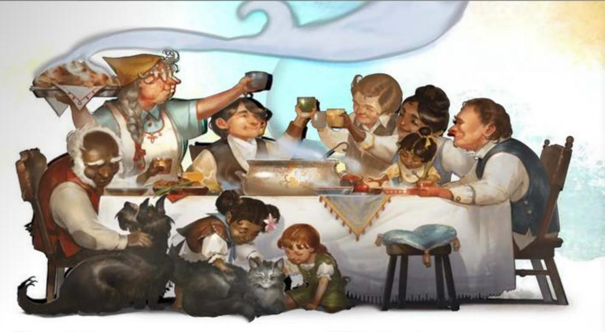

### HALFLING

Cherished and guided by gods who value life, home, and hearth, halflings gravitate toward bucolic havens where family and community help shape their lives. That said, many halflings possess a brave and adventurous spirit that leads them on journeys of discovery, affording them the chance to explore a bigger world and make new friends along the way. Their size—similar to that of a human child—helps them pass through crowds unnoticed and slip through tight spaces.

Anyone who has spent time around halflings, particularly halfling adventurers, has likely witnessed the storied "luck of the halflings" in action. When a halfling is in mortal danger, an unseen force seems to intervene on the halfling's behalf. Many halflings believe in the power of luck, and they attribute their unusual gift to one or more of their benevolent gods, including Yondalla, Brandobaris, and Charmalaine. The same gift might contribute to their robust life spans (about 150 years).

Halfling communities come in all varieties. For every sequestered shire tucked away in an unspoiled part of the world, there's a crime syndicate like the Boromar Clan in the Eberron setting or a territorial mob of halflings like those in the Dark Sun setting.

Halflings who prefer to live underground are sometimes called strongheart halflings or stouts. Nomadic halflings, as well as those who live among humans and other tall folk, are sometimes called lightfoot halflings or tallfellows.

### HALFLING TRAITS

Creature Type: Humanoid

Size: Small (about 2-3 feet tall)

Speed: 30 feet

As a Halfling, you have these special traits.

Brave. You have Advantage on saving throws you make to avoid or end the Frightened condition.

Halfling Nimbleness. You can move through the space of any creature that is a size larger than you, but you can't stop in the same space.

Luck. When you roll a 1 on the d20 of a D20 Test, you can reroll the die, and you must use the new roll.

Naturally Stealthy. You can take the Hide action even when you are obscured only by a creature that is at least one size larger than you.

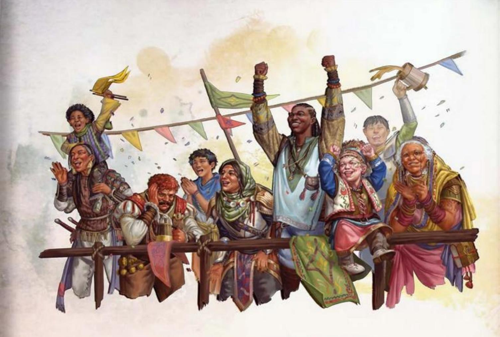

### HUMAN

Found throughout the multiverse, humans are as varied as they are numerous, and they endeavor to achieve as much as they can in the years they are given. Their ambition and resourcefulness are commended, respected, and feared on many worlds.

Humans are as diverse in appearance as the people of Earth, and they have many gods. Scholars dispute the origin of humanity, but one of the earliest known human gatherings is said to have occurred in Sigil, the torus-shaped city at the center of the multiverse and the place where the Common language was born. From there, humans could have spread to every part of the multiverse, bringing the City of Doors' cosmopolitanism with them.

### HUMAN TRAITS

Creature Type: Humanoid

Size: Medium (about 4-7 feet tall) or Small (about 2-4 feet tall), chosen when you select this species

Speed: 30 feet

As a Human, you have these special traits.

Resourceful. You gain Heroic Inspiration whenever you finish a Long Rest.

Skillful. You gain proficiency in one skill of your choice.

Versatile. You gain an Origin feat of your choice (see chapter 5). Skilled is recommended.

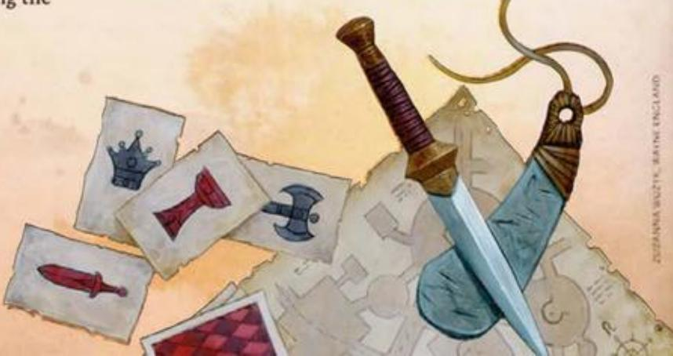

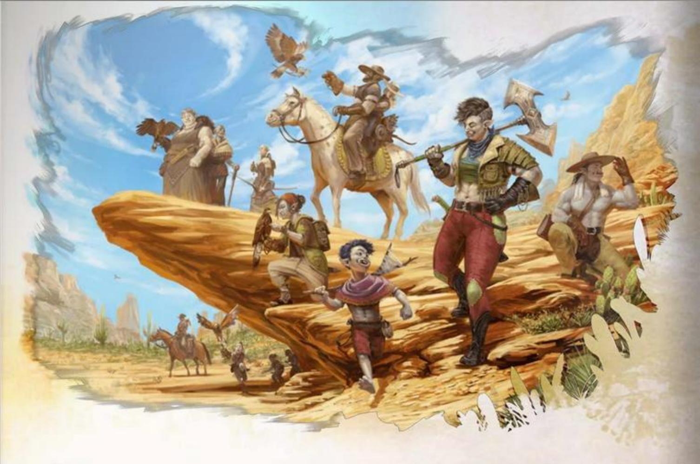

### ORC

Orcs trace their creation to Gruumsh, a powerful god who roamed the wide open spaces of the Material Plane. Gruumsh equipped his children with gifts to help them wander great plains, vast caverns, and churning seas and to face the monsters that lurk there. Even when they turn their devotion to other gods, orcs retain Gruumsh's gifts: endurance, determination, and the ability to see in darkness.

Orcs are, on average, tall and broad. They have gray skin, ears that are sharply pointed, and prominent lower canines that resemble small tusks. Orc youths on some worlds are told about their ancestors' great travels and travails. Inspired by those tales, many of those orcs wonder when Gruumsh will call on them to match the heroic deeds of old and if they will prove worthy of his favor. Other orcs are happy to leave old tales in the past and find their own way.

### ORC TRAITS

Creature Type: Humanoid

Size: Medium (about 6-7 feet tall)

Speed: 30 feet

As an Orc, you have these special traits.

Adrenaline Rush. You can take the Dash action as a Bonus Action. When you do so, you gain a number of Temporary Hit Points equal to your Proficiency Bonus.

You can use this trait a number of times equal to your Proficiency Bonus, and you regain all expended uses when you finish a Short or Long Rest.

Darkvision. You have Darkvision with a range of 120 feet.

Relentless Endurance. When you are reduced to 0 Hit Points but not killed outright, you can drop to 1 Hit Point instead. Once you use this trait, you can't do so again until you finish a Long Rest.

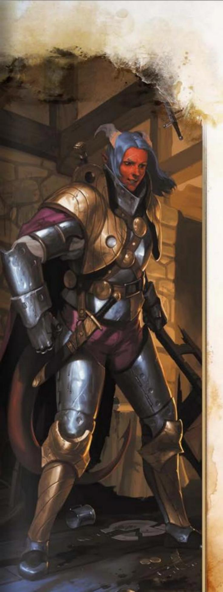

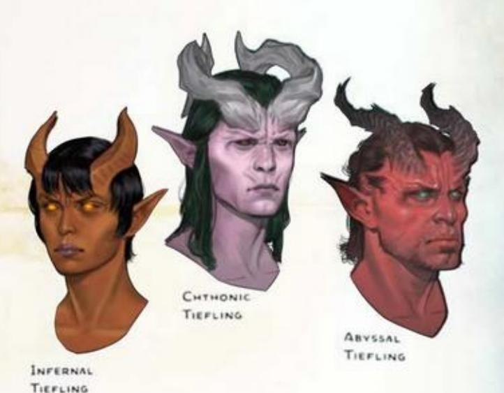

### TIEFLING

Tieflings are either born in the Lower Planes or have fiendish ancestors who originated there. A tiefling (pronounced TEE-fling) is linked by blood to a devil, a demon, or some other Fiend. This connection to the Lower Planes is the tiefling's fiendish legacy, which comes with the promise of power yet has no effect on the tiefling's moral outlook.

A tiefling chooses whether to embrace or lament their fiendish legacy. The three legacies are described below.

#### ABYSSAL

The entropy of the Abyss, the chaos of Pandemonium, and the despair of Carceri call to tieflings who have the abyssal legacy. Horns, fur, tusks, and peculiar scents are common physical features of such tieflings, most of whom have the blood of demons coursing through their veins.

#### CHTHONIC

Tieflings who have the chthonic legacy feel not only the tug of Carceri but also the greed of Gehenna and the gloom of Hades. Some of these tieflings look cadaverous. Others possess the unearthly beauty of a succubus, or they have physical features in common with a night hag, a yugoloth, or some other Neutral Evil fiendish ancestor.

#### INFERNAL

The infernal legacy connects tieflings not only to Gehenna but also the Nine Hells and the raging battlefields of Acheron. Horns, spines, tails, golden eyes, and a faint odor of sulfur or smoke are common physical features of such tieflings, most of whom trace their ancestry to devils.

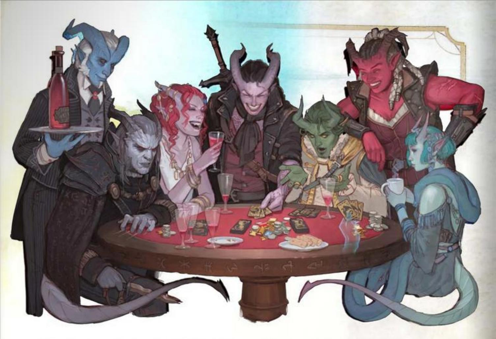

### TIEFLING TRAITS

Creature Type: Humanoid

Size: Medium (about 4–7 feet tall) or Small (about 3–4 feet tall), chosen when you select this species

Speed: 30 feet

As a Tiefling, you have the following special traits.

Darkvision. You have Darkvision with a range of 60 feet.

Fiendish Legacy. You are the recipient of a legacy that grants you supernatural abilities. Choose a legacy from the Fiendish Legacies table. You gain the level 1 benefit of the chosen legacy.

#### FIENDISH LEGACIES

| Legacy   | Level 1                                                                                             | Level 3         | Level 5             |
|----------|-----------------------------------------------------------------------------------------------------|-----------------|---------------------|
| Abyssal  | You have Resistance to Poison damage. You also know the *Poison Spray* cantrip.                     | Ray of Sickness | Hold Person         |
| Chthonic | You have Resistance to Necrotic damage. You also know the *Chill Touch* cantrip.                    | False Life      | Ray of Enfeeblement |
| Infernal | You have Resistance to Fire damage. You also know the Fire Bolt cantrip.                            | Hellish Rebuke  | Darkness            |

When you reach character levels 3 and 5, you learn a higher-level spell, as shown on the table. You always have that spell prepared. You can cast it once without a spell slot, and you regain the ability to cast it in that way when you finish a Long Rest. You can also cast the spell using any spell slots you have of the appropriate level.

Intelligence, Wisdom, or Charisma is your spellcasting ability for the spells you cast with this trait (choose the ability when you select the legacy).

Otherworldly Presence. You know the Thaumaturgy cantrip. When you cast it with this trait, the spell uses the same spellcasting ability you use for your Fiendish Legacy trait.

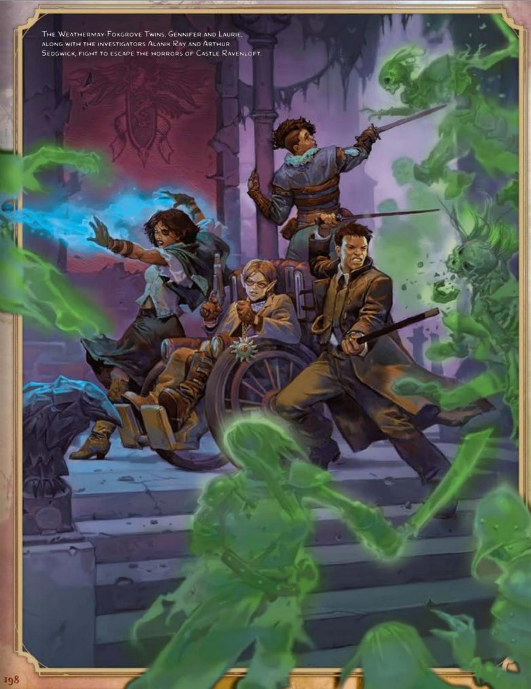
