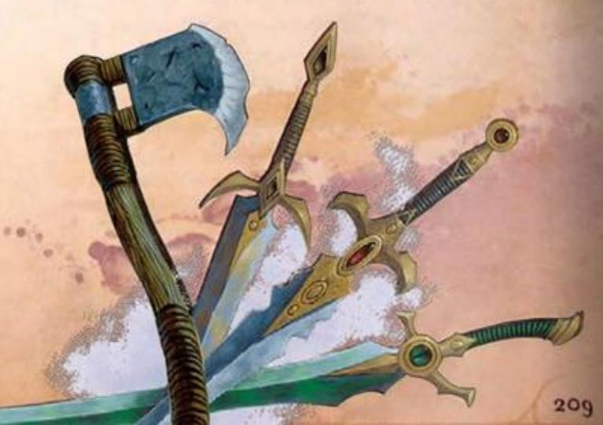

# FIGHTING STYLE FEATS

These feats are in the Fighting Style category.

### ARCHERY

Fighting Style Feat (Prerequisite: Fighting Style Feature)

You gain a +2 bonus to attack rolls you make with Ranged weapons.

### BLIND FIGHTING

Fighting Style Feat (Prerequisite: Fighting Style Feature)

You have Blindsight with a range of 10 feet.

### DEFENSE

Fighting Style Feat (Prerequisite: Fighting Style Feature)

While you're wearing Light, Medium, or Heavy armor, you gain a +1 bonus to Armor Class.

### DUELING

Fighting Style Feat (Prerequisite: Fighting Style Feature)

When you're holding a Melee weapon in one hand and no other weapons, you gain a +2 bonus to damage rolls with that weapon.

### GREAT WEAPON FIGHTING

Fighting Style Feat (Prerequisite: Fighting Style Feature)

When you roll damage for an attack you make with a Melee weapon that you are holding with two hands, you can treat any 1 or 2 on a damage die as a 3. The weapon must have the Two-Handed or Versatile property to gain this benefit.

### INTERCEPTION

Fighting Style Feat (Prerequisite: Fighting Style Feature)

When a creature you can see hits another creature within 5 feet of you with an attack roll, you can take a Reaction to reduce the damage dealt to the target by 1d10 plus your Proficiency Bonus. You must be holding a Shield or a Simple or Martial weapon to use this Reaction.

### PROTECTION

Fighting Style Feat (Prerequisite: Fighting Style Feature)

When a creature you can see attacks a target other than you that is within 5 feet of you, you can take a Reaction to interpose your Shield if you're holding one. You impose Disadvantage on the triggering attack roll and all other attack rolls against the target until the start of your next turn if you remain within 5 feet of the target.

### THROWN WEAPON FIGHTING

Fighting Style Feat (Prerequisite: Fighting Style Feature)

When you hit with a ranged attack roll using a weapon that has the Thrown property, you gain a +2 bonus to the damage roll.

### TWO-WEAPON FIGHTING

Fighting Style Feat (Prerequisite: Fighting Style Feature)

When you make an extra attack as a result of using a weapon that has the Light property, you can add your ability modifier to the damage of that attack if you aren't already adding it to the damage.

### UNARMED FIGHTING

Fighting Style Feat (Prerequisite: Fighting Style Feature)

When you hit with your Unarmed Strike and deal damage, you can deal Bludgeoning damage equal to 1d6 plus your Strength modifier instead of the normal damage of an Unarmed Strike. If you aren't holding any weapons or a Shield when you make the attack roll, the d6 becomes a d8.

At the start of each of your turns, you can deal 1d4 Bludgeoning damage to one creature Grappled by you.
