# CREATURE STAT BLOCKS

This appendix provides stat blocks for creatures mentioned elsewhere in the book, particularly in the class, equipment, and spell chapters. See the rules glossary for how to read a stat block, and see the *Monster Manual* for even more creatures.

The following stat blocks are presented in alphabetical order. When the Dungeon Master uses a stat block, the DM may change details in it.

### APE

Medium Beast, Unaligned

AC 12 Initiative +2 (12) HP 19 (3d8 + 6)

Speed 30 ft., Climb 30 ft.

MOD SAVE MOD SAVE MOD SAVE

STR 16 +3 +3 DEX 14 +2 +2 CON 14 +2 +2

INT 6 -2 -2 Wis 12 +1 +1 Cha 7 -2 -2

Skills Athletics +5, Perception +3 Senses Passive Perception 13 Languages None CR 1/2 (XP 100; PB +2)

#### ACTIONS

Multiattack. The ape makes two Fist attacks.

Fist. Melee Attack Roll: +5, reach 5 ft. Hit: 5 (1d4 + 3) Bludgeoning damage.

Rock (Recharge 6). Ranged Attack Roll: +5, range 25/50 ft. Hit: 10 (2d6 + 3) Bludgeoning damage.

### BAT

Tiny Beast, Unaligned

AC 12 Initiative +2 (12) HP 1 (1d4 – 1)

Speed 5 ft., Fly 30 ft.

STR 2 -4 -4 DEX 15 +2 +2 CON 8 -1 -1
INT 2 -4 -4 Wis 12 +1 +1 CHA 4 -3 -3

BAT

Senses Blindsight 60 ft., Passive Perception 11 Languages None CR 0 (XP 10; PB +2)

#### ACTIONS

Bite. Melee Attack Roll: +4, reach 5 ft. Hit: 1 Piercing damage.

### BADGER

Tiny Beast, Unaligned

AC 11 Initiative +0 (10)

HP 5 (1d4 + 3) Speed 20 ft., Burrow 5 ft.

MOD SAVE MOD SAVE MOD SAVE

STR 10 +0 +0 DEX 11 +0 +0 CON 16 +3 +3

INT 2 -4 -4 Wis 12 +1 +1 CHA 5 -3 -3

Skills Perception +3
Resistances Poison
Senses Darkvision 30 ft., Passive Perception 13
Languages None
CR 0 (XP 10; PB +2)

#### ACTIONS

Bite. Melee Attack Roll: +2, reach 5 ft. Hit: 1 Piercing damage.

### BLACK BEAR

Medium Beast, Unaligned

AC 11 Initiative +1 (11) HP 19 (3d8 + 6)

Speed 30 ft., Climb 30 ft., Swim 30 ft.

MOD SAVE MOD SAVE MOD SAVE

STR 15 +2 +2 DEX 12 +1 +1 CON 14 +2 +2

INT 2 -4 -4 WIS 12 +1 +1 CHA 7 -2 -2

Skills Perception +5
Senses Darkvision 60 ft., Passive Perception 15
Languages None
CR 1/2 (XP 100; PB +2)

#### ACTIONS

Multiattack. The bear makes two Rend attacks.

Rend. Melee Attack Roll: +4, reach 5 ft. Hit: 5 (1d6 + 2) Slashing damage.

### BOAR

Medium Beast, Unaligned

AC 11 Initiative +0 (10) HP 13 (2d8 + 4)

Speed 40 ft.

MOD SAVE MOD SAVE MOD SAVE

STR 13 +1 +1 DEX 11 +0 +0 CON 14 +2 +2

INT 2 -4 -4 Wis 9 -1 -1 CHA 5 -3 -3

Senses Passive Perception 9 Languages None CR 1/4 (XP 50; PB +2)

### TRAITS

**Bloodied Fury.** While Bloodied, the boar has Advantage on attack rolls.

#### ACTIONS

Gore. Melee Attack Roll: +3, reach 5 ft. Hit: 4 (1d6 + 1) Piercing damage. If the boar moved at least 20 feet straight toward the target immediately before the hit, the target takes an extra 3 (1d6) Piercing damage and, if it is Large or smaller, has the Prone condition.

### BROWN BEAR

Large Beast, Unaligned

AC 11 Initiative +1 (11)

HP 22 (3d10 + 6)

Speed 40 ft., Climb 30 ft.

MOD SAVE MOD SAVE MOD SAVE

STR 17 +3 +3 DEX 12 +1 +1 CON 15 +2 +2

INT 2 -4 -4 Wis 13 +1 +1 CHA 7 -2 -2

Skills Perception +3
Senses Darkvision 60 ft., Passive Perception 13
Languages None
CR 1 (XP 200; PB +2)

#### ACTIONS

Multiattack. The bear makes one Bite attack and one Claw attack.

Bite. Melee Attack Roll: +5, reach 5 ft. Hit: 7 (1d8 + 3) Piercing damage.

Claw. Melee Attack Roll: +5, reach 5 ft. Hit: 5 (1d4 + 3) Slashing damage, and the target has the Prone condition if it is Huge or smaller.

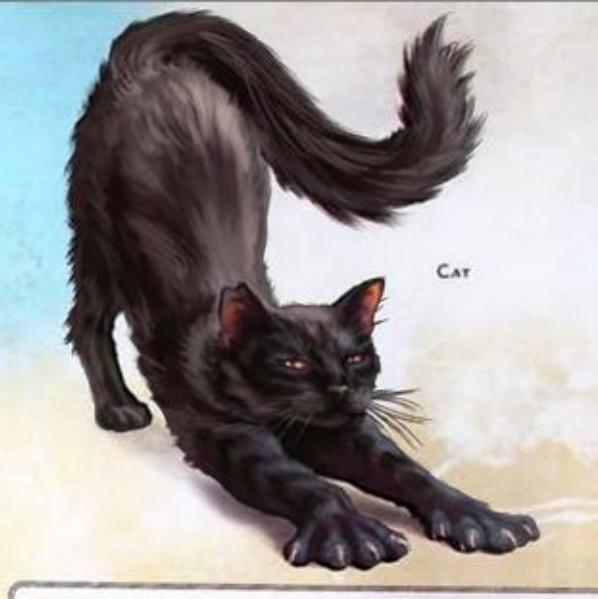

### CAMEL

Large Beast, Unaligned

AC 10 Initiative –1 (9) HP 17 (2d10 + 6) Speed 50 ft.

MOD SAVE MOD SAVE MOD SAVE

STR 15 +2 +2 DEX 8 -1 -1 CON 17 +3 +5

INT 2 -4 -4 WIS 11 +0 +0 CHA 5 -3 -3

Senses Darkvision 60 ft., Passive Perception 10 Languages None CR 1/8 (XP 25; PB +2)

#### ACTIONS

Bite. Melee Attack Roll: +4, reach 5 ft. Hit: 4 (1d4 + 2) Bludgeoning damage.

### CAT

Tiny Beast, Unaligned

AC 12 Initiative +2 (12) HP 2 (1d4) Speed 40 ft., Climb 40 ft.

STR 3 -4 -4 DEX 15 +2 +4 CON 10 +0 +0
INT 3 -4 -4 WIS 12 +1 +1 CHA 7 -2 -2

Skills Perception +3, Stealth +4
Senses Darkvision 60 ft., Passive Perception 13
Languages None
CR 0 (XP 10; PB +2)

### TRAITS

Jumper. The cat's jump distance is determined using its Dexterity rather than its Strength.

#### ACTIONS

Scratch. Melee Attack Roll: +4, reach 5 ft. Hit: 1 Slashing damage.

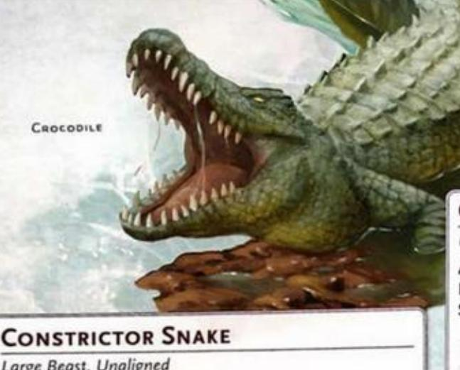

Large Beast, Unaligned

Initiative +2 (12) AC 13

HP 13 (2d10 + 2)

Speed 30 ft., Swim 30 ft.

| 1   |    | MOD | SAVE |        | MOD | SAVE |        | MOD | SAVE |
|-----|----|-----|------|--------|-----|------|--------|-----|------|
| STR | 15 | +2  | +2   | DEX 14 | +2  | +2   | CON 12 | +1  | +1   |
| INT | 1  | -5  | -5   | Wis 10 | +0  | +0   | CHA 3  | -4  | -4   |

Skills Perception +2, Stealth +4 Senses Blindsight 10 ft., Passive Perception 12 Languages None CR 1/4 (XP 50; PB +2)

#### ACTIONS

Bite. Melee Attack Roll: +4, reach 5 ft. Hit: 6 (1d8 + 2) Piercing damage.

Constrict. Strength Saving Throw: DC 12, one Medium or smaller creature the snake can see within 5 feet. Failure: 7 (3d4) Bludgeoning damage, and the target has the Grappled condition (escape DC 12).

### CRAB

Tiny Beast, Unaligned

AC 11 Initiative +0 (10)

HP 3 (1d4 + 1)

Speed 20 ft., Swim 20 ft.

|     |   | MOD | SAVE |        | MOD | SAVE |        | MOD | SAVE |
|-----|---|-----|------|--------|-----|------|--------|-----|------|
| STR | 6 | -2  | -2   | DEX 11 | +0  | +0   | CON 12 | +1  | +1   |
| INT | 1 | -5  | -5   | Wis 8  | -1  | -1   | CHA 2  | -4  | -4   |

Skills Stealth +2 Senses Blindsight 30 ft., Passive Perception 9 Languages None CR 0 (XP 10; PB +2)

### TRAITS

Amphibious. The crab can breathe air and water.

#### ACTIONS

Claw. Melee Attack Roll: +2, reach 5 ft. Hit: 1 Bludgeoning damage.

### CROCODILE

Large Beast, Unaligned

Initiative +0 (10) AC 12

HP 13 (2d10 + 2)

Speed 20 ft., Swim 30 ft.

MOD SAVE MOD SAVE MOD SAVE STR 15 +2 +2 DEX 10 +0 +0 CON 13 +1 +3 INT 2 -4 -4 WIS 10 +0 +0 CHA 5 -3 -3

Skills Stealth +2 Senses Passive Perception 10 Languages None CR 1/2 (XP 100; PB +2)

### TRAITS

Hold Breath. The crocodile can hold its breath for 1 hour.

#### ACTIONS

Bite. Melee Attack Roll: +4, reach 5 ft. Hit: 6 (1d8 + 2) Piercing damage. If the target is Medium or smaller. it has the Grappled condition (escape DC 12). While Grappled, the target has the Restrained condition.

### DIRE WOLF

Large Beast, Unaligned

AC 14 Initiative +2 (12) HP 22 (3d10 + 6) Speed 50 ft.

MOD SAVE MOD SAVE MOD SAVE STR 17 +3 +3 DEX 15 +2 +2 CON 15 +2 +2 INT 3 -4 -4 WIS 12 +1 +1 CHA 7 -2 -2

Skills Perception +5, Stealth +4 Senses Darkvision 60 ft., Passive Perception 15 Languages None CR 1 (XP 200; PB +2)

### TRAITS

Pack Tactics. The wolf has Advantage on an attack roll against a creature if at least one of the wolf's allies is within 5 feet of the creature and the ally doesn't have the Incapacitated condition.

#### ACTIONS

Bite. Melee Attack Roll: +5, reach 5 ft. Hit: 8 (1d10 + 3) Piercing damage, and the target has the Prone condition if it is Huge or smaller.

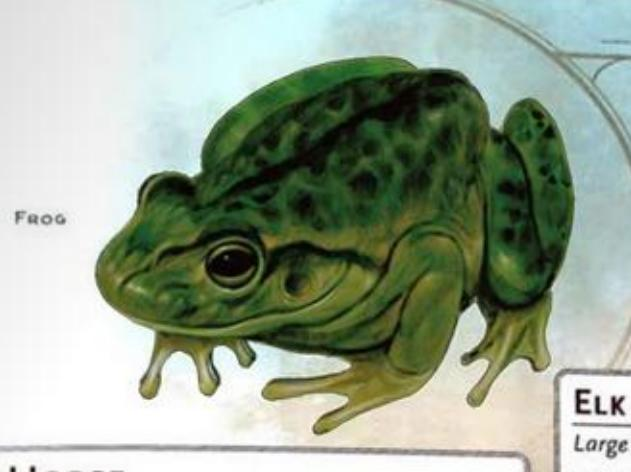

### DRAFT HORSE

Large Beast, Unaligned

AC 10 Initiative +0 (10) HP 15 (2d10 + 4)

Speed 40 ft.

STR 18 +4 +4 DEX 10 +0 +0 Con 15 +2 +2
INT 2 -4 -4 WIS 11 +0 +0 Cha 7 -2 -2

Senses Passive Perception 10 Languages None CR 1/4 (XP 50; PB +2)

#### ACTIONS

Hooves. Melee Attack Roll: +6, reach 5 ft. Hit: 6 (1d4 + 4) Bludgeoning damage.

### ELEPHANT

Huge Beast, Unaligned

AC 12 Initiative –1 (9)

HP 76 (8d12 + 24) Speed 40 ft.

MOD SAVE

STR 22 +6 +6 DEX 9 -1 -1 CON 17 +3 +3

INT 3 -4 -4 WIS 11 +0 +0 CHA 6 -2 -2

Senses Passive Perception 10 Languages None CR 4 (XP 1,100; PB +2)

#### ACTIONS

Multiattack. The elephant makes two Gore attacks.

Gore. Melee Attack Roll: +8, reach 5 ft. Hit: 15 (2d8 + 6) Piercing damage. If the elephant moved at least 20 feet straight toward the target immediately before the hit, the target also has the Prone condition.

#### BONUS ACTIONS

Trample. Dexterity Saving Throw: DC 16, one creature within 5 feet that has the Prone condition. Failure: 17 (2d10 + 6) Bludgeoning damage. Success: Half damage.

Large Beast, Unaligned

AC 10 Initiative +0 (10) HP 11 (2d10)

Speed 50 ft.

STR 16 +3 +3 DEX 10 +0 +0 CON 11 +0 +0
INT 2 -4 -4 WIS 10 +0 +0 CHA 6 -2 -2

Skills Perception +2 Senses Darkvision 60 ft., Passive Perception 12 Languages None

CR 1/4 (XP 50; PB +2)

#### ACTIONS

Ram. Melee Attack Roll: +5, reach 5 ft. Hit: 6 (1d6 + 3) Bludgeoning damage. If the elk moved at least 20 feet straight toward the target immediately before the hit, the target takes an extra 3 (1d6) Bludgeoning damage and, if it is Huge or smaller, has the Prone condition.

### FROG

Tiny Beast, Unaligned

AC 11 Initiative +1 (11) HP 1 (1d4 – 1)

Speed 20 ft., Swim 20 ft.

MOD SAVE MOD SAVE MOD SAVE

STR 1 -5 -5 DEX 13 +1 +1 CON 8 -1 -1

INT 1 -5 -5 Wis 8 -1 -1 Cha 3 -4 -4

Skills Perception +1, Stealth +3
Senses Darkvision 30 ft., Passive Perception 11
Languages None
CR 0 (XP 10; PB +2)

#### TRAITS

Amphibious. The frog can breathe air and water.

Standing Leap. The frog's Long Jump is up to 10 feet and its High Jump is up to 5 feet with or without a running start.

#### ACTIONS

Bite. Melee Attack Roll: +3, reach 5 ft. Hit: 1 Piercing damage.

### GIANT BADGER

Medium Beast, Unaligned

AC 13

Initiative +0 (10)

HP 15 (2d8 + 6)

Speed 30 ft., Burrow 10 ft.

MOD SAVE MOD SAVE STR 13 +1 +1 DEX 10 +0 +0 CON 17 +3 +3 CHA 5 -3 -3 2 -4 -4 Wis 12 +1 +1

Skills Perception +3 Resistances Poison Senses Darkvision 60 ft., Passive Perception 13 Languages None CR 1/4 (XP 50; PB +2)

#### ACTIONS

Bite. Melee Attack Roll: +3, reach 5 ft. Hit: 6 (2d4 + 1) Piercing damage.

### GIANT CRAB

Medium Beast, Unaligned

AC 15 Initiative +1 (11)

HP 13 (3d8)

Speed 30 ft., Swim 30 ft.

MOD SAVE MOD SAVE STR 13 +1 +1 DEX 13 +1 +1 CON 11 +0 +0 INT 1 -5 -5 WIS 9 -1 -1 CHA 3 -4 -4

Skills Stealth +3

Senses Blindsight 30 ft., Passive Perception 9 Languages None

CR 1/8 (25 XP; PB +2)

### TRAITS

Amphibious. The crab can breathe air and water.

#### ACTIONS

Claw. Melee Attack Roll: +3, reach 5 ft. Hit: 4 (1d6 + 1) Bludgeoning damage. If the target is Medium or smaller, it has the Grappled condition (escape DC 11). The crab has two claws, each of which can grapple one target.

### GIANT GOAT

Large Beast, Unaligned

Initiative +1 (11)

HP 19 (3d10 + 3)

Speed 40 ft., Climb 30 ft.

MOD SAVE MOD SAVE MOD SAVE STR 17 +3 +5 DEX 13 +1 +1 CON 12 +1 +1 INT 3 -4 -4 WIS 12 +1 +1 CHA 6 -2 -2

Skills Perception +3

Senses Darkvision 60 ft., Passive Perception 13

Languages None

CR 1/2 (XP 100; PB +2)

#### ACTIONS

Ram. Melee Attack Roll: +5, reach 5 ft. Hit: 6 (1d6 + 3) Bludgeoning damage. If the goat moved at least 20 feet straight toward the target immediately before the hit. the target takes an extra 5 (2d4) Bludgeoning damage and, if it is Huge or smaller, has the Prone condition.

### GIANT SEAHORSE

Large Beast, Unaligned

AC 14 Initiative +1 (11)

HP 16 (3d10)

Speed 5 ft., Swim 40 ft.

MOD SAVE MOD SAVE MOD SAVE STR 15 +2 +2 DEX 12 +1 +1 CON 11 +0 +0 INT 2 -4 -4 Wis 12 +1 +1 CHA 5 -3 -3

Senses Passive Perception 11

Languages None

CR 1/2 (XP 100; PB +2)

### TRAITS

Water Breathing. The seahorse can breathe only underwater.

#### ACTIONS

Ram. Melee Attack Roll: +4, reach 5 ft. Hit: 9 (2d6 + 2) Bludgeoning damage, or the seahorse deals 11 (2d8 + 2) Bludgeoning damage if it moved at least 20 feet straight toward the target immediately before the hit.

### **BONUS ACTIONS**

Bubble Dash. While underwater, the seahorse moves up to half its Swim Speed without provoking Opportunity Attacks.

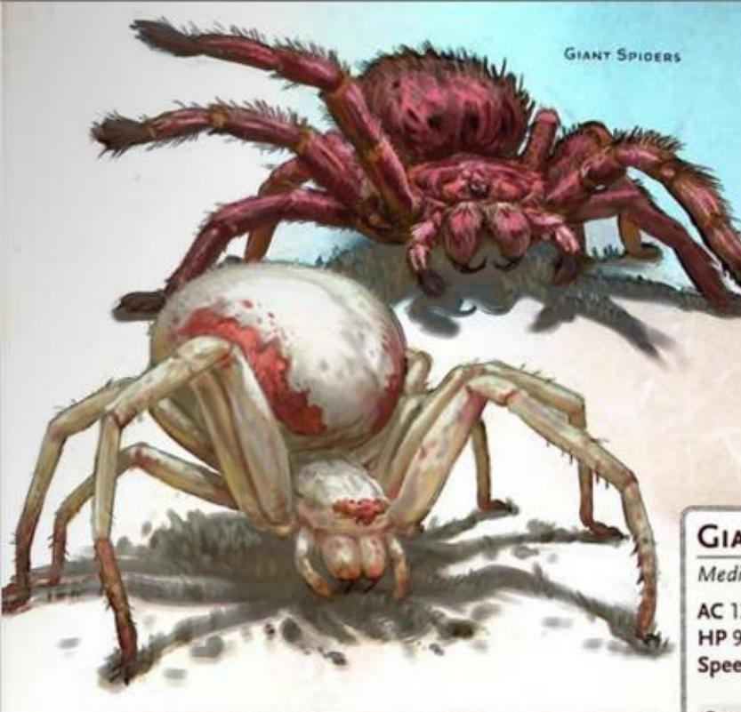

### GIANT SPIDER

Large Beast, Unaligned

AC 14 Initiative +3 (13)

HP 26 (4d10 + 4)

Speed 30 ft., Climb 30 ft.

|     |    | MOD | SAVE |     |    | MOD | SAVE |        | MOD | SAVE |
|-----|----|-----|------|-----|----|-----|------|--------|-----|------|
| STR | 14 | +2  | +2   | DEX | 16 | +3  | +3   | CON 12 | +1  | +1   |
| INT | 2  | -4  | -4   | Wis | 11 | +0  | +0   | CHA 4  | -3  | -3   |

Skills Perception +4, Stealth +7
Senses Darkvision 60 ft., Passive Perception 14
Languages None
CR 1 (XP 200; PB +2)

#### TRAITS

Spider Climb. The spider can climb difficult surfaces, including along ceilings, without needing to make an ability check.

Web Walker. The spider ignores movement restrictions caused by webs, and it knows the location of any other creature in contact with the same web.

#### ACTIONS

Bite. Melee Attack Roll: +5, reach 5 ft. Hit: 7 (1d8 + 3) Piercing damage plus 7 (2d6) Poison damage.

Web (Recharge 5-6). Dexterity Saving Throw: DC 13, one creature the spider can see within 60 feet. Failure: The target has the Restrained condition until the web is destroyed (AC 10; HP 5; Vulnerability to Fire damage; Immunity to Poison and Psychic damage).

### GIANT WEASEL

Medium Beast, Unaligned

AC 13 Initiative +3 (13) HP 9 (2d8)

Speed 40 ft., Climb 30 ft.

|     |    | MOD | SAVE |        | MOD | SAVE |        | MOD | SAVE |
|-----|----|-----|------|--------|-----|------|--------|-----|------|
| STR | 11 | +0  | +0   | DEX 17 | +3  | +3   | Con 10 | +0  | +0   |
| INT | 4  | -3  | -3   | Wis 12 | +1  | +1   | CHA 5  | -3  | -3   |

Skills Acrobatics +5, Perception +3, Stealth +5 Senses Darkvision 60 ft., Passive Perception 13 Languages None CR 1/8 (XP 25; PB +2)

#### ACTIONS

Bite. Melee Attack Roll: +5, reach 5 ft. Hit: 5 (1d4 + 3) Piercing damage.

### GOAT

Medium Beast, Unaligned

AC 10 Initiative +0 (10) HP 4 (1d8)

Speed 40 ft., Climb 30 ft.

MOD SAVE MOD SAVE MOD SAVE

STR 11 +0 +2 DEX 10 +0 +0 CON 11 +0 +0

INT 2 -4 -4 WIS 10 +0 +0 CHA 5 -3 -3

Skills Perception +2
Senses Darkvision 60 ft., Passive Perception 12
Languages None
CR 0 (XP 10; PB +2)

#### ACTIONS

Ram. Melee Attack Roll: +2, reach 5 ft. Hit: 1 Bludgeoning damage, or the goat deals 2 (1d4) Bludgeoning damage if it moved at least 20 feet straight toward the target immediately before the hit.

### HAWK

Tiny Beast, Unaligned

AC 13 Initiative +3 (13)

HP 1 (1d4 - 1) Speed 10 ft., Fly 60 ft.

STR 5 -3 -3 DEX 16 +3 +3 CON 8 -1 -1
INT 2 -4 -4 Wis 14 +2 +2 Cha 6 -2 -2

Skills Perception +6 Senses Passive Perception 16 Languages None CR 0 (XP 10; PB +2)

#### ACTIONS

Talons. Melee Attack Roll: +5, reach 5 ft. Hit: 1 Slashing damage.

### IMP

Tiny Fiend (Devil), Lawful Evil

AC 13 Initiative +3 (13)

HP 21 (6d4 + 6)

Speed 20 ft., Fly 40 ft.

STR 6 -2 -2 DEX 17 +3 +3 CON 13 +1 +1

INT 11 +0 +0 Wis 12 +1 +1 CHA 14 +2 +2

Skills Deception +4, Insight +3, Stealth +5
Resistances Cold
Immunities Fire, Poison; Poisoned
Senses Darkvision 120 ft., Passive Perception 11
Languages Common, Infernal
CR 1 (XP 200; PB +2)

### TRAITS

**Devil's Sight.** Magical Darkness doesn't impede the imp's Darkvision.

Magic Resistance. The imp has Advantage on saving throws against spells and other magical effects.

#### ACTIONS

Sting. Melee Attack Roll: +5, reach 5 ft. Hit: 6 (1d6 + 3) Piercing damage plus 7 (2d6) Poison damage.

Invisibility. The imp casts Invisibility on itself, requiring no spell components and using Charisma as the spell-casting ability.

Shape-Shift. The imp shape-shifts to resemble a rat (Speed 20 ft.), a raven (20 ft., Fly 60 ft.), or a spider (20 ft., Climb 20 ft.), or it returns to its true form. Its statistics are the same in each form, except for its Speed. Any equipment it's wearing or carrying isn't transformed.

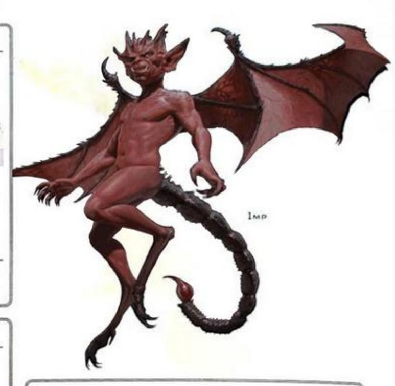

### LION

Large Beast, Unaligned

AC 12 Initiative +2 (12)

HP 22 (4d10) Speed 50 ft.

MOD SAVE MOD SAVE

STR 17 +3 +3 DEX 15 +2 +2 CON 11 +0 +0

INT 3 -4 -4 WIS 12 +1 +1 CHA 8 -1 -1

Skills Perception +3, Stealth +4
Senses Darkvision 60 ft., Passive Perception 13
Languages None
CR 1 (XP 200; PB +2)

#### TRAITS

Pack Tactics. The lion has Advantage on an attack roll against a creature if at least one of the lion's allies is within 5 feet of the creature and the ally doesn't have the Incapacitated condition.

Running Leap. With a 10-foot running start, the lion can Long Jump up to 25 feet.

#### ACTIONS

Multiattack. The lion makes two Rend attacks. It can replace one of these attacks with a use of Roar.

Rend. Melee Attack Roll: +5, reach 5 ft. Hit: 7 (1d8 + 3) Slashing damage.

Roar. Wisdom Saving Throw: DC 11, one creature within 15 feet. Failure: The target has the Frightened condition until the start of the lion's next turn.

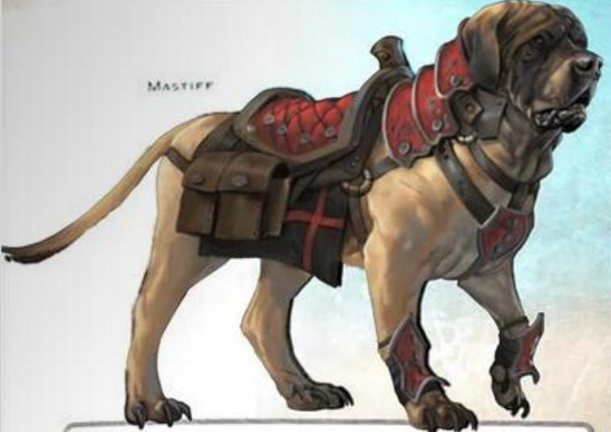

### LIZARD

Tiny Beast, Unaligned

AC 10

Initiative +0 (10)

HP 2 (1d4)

Speed 20 ft., Climb 20 ft.

MOD SAVE STR 2 -4 -4 DEX 11 +0 +0

MOD SAVE

MOD SAVE CON 10 +0 +0

Wis 8 -1 -1

CHA 3 -4 -4

Senses Darkvision 30 ft., Passive Perception 9 Languages None CR 0 (XP 10; PB +2)

#### TRAITS

Spider Climb. The lizard can climb difficult surfaces. including along ceilings, without needing to make an ability check.

#### ACTIONS

Bite. Melee Attack Roll: +2, reach 5 ft. Hit: 1 Piercing damage.

### MASTIFF

Medium Beast, Unaligned

AC 12

Initiative +2 (12)

HP 5 (1d8 + 1)

Speed 40 ft.

MOD SAVE STR 13 +1 +1

MOD SAVE DEX 14 +2 +2

MOD SAVE CON 12 +1 +1 Wis 12 +1 +3 CHA 7 -2 -2

INT 3 -4 -4 Skills Perception +5

Senses Darkvision 60 ft., Passive Perception 15

Languages None

CR 1/8 (XP 25; PB +2)

#### ACTIONS

Bite. Meice Attack Roll: +3, reach 5 ft. Hit: 4 (1d6 + 1) Piercing damage, and the target has the Prone condition if it is Large or smaller.

### MULE

Medium Beast, Unaligned

HP 11 (2d8 + 2)

Initiative +0 (10)

Speed 40 ft.

MOD SAVE STR 14 +2 +4

DEX 10 +0 +0 CON 13 +1 +1 INT 2 -4 -4 WIS 10 +0 +0 CHA 5 -3 -3

MOD SAVE

Senses Passive Perception 10 Languages None CR 1/8 (XP 25; PB +2)

### TRAITS

Beast of Burden. The mule counts as one size larger for the purpose of determining its carrying capacity.

#### ACTIONS

Hooves. Melee Attack Roll: +4, reach 5 ft. Hit: 4 (1d4 + 2) Bludgeoning damage.

### OCTOPUS

Small Beast, Unaligned

AC 12

Initiative +2 (12)

HP 3 (1d6)

Speed 5 ft., Swim 30 ft.

MOD SAVE MOD SAVE MOD SAVE STR 4 -3 -3 DEX 15 +2 +2 CON 11 +0 +0 INT 3 -4 -4 WIS 10 +0 +0 CHA 4 -3 -3

Skills Perception +2, Stealth +6 Senses Darkvision 30 ft., Passive Perception 12 Languages None CR 0 (XP 10; PB +2)

#### TRAITS

Compression. The octopus can move through a space as narrow as 1 inch without squeezing.

Water Breathing. The octopus can breathe only underwater.

#### ACTIONS

Tentacles. Melee Attack Roll: +4, reach 5 ft. Hit: 1 Bludgeoning damage.

#### REACTIONS

Ink Cloud (1/Day). Trigger: A creature ends its turn within 5 feet of the octopus while underwater. Response: The octopus releases ink that fills a 5-foot Cube centered on itself, and the octopus moves up to its Swim Speed. The Cube is Heavily Obscured for 1 minute or until a strong current or similar effect disperses the ink.

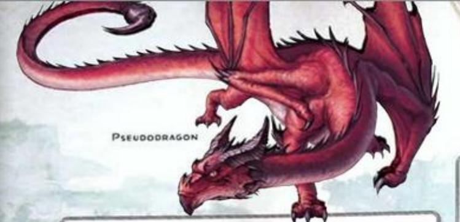

#### OWL

Tiny Beast, Unaligned

AC 11

Initiative +1 (11)

HP 1 (1d4 - 1) Speed 5 ft., Fly 60 ft.

STR 3 -4 -4 DEX 13 +1 +1 CON 8 -1 -1
INT 2 -4 -4 WIS 12 +1 +1 CHA 7 -2 -2

Skills Perception +5, Stealth +5
Senses Darkvision 120 ft., Passive Perception 15
Languages None
CR 0 (XP 10; PB +2)

### TRAITS

Flyby. The owl doesn't provoke Opportunity Attacks when it flies out of an enemy's reach.

#### ACTIONS

Talons. Melee Attack Roll: +3, reach 5 ft. Hit: 1 Slashing damage.

### PANTHER

Medium Beast, Unaligned

AC 12

Initiative +2 (12)

HP 13 (3d8)

Speed 50 ft., Climb 40 ft.

MOD SAVE MOD SAVE MOD SAVE

STR 14 +2 +2 DEX 15 +2 +2 CON 10 +0 +0

INT 3 -4 -4 Wis 14 +2 +2 CHA 7 -2 -2

Skills Perception +4, Stealth +6
Senses Darkvision 60 ft., Passive Perception 14
Languages None
CR 1/4 (XP 50; PB +2)

#### ACTIONS

Multiattack. The panther makes one Pounce attack and uses Prowl.

Pounce. Melee Attack Roll: +4, reach 5 ft. Hit: 4 (1d4 + 2) Slashing damage, or the panther deals 7 (2d4 + 2) Slashing damage if it had Advantage on the attack roll.

**Prowl.** The panther moves up to half its Speed without provoking Opportunity Attacks. At the end of this movement, the panther can take the Hide action.

### PONY

Medium Beast, Unaligned

AC 10

Initiative +0 (10)

HP 11 (2d8 + 2) Speed 40 ft.

MOD SAVE MOD SAVE MOD SAVE

STR 15 +2 +4 DEX 10 +0 +0 CON 13 +1 +1

INT 2 -4 -4 WIS 11 +0 +0 CHA 7 -2 -2

Senses Passive Perception 10 Languages None

CR 1/8 (XP 25; PB +2)

#### ACTIONS

Hooves. Melee Attack Roll: +4, reach 5 ft. Hit: 4 (1d4 + 2) Bludgeoning damage.

### **PSEUDODRAGON**

Tiny Dragon, Neutral Good

AC 14 Initiative +2 (12)

HP 10 (3d4 + 3)

Speed 15 ft., Fly 60 ft.

STR 6 -2 -2 DEX 15 +2 +2 CON 13 +1 +1
INT 10 +0 +0 WIS 12 +1 +1 CHA 10 +0 +0

Skills Perception +5, Stealth +4
Senses Blindsight 10 ft., Darkvision 60 ft.,

Passive Perception 15

Languages Understands Common and Draconic but can't speak

CR 1/4 (XP 50; PB +2)

### TRAITS

Magic Resistance. The pseudodragon has Advantage on saving throws against spells and other magical effects.

#### ACTIONS

Multiattack. The pseudodragon makes two Bite attacks.

Bite. Melee Attack Roll: +4, reach 5 ft. Hit: 4 (1d4 + 2) Piercing damage.

Sting. Constitution Saving Throw: DC 12, one creature the pseudodragon can see within 5 feet. Failure: 5 (2d4 + 2) Poison damage, and the target has the Poisoned condition for 1 hour. Failure by 5 or More: The Poisoned target also has the Unconscious condition until it takes damage or another creature takes an action to shake it awake.

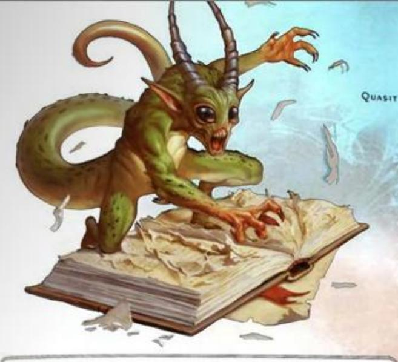

### QUASIT

Tiny Fiend (Demon), Chaotic Evil

Initiative +3 (13) HP 25 (10d4)

Speed 40 ft.

MOD SAVE MOD SAVE MOD SAVE STR 5 -3 -3 DEX 17 +3 +3 CON 10 +0 +0 WIS 10 +0 +0 CHA 10 +0 +0 INT 7 -2 -2

Skills Stealth +5 Resistances Cold, Fire, Lightning Immunities Poison; Poisoned

Senses Darkvision 120 ft., Passive Perception 10 Languages Abyssal, Common

CR 1 (XP 200; PB +2)

### TRAITS

Magic Resistance. The quasit has Advantage on saving throws against spells and other magical effects.

Rend. Melee Attack Roll: +5, reach 5 ft. Hit: 5 (1d4 + 3) Slashing damage, and the target has the Poisoned condition until the start of the quasit's next turn.

Invisibility. The quasit casts Invisibility on itself, requiring no spell components and using Charisma as the spellcasting ability.

Scare (1/Day). Wisdom Saving Throw: DC 10, one creature within 20 feet. Failure: The target has the Frightened condition. At the end of each of its turns, the target repeats the save, ending the effect on itself on a success. After 1 minute, it succeeds automatically.

Shape-Shift. The quasit shape-shifts to resemble a bat (Speed 10 ft., Fly 40 ft.), a centipede (40 ft., Climb 40 ft.), or a toad (40 ft., Swim 40 ft.), or it returns to its true form. Its statistics are the same in each form, except for its Speed. Any equipment it's wearing or carrying isn't transformed.

### RAT

Tiny Beast, Unaligned

AC 10 Initiative +0 (10) HP 1 (1d4 - 1) Speed 20 ft., Climb 20 ft.

MOD SAVE MOD SAVE STR 2 -4 -4 DEX 11 +0 +0 CON 9 -1 -1 INT 2 -4 -4 WIS 10 +0 +0 CHA 4 -3 -3

Skills Perception +2 Senses Darkvision 30 ft., Passive Perception 12 Languages None CR 0 (XP 10; PB +2)

#### TRAITS

Agile. The rat doesn't provoke Opportunity Attacks when it moves out of an enemy's reach.

#### ACTIONS

Bite. Melee Attack Roll: +2, reach 5 ft. Hit: 1 Piercing damage.

### RAVEN

Tiny Beast, Unaligned

AC 12 Initiative +2 (12) HP 2 (1d4)

Speed 10 ft., Fly 50 ft.

MOD SAVE MOD SAVE STR 2 -4 -4 DEX 14 +2 +2 CON 10 +0 +0 INT 5 -3 -3 WIS 13 +1 +1 CHA 6 -2 -2

Skills Perception +3 Senses Passive Perception 13 Languages None CR 0 (XP 10; PB +2)

#### TRAITS

Mimicry. The raven can mimic simple sounds it has heard, such as a whisper or chitter. A hearer can discern the sounds are imitations with a successful DC 10 Wisdom (Insight) check.

Beak. Melee Attack Roll: +4, reach 5 ft. Hit: 1 Piercing damage.

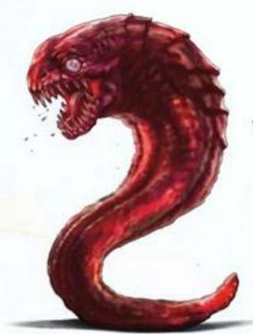

SLAAD TADPOLE

### REEF SHARK

Medium Beast, Unaligned

AC 12 Initiative +2 (12) HP 22 (4d8 + 4)

Speed 5 ft., Swim 30 ft.

MOD SAVE MOD SAVE MOD SAVE MOD SAVE

STR 14 +2 +2 DEX 15 +2 +2 CON 13 +1 +1

INT 1 -5 -5 Wis 10 +0 +0 CHA 4 -3 -3

Skills Perception +2

Senses Blindsight 30 ft., Passive Perception 12 Languages None

CR 1/2 (XP 100; PB +2)

### TRAITS

Pack Tactics. The shark has Advantage on an attack roll against a creature if at least one of the shark's allies is within 5 feet of the creature and the ally doesn't have the Incapacitated condition.

Water Breathing. The shark can breathe only underwater.

#### ACTIONS

Bite. Melee Attack Roll: +4, reach 5 ft. Hit: 7 (2d4 + 2) Piercing damage.

### RIDING HORSE

Large Beast, Unaligned

AC 11 Initiative +1 (11)

HP 13 (2d10 + 2) Speed 60 ft.

MOD SAVE MOD SAVE MOD SAVE

STR 16 +3 +3 DEX 13 +1 +1 CON 12 +1 +1

INT 2 -4 -4 WIS 11 +0 +0 CHA 7 -2 -2

Senses Passive Perception 10 Languages None CR 1/4 (XP 50; PB +2)

#### ACTIONS

Hooves. Melee Attack Roll: +5, reach 5 ft. Hit: 7 (1d8 + 3) Bludgeoning damage.

### SCORPION

Tiny Beast, Unaligned

AC 11 Initiative +0 (10)

HP 1 (1d4 - 1) Speed 10 ft.

STR 2 -4 -4 DEX 11 +0 +0 CON 8 -1 -1
INT 1 -5 -5 WIS 8 -1 -1 CHA 2 -4 -4

Senses Blindsight 10 ft., Passive Perception 9 Languages None CR 0 (XP 10; PB +2)

#### ACTIONS

Sting. Melee Attack Roll: +2, reach 5 ft. Hit: 1 Piercing damage plus 3 (1d6) Poison damage.

### SKELETON

Medium Undead, Lawful Evil

AC 13 Initiative +3 (13) HP 13 (2d8 + 4)

Speed 30 ft.

MOD SAVE

MOD SAVE

MOD SAVE

MOD SAVE

MOD SAVE

MOD SAVE

MOD SAVE

MOD SAVE

MOD SAVE

MOD SAVE

MOD SAVE

CON 15 +2 +2

INT 6 -2 -2 Wis 8 -1 -1 CHA 5 -3 -3

Vulnerabilities Bludgeoning
Immunities Poison; Exhaustion, Poisoned
Gear Shortbow, Shortsword
Senses Darkvision 60 ft., Passive Perception 9
Languages Understands the languages it knew in life but can't speak
CR 1/4 (XP 50; PB +2)

#### ACTIONS

Shortsword. Melee Attack Roll: +5, reach 5 ft. Hit: 6 (1d6 + 3) Piercing damage.

Shortbow. Ranged Attack Roll: +5, range 80/320 ft. Hit: 6 (1d6 + 3) Piercing damage.

### SLAAD TADPOLE

Tiny Aberration, Chaotic Neutral

AC 12 Initiative +2 (12)

HP 7 (3d4)

Speed 30 ft., Burrow 10 ft.

STR 7 -2 -2 DEX 15 +2 +2 CON 10 +0 +0
INT 3 -4 -4 WIS 5 -3 -3 CHA 3 -4 -4

Skills Stealth +4

Resistances Acid, Cold, Fire, Lightning, Thunder Senses Darkvision 60 ft., Passive Perception 7 Languages Understands Slaad but can't speak CR 1/8 (XP 25; PB +2)

### TRAITS

Magic Resistance. The slaad has Advantage on saving throws against spells and other magical effects.

#### ACTIONS

Bite. Melee Attack Roll: +4, reach 5 ft. Hit: 5 (1d6 + 2) Piercing damage.

### SPHINX OF WONDER

Tiny Celestial, Lawful Good

AC 13 Initiative +3 (13) HP 24 (7d4 + 7)

Speed 20 ft., Fly 40 ft.

STR 6 -2 -2 DEX 17 +3 +3 CON 13 +1 +1
INT 15 +2 +2 Wis 12 +1 +1 CHA 11 +0 +0

Skills Arcana +4, Religion +4, Stealth +5
Resistances Necrotic, Psychic, Radiant
Senses Darkvision 60 ft., Passive Perception 11
Languages Celestial, Common
CR 1 (XP 200; PB +2)

#### TRAITS

Magic Resistance. The sphinx has Advantage on saving throws against spells and other magical effects.

#### ACTIONS

Rend. Melee Attack Roll: +5, reach 5 ft. Hit: 5 (1d4 + 3) Slashing damage plus 7 (2d6) Radiant damage.

#### REACTIONS

Burst of Ingenuity (2/Day). Trigger: The sphinx or another creature within 30 feet makes an ability check or a saving throw. Response: The sphinx adds 2 to the roll.

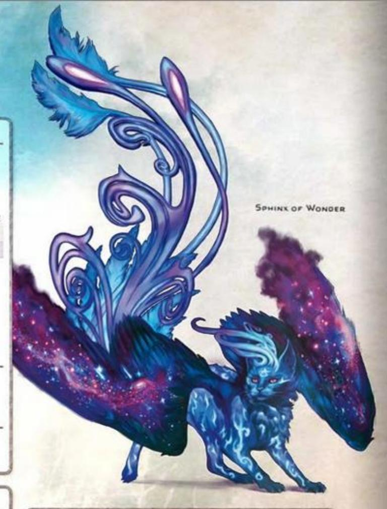

### SPIDER

Tiny Beast, Unaligned

AC 12 Initiative +2 (12) HP 1 (1d4 – 1)

Speed 20 ft., Climb 20 ft.

STR 2 -4 -4 DEX 14 +2 +2 CON 8 -1 -1
INT 1 -5 -5 WIS 10 +0 +0 CHA 2 -4 -4

Skills Stealth +4
Senses Darkvision 30 ft., Passive Perception 10
Languages None
CR 0 (XP 10; PB +2)

#### TRAITS

Spider Climb. The spider can climb difficult surfaces, including along ceilings, without needing to make an ability check.

Web Walker. The spider ignores movement restrictions caused by webs, and the spider knows the location of any other creature in contact with the same web.

#### ACTIONS

Bite. Melee Attack Roll: +4, reach 5 ft. Hit: 1 Piercing damage plus 2 (1d4) Poison damage.

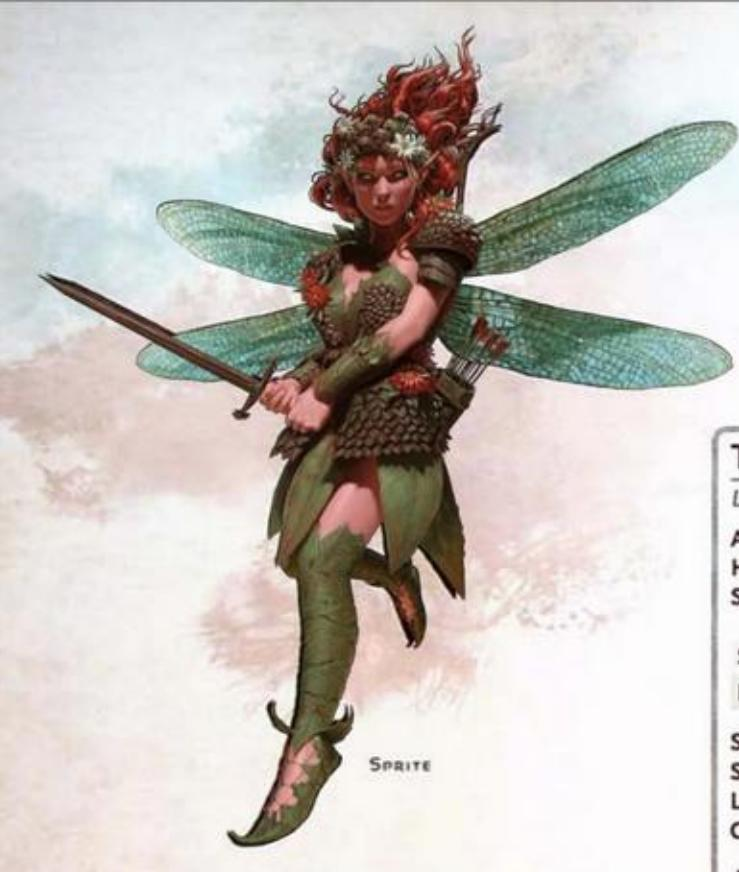

### SPRITE

Tiny Fey, Neutral Good

AC 15 Initiative +4 (14) HP 10 (4d4)

Speed 10 ft., Fly 40 ft.

|     |    | MOD | SAVE |        | MOD | SAVE |        | MOD SAVE |
|-----|----|-----|------|--------|-----|------|--------|----------|
| STR | 3  | -4  | -4   | DEX 18 | +4  | +4   | Con 10 | +0 +0    |
| INT | 14 | +2  | +2   | Wis 13 | +1  | +1   | CHA 11 | +0 +0    |

Skills Perception +3, Stealth +8
Senses Passive Perception 13
Languages Common, Elvish, Sylvan
CR 1/4 (XP 50; PB +2)

#### ACTIONS

Needle Sword. Melee Attack Roll: +6, reach 5 ft. Hit: 6 (1d4 + 4) Piercing damage.

Enchanting Bow. Ranged Attack Roll: +6, range 40/160 ft. Hit: 1 Piercing damage, and the target has the Charmed condition until the start of the sprite's next turn.

Heart Sight. Charisma Saving Throw: DC 10, one creature within 5 feet the sprite can see. Celestials, Fiends, and Undead automatically fail the save. Failure: The sprite knows the target's emotions and alignment.

Invisibility. The sprite casts Invisibility on itself, requiring no spell components and using Charisma as the spellcasting ability.

### TIGER

Large Beast, Unaligned

AC 13 Initiative +3 (13) HP 22 (3d10 + 6)

Speed 40 ft.

STR 17 +3 +3 DEX 16 +3 +3 CON 14 +2 +2
INT 3 -4 -4 WIS 12 +1 +1 CHA 8 -1 -1

Skills Perception +3, Stealth +7
Senses Darkvision 60 ft., Passive Perception 13
Languages None
CR 1 (XP 200; PB +2)

#### ACTIONS

Multiattack. The tiger makes one Pounce attack and uses Prowl.

Pounce. Melee Attack Roll: +5, reach 5 ft. Hit: 6 (1d6 + 3) Slashing damage. If the tiger had Advantage on the attack roll, the target takes an extra 3 (1d6) Slashing damage and, if it is Huge or smaller, has the Prone condition.

**Prowl.** The tiger moves up to half its Speed without provoking Opportunity Attacks. At the end of this movement, the tiger can take the Hide action.

### **VENOMOUS SNAKE**

Tiny Beast, Unaligned

AC 12 Initiative +2 (12) HP 5 (2d4)

Speed 30 ft., Swim 30 ft.

STR 2 -4 -4 DEX 15 +2 +2 CON 11 +0 +0
INT 1 -5 -5 WIS 10 +0 +0 CHA 3 -4 -4

Senses Blindsight 10 ft., Passive Perception 10 Languages None CR 1/8 (XP 25; PB +2)

#### ACTIONS

Bite. Melee Attack Roll: +4, reach 5 ft. Hit: 4 (1d4 + 2) Piercing damage plus 3 (1d6) Poison damage.

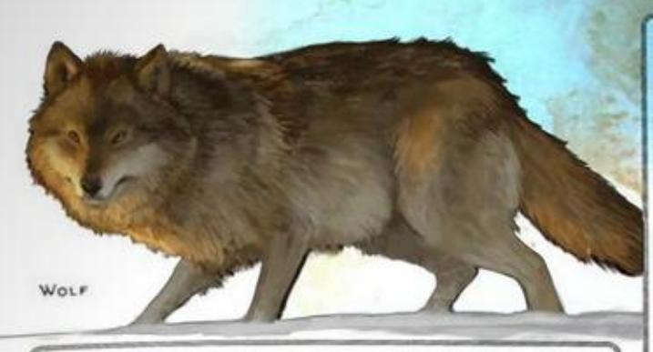

### WARHORSE

Large Beast, Unaligned

AC 11 Initiative +1 (11)

HP 19 (3d10 + 3)

Speed 60 ft.

STR 18 +4 +4 DEX 12 +1 +1 CON 13 +1 +1

INT 2 -4 -4 Wis 12 +1 +3 CHA 7 -2 -2

Senses Passive Perception 11 Languages None CR 1/2 (XP 100; PB +2)

#### ACTIONS

Hooves. Melee Attack Roll: +6, reach 5 ft. Hit: 9 (2d4 + 4) Bludgeoning damage. If the horse moved at least 20 feet straight toward the target immediately before the hit, the target takes an extra 5 (2d4) Bludgeoning damage and, if it is Huge or smaller, has the Prone condition.

### WEASEL

Tiny Beast, Unaligned

AC 13 Initiative +3 (13)

HP 1 (1d4 - 1)

Speed 30 ft., Climb 30 ft.

MOD SAVE MOD SAVE MOD SAVE

STR 3 -4 -4 DEX 16 +3 +3 CON 8 -1 -1

INT 2 --4 -4 Wis 12 +1 +1 CHA 3 -4 -4

Skills Acrobatics +5, Perception +3, Stealth +5
Senses Darkvision 60 ft., Passive Perception 13
Languages None
CR 0 (XP 10; PB +2)

#### ACTIONS

Bite. Molee Attack Roll: +5, reach 5 ft. Hit: 1 Piercing damage.

### WOLF

Medium Beast, Unaligned

AC 12 Initiative +2 (12) HP 11 (2d8 + 2) Speed 40 ft.

MOD SAVE MOD SAVE MOD SAVE MOD SAVE

STR 14 +2 +2 DEX 15 +2 +2 CON 12 +1 +1

INT 3 -4 -4 WIS 12 +1 +1 CHA 6 -2 -2

Skills Perception +5, Stealth +4
Senses Darkvision 60 ft., Passive Perception 15
Languages None
CR 1/4 (XP 50; PB +2)

### TRAITS

Pack Tactics. The wolf has Advantage on attack rolls against a creature if at least one of the wolf's allies is within 5 feet of the creature and the ally doesn't have the Incapacitated condition.

#### ACTIONS

Bite. Melee Attack Roll: +4, reach 5 ft. Hit: 5 (1d6 + 2) Piercing damage, and the target has the Prone condition if it is Medium or smaller.

### ZOMBIE

Medium Undead, Neutral Evil

AC 8 Initiative -2 (8) HP 15 (2d8 + 6) Speed 20 ft.

MOD SAVE MOD SAVE MOD SAVE

STR 13 +1 +1 DEX 6 -2 -2 CON 16 +3 +3

INT 3 -4 -4 WIS 6 -2 +0 CHA 5 -3 -3

Immunities Poison; Exhaustion, Poisoned
Senses Darkvision 60 ft., Passive Perception 8
Languages Understands the languages it knew in life but can't speak
CR 1/4 (XP 50; PB +2)

#### TRAITS

Undead Fortitude. If damage reduces the zombie to 0 Hit Points, it must make a Constitution saving throw with a DC of 5 plus the damage taken unless the damage is Radiant or from a Critical Hit. On a successful save, the zombie drops to 1 Hit Point instead.

#### ACTIONS

Slam. Melee Attack Roll: +3, reach 5 ft. Hit: 4 (1d6 + 1) Bludgeoning damage.